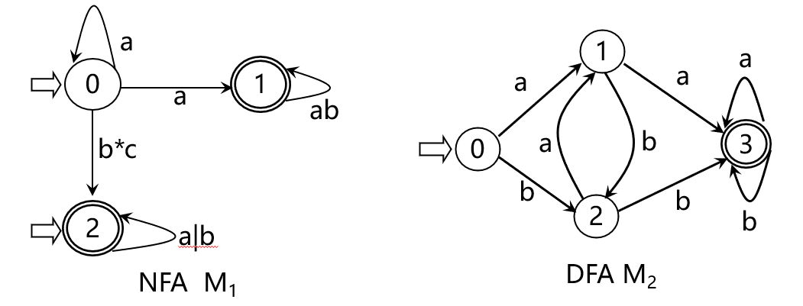
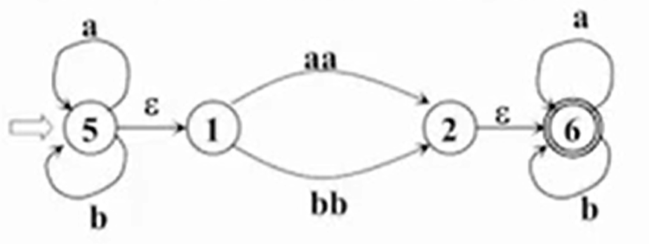
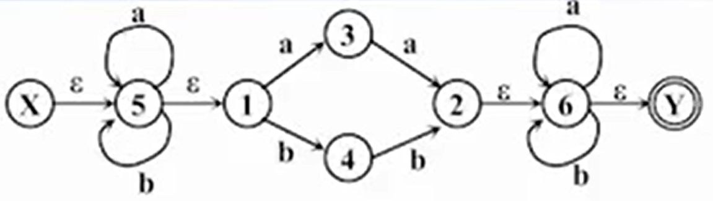
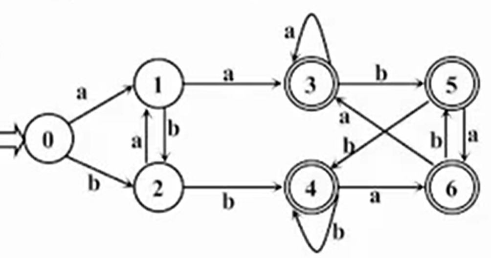
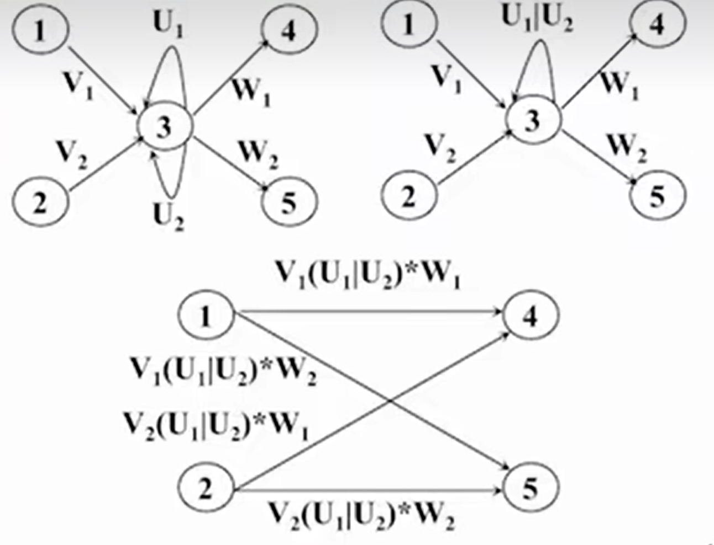
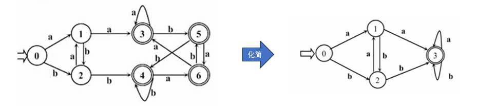
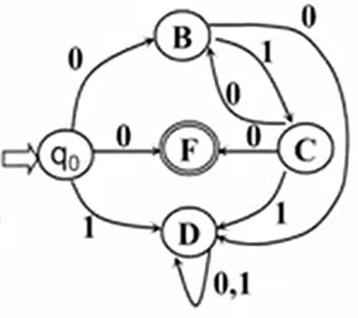
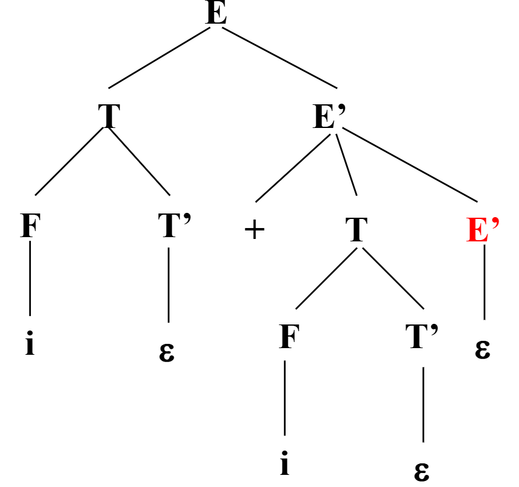

# 形式语言描述

## 1. **几个基本概念**

- 字符的集合构成了**字母表$\Sigma$**。

- **字母表$\Sigma$**中的每一个元素称为一个**字符**。

- **字母表$\Sigma$**上的**字**是由它的字符所构成的一个有穷的序列。

- 有个特殊的字是**空字$\varepsilon$**，表示这个字的构成中没有使用任何字母表中任何一个字符。

- **$\Sigma^*$** 表示了**字母表$\Sigma$**上的字的全体，它包括了空字$\epsilon$，是个无穷的集合。

  例如：设$\Sigma$ = (a,b)， 则**$\Sigma^*$** = {$\varepsilon$, a, b, aa, ab, ba, bb, aaa, ...}

- **$\Sigma^*$** 的子集**$U$和$V$的连接（积）**定义为$UV=\{\alpha\beta | \alpha \in U \& \beta \in V\}$

  例如：字符表 \(\Sigma = \{0, 1\}\)（二进制场景），定义：

  - \(U = \{0, 11, 001\}\)（U 是 3 个二进制字符串的集合）
  - \(V = \{\varepsilon\ , 1, 00\}\)（V 含「空串 \(\varepsilon\)」，空串拼接不改变原字符串）

  那么\(UV = \{0, 01, 000, 11, 111, 1100, 001, 0011, 00100\}\)。

- **$V$自身的n次积**记作$V^n=VV...V$。

- 规定$V^0 = \{\varepsilon\}$。

- 规定$V^*=V^0 \cup V^1 \cup V^2 \cup ...$  ；$V^*$表示**$V$的闭包**。

- 规定$V^+=V V^*$  ；$V^+$表示**$V$​​​的正规闭包**。

## 2. 形式语言的种类

形式语言的描述都有四部分组成。

$G = (V_t, V_n, S, P)$其中：

$V_t$:表示终结符的集合（非空）。 $V_n$:表示非终结符的集合（非空）。$S$：表示文法的开始符合，$S \in V_n$。 $P$:表示产生式有限集。

产生式的种类不同，形式语言的种类也不同。一共有四种，表述能力依次减弱：

1. 0型文法（短文语法，图灵机）：形如$\alpha \rightarrow \beta$， 其中$\alpha \in (V_t \cup V_n)*$且至少包含一个非终结符；$\beta \in (V_t \cup V_n)*$。

2. 1型文法（上下文有关文法，线性界限自动机）：形如$\alpha \rightarrow \beta$， 其中$|\alpha| \le |\beta|$， 只有$S \rightarrow \varepsilon$例外。

3. 2型文法（上下文无关文法，非确定下推自动机）：形如$\alpha \rightarrow \beta$， 其中$\alpha \in V_n$；$\beta \in (V_t \cup V_n)*$​。而且S必须出现推导式的左边一次。这类语法的核心要求就是“**左边必须是 “单个非终结符”**”，他能表述正规文法所不能表述的嵌套、递归、成对出现。

4. 3型文法（正规文法，有限自动机）：

   a. 右线性文法：形如$A \rightarrow \alpha B$或$A \rightarrow \alpha$，其中$\alpha \in V_t*$; $A, B \in V_n$​。

   b. 左线性文法：形如$A \rightarrow B \alpha$或$A \rightarrow \alpha$，其中$\alpha \in V_t*$; $A, B \in V_n$​。

   这种文法只能表示“**由终结符的有限次重复、可选组合构成的语言**”

## 3. 基本概念

**直接推出**：$\alpha A \gamma \Rightarrow \alpha \beta \gamma$，当且仅当$A \rightarrow \beta$式一个产生式，且$\alpha , \gamma \in (V_t \cup V_n)*$。

**推导**：如果$\alpha_1 \Rightarrow \alpha_2 \Rightarrow ... \Rightarrow \alpha_n$，则我们称这个序列为$\alpha_1$到$\alpha_n$的一个推导，若存在一个$\alpha_1$到$\alpha_n$的推导，那么称$\alpha_1$可以推导出$\alpha_n$。

$α_1 \mathop{\Rightarrow} \limits^*  α_n$  从$α_1$出发，经过0步或若干步推出$α_n$。

$α_1 \mathop{\Rightarrow} \limits^+  α_n$  从$α_1$出发，经过1步或若干步推出$α_n$。

**句型**：如果$S \mathop{\Rightarrow} \limits^* \alpha$，则$\alpha$是该文法的一个句型。

**句子**：只有终结符的句型是一个句子。

**语言**：文法G所产生的句子的全体是一个语言，$L(G) = \{\alpha | S \mathop{\Rightarrow} \limits^+ \alpha, \alpha \in {V_t}^*\}$​

**最左推导**：一个句型到另一个句型的推导如果总是以最左边的非终结符开始，那么这个推导就是最左推导。

**最右推导**：一个句型到另一个句型的推导如果总是以最右边的非终结符开始，那么这个推导就是最右推导。

**语法树**：使用一张图来表示一个句型的推导过程，称为语法树，它是不同推导过程的共性抽象，使用最左推导或者最右推导都能得到一颗唯一的树。

**文法二义性**：对一个句子来说，如果按照某个文法可以推出两颗不同的语法树，那么这个文法是二义的。

**语言的二义性**：对于语言来说可以有多种不同文法的写法，一些文法的写法可能是二义的，但不能说明该语言是二义的。如果对于一个语言来说，所有的文法表述都是二义的，那么这个语言本身才是二义的。

比如对于表达式的上下文无关文法描述:

* 下面的描述是二义的：

​	$G(E) : E \rightarrow i | E+E | E*E|(E)$ <!-- 产生式中的 | 不包含优先级概念 -->

​	假设要推导i + i * i这样一个句子，因为产生式中的|不包含优先级概念，这里就会出现不同的选择

```c
//假设先选择*那么最左推导的过程就是
E -> E * E
E * E -> E + E * E
E + E * E -> i + E * E
i + E * E -> i + i * E
i + i * E -> i + i * i
//假设先选择+那么最左推导的过程就是
E -> E + E
E + E -> i + E
i + E -> i + E * E
i + E * E -> i + i * E
i + i * E -> i + i * i
```

它们得到的语法树也不一样

```n
先选择*         先选择+
    E            E
   /|\          /|\
  E * E        E + E
 /|\  |        |  /|\
E + E i        i E * E
|   |            |   |
i   i            i   i
```

一个句子得出了两个不同的语法树，所以这个产生式规则是二义的。

* 下面的描述是无二义的：

​	 $G(E) : E \rightarrow T | E+T$

​	$T \rightarrow F|T*F$

​	$F \rightarrow (E)|i$

​        同样对于i + i * i这个字符串，它的最左推导过程是

        ```c
        E -> E + T
        E + T -> T + T
        T + T -> F + T
        F + T -> i + T
        i + T -> i + T * F
        i + T * F -> i + F * F
        i + F * F -> i + i * F
        i + i * F -> i + i * i
        ```

​         它的最右推导过程就是

```c
E -> E + T
E + T -> E + T * F
E + T * F -> E + T * i
E + T * i -> E + F * i
E + F * i -> E + i * i
E + i * i -> T + i * i
T + i * i -> F + i * i
F + i * i -> i + i * i
```

​         都会得到一个这样的语法树：

```plaintext
        E
       /|\
      E + T
      |  /|\
      T T * F
      | |   |
      F F   i
      | |
      i i
```


# 一、词法分析器

## 1. 简述

**结果**：（单词种别，单词自身的值）的一个二元组。二元组的最后一元可以有多种表示形式，它可以是一个结果，也可也是一个符号表中的一个指针，只要能界定结果就可以。

1. 若一个种别只有一个单词符号，则使用种别编码就够了。常见的 **关键字**、**运算符**、**界定符**都是这类情况。
2. 若一个种别有多个单词符合，那么一个种别编码就不够了，还需要给出单词自身的值。比如**标识符、常量**就是这类情况。

**特点**：

1. 逻辑上说词法分析器是一个独立的阶段，但是为了效率，基本都不把它当成一个独立的阶段，而是作为一个子程序来处理。
2. 语法分析器来调用它，它返回上面提到的二元组。

**词法分析的挑战（超前搜索）**：

1. 标识符的识别，字母开头的字母数字串，后跟界定符或者运算符。
2. 常量识别，比如5E08，需要多看几步才能决定他是常量还是标识符。
3. 运算符，比如+=， ++， --。这些都需要提前看一步。

现代语言中几点通用限制，为了避免过多的超前搜索。比如：

- **所有的基本字都是保留字，程序员不得赋予它其他意义**；
- 所以的基本字使用**保留字表**被当成了特殊的标识符来处理；
- 基本字、标识符、常量之间如果没有确定的运算符或者界符作为间隔，则中间必须加一个空格来作为界定符。

**分析方法-状态图**

定义：

1. 节点代表了状态，用圆圈表示。
2. 状态之间用带箭头的弧连接，弧上标注了该状态下可以接受的字符或者字符串。
3. 一张图包含有限个状态，其中至少有一个初态，一个终态。
4. 若存在一条从初态到某一终态的道路，而且这条路上的所有弧上的标记连接成的字等于$\alpha$，则称$\alpha$能被该状态转换图所识别。

状态图的实现方法：

​    总体思维：每个状态节点作为一小段程序，由几种固定的模式拼接成整个任务。

​    具体的拼接模式：

1. 对不含由回路的分叉节点，使用switch或者if-else语句来实现。
2. 对含有回路的状态节点，使用一段由while结构或者if结构构成的程序来实现。
3. 终态节点表示已经识别出某种单词符号，对应的语句应该是return(C, val)。

​    更一般的可以使用**数据驱动的表来实现**，状态被编码成int，状态的转换使用一个二维表来表示。

## 2. 正规表达式和有限自动机

### 2.1. **几个基本概念**

-  一个字符的集合构成了**字母表$\Sigma$**。

- **字母表$\Sigma$**中的每一个元素称为一个**字符**。

- **字母表$\Sigma$**上的**字**是由它的字符所构成的一个有穷的序列。

- 有个特殊的字是**空字$\varepsilon$**，表示这个字的构成中没有使用任何字母表中任何一个字符。

- **$\Sigma^*$** 表示了**字母表$\Sigma$**上的字的全体，它包括了空字$\epsilon$，是个无穷的集合。

  例如：设$\Sigma$ = (a,b)， 则**$\Sigma^*$** = {$\varepsilon$, a, b, aa, ab, ba, bb, aaa, ...}

- **$\Sigma^*$** 的子集**$U$和$V$的连接（积）**定义为$UV=\{\alpha\beta | \alpha \in U \& \beta \in V\}$

- **$V$自身的n次积**记作$V^n=VV...V$。

- 规定$V^0 = \{\varepsilon\}$。

- 规定$V^*=V^0 \cup V^1 \cup V^2 \cup ...$  ；$V^*$表示**$V$的闭包**。

-  规定$V^+=V V^*$  ；$V^+$表示**$V$​​的正规闭包**。

### 2.2. **正规式和正规集**

#### 2.2.1 定义

- 字的全体$\Sigma^*$中有一类特殊的子集，这类子集中的字都可以使用**正规表达式**来表示。
- 可以使用正规式表达的所有字的集合就是**正规集**。
- 正规表达式是正规集的**一种表达方式**。
- 一个字的集合是正规集**当且仅当**它能**使用正规式表示**。
- $\varepsilon$ 和$\emptyset$都是字母表$\Sigma$上的正规式，它门所表示的正规集是$\{\varepsilon\}$和$\emptyset$​。

#### 2.2.2 对应关系

假设$e_1$和$e_2$都是$\Sigma$上的正规式，它们对应的正规集分别是$L(e_1)$和$L(e_2)$。那么有以下几条性质：

1. $e_1$|$e_2$是$\Sigma$上的正规式，它对应的正规集是$L(e_1) \cup L(e_2)$。
2. $e_1e_2$是$\Sigma$上的正规式，它对应的正规集是$L(e_1)L(e_2)$。也就是$L(e_1)$和$L(e_2)$的积。
3. $e_1*$是$\Sigma$上的正规式，它对应的正规集是$(L(e_1))^*$，也就是$L(e_1)$的闭包。

总的来说，**正规式是一套描述正规集的命名体系，正规集是实在的全字子集。**

#### 2.2.3 性质

一个正规集的描述可能有多个正规式。比如b(ab)* = (ba)*b，(a * b*) * = (a|b)*。

正规式有以下性质：

1. 交换律， $e_1 | e_2$ = $e_2 | e_1$
2. 结合律， $e_1 | (e_2 | e_3)$ = $(e_1 | e_2) | e_3$​
3. 结合律， $e_1  (e_2  e_3)$ = $(e_1  e_2)  e_3$​
4. 分配律，$e_1(e_2|e_3) = e_1e_2|e_1e_3$
5. 分配律，$(e_1|e_2)e_3 = e_1e_3|e_2e_3$​
6. $e\varepsilon = \varepsilon e = e$
7. $e_1e_2 <> e_2e_1$

### 2.3. 有限自动机（FA）

#### 2.3.1 确定有限自动机（DFA）

- 确定有限自动机可表示成一个五元组$M = (S, \Sigma, f, S_0, F)$， 其中

  1. $S$ 表示一个有穷的状态集。
  1. $\Sigma$ 表示一个字母表。
  1. $f$ 表示状态转换函数，它是$S \times \Sigma \rightarrow S$的单值部分的映射。$f(s,a) = s^{'}$表示当前状态为$s$，在接收到字符串$a$时，将转换成$s^{'}$ 。
  1. $S_0 \in S$，它表示**唯一**的一个初态。
  1. $F$表示终态，它可以为空也可也有多个，$F \subset S$​。


- 它的其他表示方式还有状态转移图和转移矩阵。
- 对于$\Sigma^*$中的任何字$\alpha$， 若存在一条从初态到某一终态的道路，这条道路上所有弧上的标记**字符**连接起来等于$\alpha$，那么$\alpha$能被DFA所识别。
-  DFA M所能识别的字的全体被记作L(M)。

#### 2.3.2 非确定有限自动机（NFA）

- 非确定有限自动机跟确定有限自动机一样，也形式化成一个五元组$M = (S, \Sigma, f, S_0, F)$， 其中

  1. $S$ 表示一个有穷的状态集。
  2. $\Sigma$ 表示一个字母表。
  3. $f$ 表示状态转换函数，它是$S \times \Sigma^* \rightarrow 2^S$的部分映射。$2^S$表示$S$的密集，他是集合$S$的所有子集构成的集合。（这就是非确定的由来，一个状态接收一个字或者字符转移的结果不只有一个）
  4. $S_0 \subset S$，它的初态不一定是唯一的，但是不能为空。
  5. $F$表示终态，它可以为空也可也有多个，$F \subset S$​。


- 对于$\Sigma^*$中的任何字$\alpha$， 若存在一条从某一初态到某一终态的道路，这条道路上所有弧上的标记的**字**连接起来等于$\alpha$，那么$\alpha$能被NFA所识别。
-  NFA M所能识别的字的全体被记作L(M)。

#### 2.3.3 NFA和DFA的区别

下图是状态转移图



- 根据上面的图可以看出NFA和DFA的区别：

  1. NFA可以有多个初态，DFA只有一个
  2. NFA弧上的标记可以是$\Sigma^*$中的任意一个字或者干脆是一个正规式，而DFA只能是$\Sigma$中的一个字符。
  3. 同一个字可能出现同状态射出的多条弧上，这也就是说NFA在状态确定和输入确定的情况不存在唯一后继状态。而DFA则严格满足唯一后继状态。
  4. 所以DFA是NFA的一个特例。


- 如果有两个有限自动状态机M和M‘，如果L(M) = L(M')，则M于M‘**等价**。这个**等价判断的算法是存在的**。
- 对于每个NFA来说都有一个DFA能与之等价，所以NFA和DFA的描述能力是相同的。

#### 2.3.4 NFA到DFA的转换方法

步骤一：引入新的初态节点$X$和终态节点$Y$，$X,Y \notin S$，从$X$到$S_0$中所有状态节点连接一条$\varepsilon$  弧，从F中所有状态节点连接一条$\varepsilon$弧到Y。

步骤二： 对于NFA上的弧上的标记的字按照如下三条规则，拆分成一个一个字符。

1. 对于ab形式的正规式，加入一个新的状态，这个状态接受a到这个状态，接受b转移到另一个状态。

2. 对于a|b形式的正规式，裁成两个弧，分别是a和b。

3. 对于a*形式的正规式，加入一个新的状态，这个状态接受a转移到自己，与老状态的前驱和后继连接都使用$\varepsilon$​弧。

4. 对于a*形式的正规式，引入一个的状态，这个状态接受a转移到自己，与老状态的连接都使用$\varepsilon$弧。


步骤三：使用子集法发确定NFA（消除$\varepsilon$和状态转移的不确定性）子集法 ：

* 假设I是状态集的一个子集，**I的$\varepsilon$-闭包（$\varepsilon$-closure(I)）**定义为：

  1. 若$s \in I$，则$s \in \varepsilon-closure(I)$。
  2. 若$s \in I$，则经过$s$出发的任意一条或者多条$\varepsilon$弧能到达的任何状态$s^{'}$都属于$\varepsilon$-closure(I)

  所以$\varepsilon$-closure(I)的形式化定义为：

  $\varepsilon-closure(I)$ = $I \cup \{s^{'} | 从某个s \in I出发经过任意多条\varepsilon 弧能到达的状态，任意多条表示为0条或者多余0条的任意条\}$。 

* 假设$a$是$\Sigma$中的一个字符，定义**集合$I_a = \varepsilon-closure(J)$**，其中$J$为$I$中的某个状态经过$a$弧而到达的状态集合。

* 通过化简把原状态化，变化成新状态，新状态的组成形式是“老状态$\varepsilon$-closure(I)经过任意$a$弧到达**集合$I_a$​**，最后对新状态”。最后对得到最新的状态进行新的编码，最终得到了新的DFA。

* 

比如下面的这个非确定有限状态机。



经过第一和第二步的变化，会得到下面等价的图。



通过子集法可以得到下面的新状态。

| $\varepsilon$-closure(I)             | $I_a$                        | $I_b$                        |
| ------------------------------------ | ---------------------------- | ---------------------------- |
| {X, 5, 1} **(新状态0，新初态)**      | {5,3,1} **（新状态1）**      | {5,4,1}**（新状态2）**       |
| {5,3,1}**（新状态1）**               | {5,2,3,1,6,Y}**（新状态3）** | {5,4,1}**（新状态2）**       |
| {5,4,1}**（新状态2）**               | {5,3,1}**（新状态1）**       | {5,2,4,1,6,Y}**（新状态4）** |
| {5,2,3,1,6,Y}**（新状态3，新终态）** | {5,2,3,6,1,Y}**（新状态3）** | {5,4,6,1,Y}**（新状态5）**   |
| {5,2,4,1,6,Y}**（新状态4，新终态）** | {5,3,6,1,Y}**（新状态6）**   | {5,2,4,6,1,Y}**（新状态4）** |
| {5,4,6,1,Y}**（新状态5，新终态）**   | {5,3,6,1,Y}**（新状态6）**   | {5,2,6,4,1,Y}**（新状态4）** |
| {5,3,6,1,Y}**（新状态6，新终态）**   | {5,2,6,3,1,Y}**（新状态3）** | {5,6,4,1,Y}**（新状态5）**   |

其中包含x和Y的新状态就是最新DFA上的起始和终结节点，这样我们就得到了这样一张新的DFA转换图。



### 2.4 FA和正规式等价性

**等价性**：任何一个有限自动机$M$都存在一个正规式$r$使得$L(M) = L(r)$。 前一个L表示有限自动机识别字的全体，后一个L表示正规式对应的正规集。

**FA到正规式的转换步骤**：

步骤一：引入新的初态节点$X$和终态节点$Y$，$X,Y \notin S$，从$X$到$S_0$中所有状态节点连接一条$\varepsilon$  弧，从F中所有状态节点连接一条$\varepsilon$弧到Y。得到$M^{'}$，这时候$L(M) = L(M^{'})$

步骤二：在$M^{'}$​上，使用2.3.4节步骤二的**逆变换**得到从刚加入的初态到终态的唯一转换，转换弧上的标记就是得到的正规式。

比如下面这个转换，先把状态3上的弧合并，得到一条新的弧$U_1|U_2$。最后把节点3删掉得到最终的NFA，新NFA上的弧就是正规式的表达。



**正规式到NFA的转换**：

结论：任何一个正规式$r$都存在一个有限自动机$M$与之等价。 使得$L(r) = L(M)$。这个有限自动机M**只有一个初态和一个终态，而且没有从终态发出的弧**。

步骤一：确定一个初态和一个终态，初态射出一个弧到终态，弧上的标记为该正规式。得到一个NFA $M^{'}$。

步骤二：在$M^{'}$​上，使用2.3.4节步骤二的变换可以进一步得到DFA。

### 2.5 DFA的化简

**状态的等价性**：假设$s$和$t$是有限状态机$M$​的两个状态，

​     $s$和$t$等价是指：从$s$出发，如果读入**任意一个字$\alpha$**停止于终态，那么对应的，从$t$出发读入$\alpha$也会停止于终态（但是这个终态不一定就是$s$到达那个终态），**反之亦然**。

两个状态如果不等价，那么说他们**是可区别的**。也就是只要存在一个字$\alpha$如果状态$s$接收该字到达终态，而状态$t$接收该字到达不了终态，那么$s$和$t$就是可区别的。


**简化的基本思想**：把$M$的状态集划分成一些不相交的子集，使得任何两个不同子集的状态是可区别的，而同一子集的任何两个状态是等价的。

**简化的过程**：

1. 把$S$划分成终态和非终态两个子集，形成基本划分$\phi$。

2. 检查$\phi$​中的每个子集，看他们是否能做进一步的划分，如果能划分则继续划分。直到所有的子集都不能再划分为止。

   ​     假设$\phi = \{I^1, I^2, ..., I^m\}$, 其中$I^k$(其中$k$在1和m之间)，$I^k$包含了$k$个状态。

   ​     对于一个输入的字符$a$使得某个$I_a^{(i)}$不会被包含在$\phi$中现有的某个子集，那么至少可以把$I^{i}$划分成两个部分。

3. 若一个子集中包含原来的初态或者终态，那么这个子集就是新的初态或者终态。

4. 选取每个子集的其中一个代表，消去其他状态。这样就得到了简化后的DFA。

 比如对下面的NFA：

先划分成终态和非终态两个子集 $I^{(1)}=\{0，1，2\}$和$I^{(2)}=\{3，4，5,6\}$

检查对于$I_a^{(1)}$和 $I_b^{(1)}$的结果在不在现行划分的一个子集里面。此时$I_a^{(1)} = \{1，3\}$​，在不同一个子集，这时候{0，2}可以划在一起，{1}划在一起。

于是$I^{(11)}=\{0, 2\}$ $I^{(12)} = \{1\}$和$I^{(2)}=\{3，4，5,6\}$。

此时$I_a^{(11)} = \{1\}$，满足在不同子集的条件，继续看$I_b^{(11)} = \{2,4\}$,不在同一个子集，继续拆分。

于是$I^{(111)}=\{0\}$ $I^{(112)}=\{2\}$ $I^{(12)} = \{1\}$和$I^{(2)}=\{3，4，5,6\}$。

继续对$I^{(2)}$进行运算得到$I_a^{(2)} = \{3,6\}$ $I_b^{(2)} = \{5,4\}$都存在于一个已有的子集中，成立，所以最终的状态变成了4个。



### 2.6. 词法分析生成器（Lex）

**举例：**

输入一：辅助定义，比如 $letter \rightarrow A|B|...|Z$   $digit \rightarrow 0|1|...|9$

输入二：识别规则，比如:  

​	$DIM \rightarrow (1, -)$

​	$IF \rightarrow (2, -)$

​        $DO \rightarrow (3, -)$

​        $letter(letter|digit)* \rightarrow (6, TOKEN)$

​        $digit(digit)* \rightarrow (7, NUMBER)$

​        $* \rightarrow (8, -)$

​        $+ \rightarrow (9, -)$

**过程**：

- 对每条规则构建一个相应的非确定有限自动机。
- 加入一个新初态X，通过$\varepsilon$弧将这些自动机连接成一个新的NFA。
- 再把新得到的NFA通过确定化转换为DFA，通过算法简化DFA。
- 生成对应的状态转换表和控制执行程序。


### 2.7 正规文法和有限自动机的等价性

词法的描述除了上面提到的正规式，还有一种描述方法的就是正规文法。正规文法也就是乔姆斯基的提出的形式语言描述的的三型文法，它是上下文无关文法的一个特例。

定义为$G = (V_t, V_n, S, P)$  其中：$V_t$:表示终结符的结合（非空）。 $V_n$:表示非终结符（非空）。$S$：表示文法的开始符合，$S \in V_n$。 $P$:表示产生式有限集，正规文法的产生式规则符合下面这种形式：

a. 右线性文法：形如$A \rightarrow \alpha B$或$A \rightarrow \alpha$，其中$\alpha \in V_t*$; $A, B \in V_n$​。

b. 左线性文法：形如$A \rightarrow B \alpha$或$A \rightarrow \alpha$，其中$\alpha \in V_t*$; $A, B \in V_n$​​。

**也就是他的产生式的右部只有一个非终结符，且要么位于最左边要么位于最右边，最左边的叫做左线性文法，最右边的叫做右线性文法。**

 **正规文法和有限自动机的等价性：**

1. 对每个右线性正规文法G和左线性正规文法G，都存在一个有限自动机M，使得$L(M) = L(G)$​​。

   转换步骤：正规文法的所有非终结符都描述成有限自动机的状态，对于右线性文法来说新增一个终态，对于左线性文法来说新增一个初态。右线性文法中的非终结符就是按照产生式规则从左到右连接两个状态的弧。而左线性文法则正好相反。

   例子：对于左线性正规文法$G_L = <\{0,1\}, \{B, C, D, F\}, F, P>$，其中$P$描述成：$F \rightarrow  0|C0$，$C\rightarrow B|1$，$B\rightarrow  0|C0$,$D\rightarrow 1|C1|D0|D1|B0$。按照上述规则那么最终得到等价的FA包含了B、C、D、F和一个新增的初态$q_0$，状态的连接则是产生式规则的从右到左的连接，即：

   

   

2. 对于每一个有限自动机$FA\space M$，也都能够构造一个右线性正规文法$L(G_R)$和左线性正规文法$L(G_L)$，使得$L(M) = L(G_R) = L(G_L)$。

   转换步骤就跟上面的方式反过来用。先把FA转换成DFA，对于射入终态的弧，那么可以写成形如$A \rightarrow 0| 0B$这样的产生式规则，其中A是中间状态，B是终态，0是DFA上的弧。而对于射入非终态的弧则只添加这样的规则$A \rightarrow 0B$ 所以对对上面的DFA，它的右线性文法就是$q_0 \rightarrow 0|0F|0B|1D$，$B\rightarrow 1C|0D$， $C\rightarrow 0|0F|0B|1D$ ，$D\rightarrow 1D| 0D$， $F \rightarrow \varepsilon$

# 二、语法分析

**语法分析器的功能**：按照文法的产生式（语言的语法规则），识别输入符号串是否为一个句子（合适的程序）。

## 1. 分类

**自下而上的分析方法**：

- 基本思想：从输入串开始，逐步进行规约，直到文法的开始符号。
- 规约的过程：根据文法的产生式规则，把串中出现的产生式的右部替换成左部符号。
- 顺序：从树叶节点开始，构造语法树。
- 常见的算法：算符优先分析法、LR分析法。

**自上而下的分析方法**：

- 基本思想：文法的开始符号出发，反复使用各种产生式，寻找“匹配”的推导。
- 推导的过程：根据文法的产生式规则，把串中出现的产生式左部符号替换成右部符号。
- 顺序：从树叶的根开始，构造语法树。
- 常见的算法：递归下降法、预测分析程序。


## 2. 自上而下的分析

两个问题：

1. 在产生式中，如果右边的规则有多种选择，这时候暂时的匹配成功可能是错的，需要读入更多的token才能确定，如果出错，需要有**回溯动作**。
2. 文法的左递归问题，存在这样的推导$P \mathop{\Rightarrow} \limits^* Pa$​， 这样语法树会不断增加，但是句子不会被读入，程序死循环。

### 2.1 左递归的消除

#### 2.1.1**直接左递归的消除**

​	假定P的全部产生式是$P \rightarrow P\alpha | \beta$，那么这个产生式就可以被替换成 $P \rightarrow \beta P^{'}$, $P^{'} \rightarrow \alpha P^{'}| \varepsilon$。 解释：其实整个产生式就是想说P会产生以$\beta$开头若干个$\alpha$结尾的字，那么直接生成一个$P^{'}$的新的产生式它生成若干个$\alpha$就能满足原来这个产生式的要求。

​	更一般地，假定P的全部产生式是$P \rightarrow P\alpha_1 | P\alpha_2| ... | P\alpha_m | \beta_1 |\beta_2 |...|\beta_n$

​	那么可以直接转换成$P \rightarrow \beta_1P^{'} | \beta_2P^{'} | ... | \beta_nP^{'}$

​					   $P^{'} \rightarrow \alpha_1P^{'} | \alpha_2P^{'} | ... | \alpha_mP^{'} | \varepsilon$

 **举例：**

比如对于文法$G(E)$: 

$E\rightarrow E+T|T$

$T \rightarrow T*F|F$

$F \rightarrow (E) | i$

其中$E$和$T$的产生式规则出现了直接左递归。通过直接左递归的消除会得到一个消除了直接左递归的产生式如下：

$E\rightarrow TE^{'}$

$E^{'}\rightarrow +TE^{'}|\varepsilon$

$T \rightarrow FT'$

$T' \rightarrow *FT'|\varepsilon$

$F \rightarrow (E) | i$

#### 2.2.2 **间接左递归的消除**

步骤一：把文法G的所有非终结符按照任意一种顺序排序$P_1, P_2, ..., P_n$。

步骤二：伪代码

for i = 1 to n Do:

​	for j = 1 to i-1 Do:

​		把形如$P_i \rightarrow P_jr$的规则改写成$P_i \rightarrow \delta_1r | \delta_2r |...|\delta_kr$（其中$P_i \rightarrow \delta_1 | \delta_2 |...|\delta_k$是关于$P_j$的所有规则。

​		如果此时的产生式规则中出现了关于$P_i$的直接左递归，则消除这个直接左递归。

步骤三：简化步骤二所得的的文法，去除开始符号出发永远无法到达的非终结符的产生规则。

**举例：**

比如对于文法$G(S)$, 

$S\rightarrow Qc|c$

$Q \rightarrow Rb|b$

$R\rightarrow Sa|a$


先做一个排序得到R、Q、S。

观察R的产生式，它不包含比它小的非终结符（虽然有S但是S比R大），所以不做任何操作。

观察Q的产生式，它有一个比他小的非终结符，替换得到$Q \rightarrow Sab|ab |b$ 

再看Q的产生式，它不包含比他下的非终结符（虽然有S但是S比R大），所以不做任何操作。

观察S的产生式，它包含了一个比他小的非终结符，替换得到$S \rightarrow Sabc|abc|bc|c$。

再看S的产生式，它出现了直接左递归，那么这个时候变化成

$S \rightarrow abcS^{'}|bcS^{'}|cS^{'}$

$S^{'} \rightarrow abcS^{'}|\varepsilon$

这样我们就得到了非左递归的产生式。需要注意的是如果我们开始使用的排序不同，那么最终得到的产生式也不会相同，但是功能等价。


### 2.2 LL(1)分析方法

至上而下的分析方法除了要解决上一节提到的左递归产生式文法的问题，还有另外一个回溯的问题，如果做一个假设，每一条产生式规则再面对某一个输入时候都只有唯一的候选跟他匹配，那么回溯问题就能得到解决。这类具备了这个特性的文法就是LL(1)文法。

#### 2.2.1 FIRST集合

**定义**：假设G是一个不包含左递归的文法，对G的所有非终结符的每个候选$\alpha$，定义它的终结符首符集$FIRST(\alpha)$为：

$FIRST(\alpha) = \{a | \alpha \mathop{\Rightarrow} \limits^* a..., a \in V_t\}$

如果$\alpha \mathop{\Rightarrow} \limits^* \varepsilon$， 那么 $\varepsilon \in FIRST(\alpha)$。

**作用**：如果非终结符A的任何两个不同候选$\alpha_i$和$\alpha_j$，都满足$FIRST(\alpha_i) \cap FIRST(\alpha_j) = \phi$​（即**是A的所有候选首符集两两不相交**）。当要求A匹配输入串时，A就能选择一个终结符首符集包含了当前字符a的候选项做匹配（如果有这么一个候选项）。

**提取公共公因子**：假定关于非终结符A的产生式规则是$A \rightarrow \delta\beta_1 |\delta\beta_2 | ... | \delta\beta_n | \gamma_1 | \gamma_2 |... |\gamma_m$(其中每个$\gamma$都不以$\delta$开头)。那么，可以把这些规则改写成

$A \rightarrow \delta A^{‘}| \gamma_1 | \gamma_2 |... |\gamma_m$

$A^{’} \rightarrow \beta_1 |\beta_2 | ... | \beta_n$

这样就能消除非终结符$A$中的候选项的首符集有重叠的问题。

提取公共公因子的意思是在说，如果一个非终结符的不同候选的$FIRST$集合出现了重叠的情况那么，一定能通过插入一个新的产生式规则来把所有这些有重叠首符集的候选重新组织一下，从而得到消除这部分的候选的首符集相重叠的情况。

#### 2.2.2 FOLLOW集合

**定义**：$S$是文法$G$的开始符号，对于$G$的任何非终结符$A$，定义$A$的$FOLLOW$集合$FOLLOW(A) = \{a | S \mathop{\Rightarrow} \limits^* ...Aa..., a \in V_t \}$，特别地，若$S \mathop{\Rightarrow} \limits^* ...A$, 则规定$\# \in FOLLOW(A)$​。

总的来说，两两不相交的$FIRST$集合保证了最多只会有一个句型参与后续匹配工作，$FOLLOW$集合保证了前一个匹配中只能匹配$\varepsilon$​时后续的匹配是否能继续。如果不能继续，那么必然语法错误。

#### 2.2.3 LL(1)文法

第一个L表示从左向右扫描输入串，第二个L表示最左推导，1表示每次只需要向前看一步。这样就避免了回溯问题。

**成立条件**：

1. 文法不含有左递归。
2. 文法中所有非终结符A的各个产生式的候选首符集两两不相交。
3. 文法中所有非终结符A，若它的某个候选产生式$\alpha$的FIRST集包含了$\varepsilon$, 那么$FIRST(\alpha) \cap FOLLOW(A) = \phi$。

*注意如果A的所有候选产生式的FIRST集合都不包含$\varepsilon$那么第三条就不用满足，这个时候只能说明文法的设计有冗余，对于某个特定的词法单元产生会按照当前这条规则直接进行。*

**过程**：

对于当前的输入字符$a$，假设使用非终结符$A$去做匹配，$A \rightarrow \alpha_1| \alpha_2|...|\alpha_n$​。

如果$a$属于$\alpha_i$的首符集，那么就使用$\alpha_i$做匹配。

如果$a$不属于任何一个首符集，但候选的首符集中有$\varepsilon$，而且$a\in FLLOW(A)$，则让A匹配$\varepsilon$。

否则$a$​的出现是一种语法错误。

**举例：FIRST和FOLLOW集合的使用**:

自上而下的分析，总的来看要解决两个问题，1. 面对当前的词法输入，当前使用的产生式有多条候选时候，应该使用哪一条候选？2.如果某个候选中出现了$\varepsilon$是否需要进一步匹配下一个候选。

比如对于文法$G(E)$: 

$E\rightarrow TE^{'}$

$E^{'}\rightarrow +TE^{'}|\varepsilon$

$T \rightarrow FT'$

$T' \rightarrow *FT'|\varepsilon$

$F \rightarrow (E) | i$

来匹配“i + i”这个字符串。

第一步只能是$E$的产生式，得到一颗$E$为根的树

第二步只能使用$T$的产生式，也就是再T的子节点上画出$F$和$T^{'}$

 第三步F的产生式有两个候选，一个是$(E)$，一个是$i$。这个时候问题一就出现了，通过计算$(E)$的FIRST集，发现这个集合只包含$($那么很明显就不再使用这个候选，而$i$的FIRST集合就是它自己，这样第一个非终结符就匹配了。

第四步$T^{'}$的候选有两个，很明显+都不在这两个候选的FIRST集中，这时候问题二就出现了，第二个候选就是$\varepsilon$，是否需要继续就要看$T^{'}$的FOLLOW集合是否包含了+，这儿包含所以$T^{'}$被跳过，匹配继续。

第五步$E'$的候选式就出现了，候选$+TE^{'}$的FIRST集合包含了+，所以使用这个候选。

第六步只能使用$T$的产生式，也就是再T的子节点上画出$F$和$T^{'}$

第七步F的产生式有两个候选，重复第三步。

第八步$T^{'}$要匹配#，按照第四步的要求，匹配$\varepsilon$。

同理，最后一步$E'$匹配到$\varepsilon$。

最后得到的语法分析树如下。



#### 2.2.5 FIRST集合的构建方法

对于每个$X \in V_t \cup V_n$，连续使用下面规则，直到每个$FIRST$不再增大为止：

1. 如果$X \in V_t$，那么把$X$本身加入$FIRST(X)$

2. 如果$X \in V_n$，而且有产生式$X \rightarrow a...$，则把$a$加入到$FIRST(X)$；如果$X \rightarrow \varepsilon$也是一条产生式， 则把$\varepsilon$加入到$FIRST(X)$。

3. 如果$X \rightarrow Y...$是一条产生式而且$Y \in V_n$，则把$FIRST(Y)$中的所有非$\varepsilon$元素都加入到$FIRST(X)$。

4. 如果$X \rightarrow Y_1Y_2...Y_{i-1}Y_i..Y_k$是一个产生式，其中$Y_1$到$Y_{i-1}$都是非终结符，那么：

   a. 对于任何$1 \le k \le i-1$， $FIRST(Y_k)$都含有$\varepsilon$，则把$FIRST(Y_j)$中的所有非$\varepsilon$元素都加入到$FIRST(X)$。

   b. 如果右边所有的非终结符$FIRST$都含有$\varepsilon$, 则把$\varepsilon$加入到$FIRST(X)$​​。

**备注**：有意思的是$\varepsilon$的在构建$FIRST$的作用。

1. 如果某个非终结符$X$可以推导出 $\varepsilon$，那么很明显$\varepsilon$应该属于这个非终结符的首符集，因为在碰到这个非终结符不能识别的字符时，需要有跳脱这个非终结符的能力。（这里， 某个非终结符$X$可以推导出$\varepsilon$有两种体现形式：一种并联形式是$X \rightarrow ...|\varepsilon |...$，这种形式中只要其中有一个能推导出$\varepsilon$，那么$X$就能推导出$\varepsilon$《构建的第二步》，一种串联形式是$X \rightarrow Y_1Y_2...Y_{i-1}Y_i..Y_k$，这种形式则需要所有都能推出$\varepsilon$，最终才能推导出$\varepsilon$《构建的第四步的第二小步》。）
2. 另外$\varepsilon$在处理串联这种结构的首符集继承的问题上，对于$X \rightarrow Y_1Y_2...Y_{i-1}Y_i..Y_k$这样一个产生式，$X$首符集能继承$Y_i$的前提是，所有在$Y_i$之前的$Y_j$都能被跳脱（也就是比i小的所有非终结符的FIRST集都包含了$\varepsilon$）。
3. 首符集的继承不应该轻易包含$\varepsilon$，这就回到了串联形式的属性上，对于串联形式来说只有所有的产生式右边的非终结符都能推导出$\varepsilon$才能说明左边的非终结符能够推导出$\varepsilon$，所以这儿必须要等看完了之后才能决定$\varepsilon$加还是不加《构建的第四步的第二小步》

#### 2.2.6 FOLLOW集合的构建方法

对于每个$X \in V_n$，连续使用下面规则，直到每个$FOLLOW$不再增大为止：

1.  对于文法的开始符号$S$，把$\#$加入到$FOLLOW(S)$中
2. 如果$A \rightarrow \alpha B \beta$是一个产生式，那么把$FIRST(\beta)-\{\varepsilon\}$加到$FOLLOW(B)$中。
3. 如果$A \rightarrow \alpha B$是一个产生式，或者$A \rightarrow \alpha B \beta$是一个产生式而且$\varepsilon \mathop{\Rightarrow} \limits^* FIRST(B)$，那么就可以把$FOLLOW(A)$加到$FOLLOW(B)$中。

**备注**：为什么要把$\varepsilon$排除在$FOLLOW$集合外？这跟$FOLLOW$集合的业务定位有关系，$FOLLOW$集合用来在前面的$FIRST$集合匹配不了字符（只能匹配$\varepsilon$时）的时候，判断后续的匹配是否能继续。匹配中止有专门的终结符$\#$而非$\varepsilon$，所以加入$\varepsilon$对匹配终结符没有关系。**$\varepsilon$的定位只是用来在匹配中跳脱某一规则**，所以它只用出现在$FIRST$集合中。

# 三、代码生成

## 1. 表达式的生成

