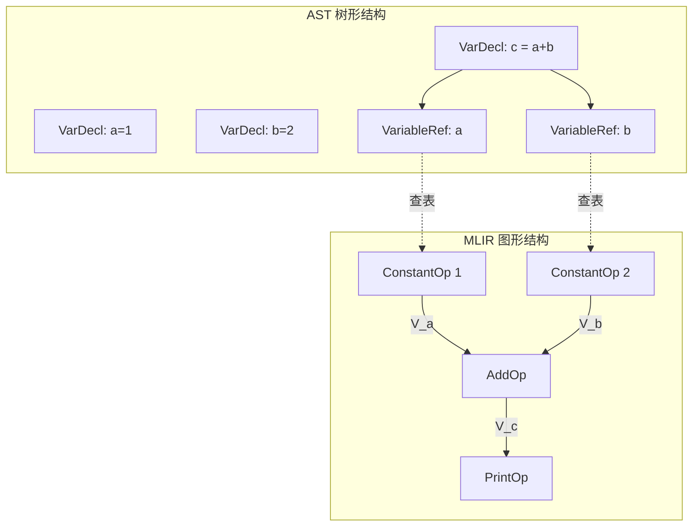
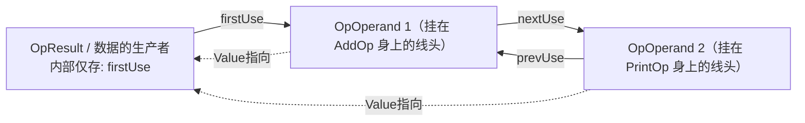

**LLVM 基础设施**以其高度模块化和优秀的优化管线著称，但其早期的 IR 设计受制于重度面向对象和指针追踪，缓存局部性较差。

作为 LLVM 演进产物的 **MLIR**，在内存架构上进行了彻底的改良，体现了极强的**数据驱动局部性**。其核心架构采用了**‘Context统一内存池分配’与‘视图（View）模式’**：底层的无类型指令由泛型的 `Operation*` 统一承载，而特定 Dialect 的强类型算子（如 `xxxOp` 类）仅作为按值传递的轻量级视图，用于安全操作底层的 `Operation` 内存。

MLIR 在架构上建立在三个正交的维度之上：

1. **结构维度（IR 嵌套树）：** 宏观上由 `Operation` -> `Region` -> `Block` -> `Operation` 构成递归的骨架。
2. **数据流维度（SSA 图）：** 算子之间通过 `Value` 传递运行时的数据流。每一个 `Value` 严格绑定一个 **`Type`**，用于在编译期进行类型系统约束（如张量形状、标量位宽）。`Operation`在定位上是“动作”，Value才是数据“实体”，所以`Type`跟着“实体”走描述属性。Operation负责验证输入的合法性，但是算子负责校验（如xxxOp类的verify函数，通常通过ODS直接生成）。
3. **元数据维度（编译期常量）：** 所有的算子（`Operation`）通过附加 **`Attribute`** 来记录编译期已知的配置（如步长、权重值）和调试信息（`Location`）。

**在内存设计上**，底层结构（Operation/Block/Region）通过 `MLIRContext` 统一在连续内存池中分配以保证缓存局部性；而所有的元数据（`Type` 和 `Attribute`）则在 `MLIRContext` 中被严格**唯一化（Uniqued）**，以实现极低开销的内存复用和基于指针的极速比对。

在工程面上，Dialect（方言）不仅可以通过 **ODS/TableGen** 生成 `Operation` 的强类型视图（Op 类）与适配器（Adaptor），同样可以通过声明式的定义自动生成用户自定义的 `Type` 与 `Attribute` C++ 类。最后配合 **DRR** 生成模式重写规则，构成了完整、可扩展的编译前端与中端基建。

## Op类的组成

- **类型识别**

  包括获取当前Operation的名称，基于RTTI的类型识别函数`classof`

- **读视图**

  包括操作数（输入）的包含语义信息的getter函数和获取索引切片和迭代器函数（比如`getLHS`）；包括结果（输出）的包含语义信息的getter函数和获取索引切片和迭代器函数（比如`getResult`）；属性 (Attributes & Properties)的获取函数；可选的，包括区域`Regions`和后继块儿`Successor`的获取函数（也就是控制流获取函数）。

- **写/改视图**

  IR的变换被划归为两类：一类是In-place Update(节点不生不灭，换个引脚或者属性)；一类是Rewrite（旧节点抛弃，新节点生成）。

  ​	In-place Update通过属性替换`setXXXAttr`和导线重插拔`MutableOperandRange` 配合`PatternRewriter`类中的`modifyOpInPlace`来实现。注意：不要直接使用

  ```c++
  // 错误做法：直接改，引擎不知道，导致优化遗漏或崩溃
  op.setStrideAttr(builder.getI32IntegerAttr(2)); 
  
  // 正确做法：使用 Rewriter 的 modifyOpInPlace
  rewriter.modifyOpInPlace(op, [&]() {
      // 在这个闭包里，尽情调用 Op 的 setter 进行原地修改
      op.setStrideAttr(rewriter.getI32IntegerAttr(2));
  });
  ```

  ​	Rewrite则通过builder和adaptor来实现，adaptor用来实现在已有对象情况下使用**带有业务语义**的读取信息，使用builder来实现对应的创建新operation的功能

- **守卫函数**

  `verify` 函数是一个综合性的静态检查钩子，用于在 IR 构建后验证这棵子树是否符合 `.td` 文件中的定义。它验证的内容包括且不仅限于：

  1. 操作数（Operands）的数量和**类型**合法性。
  2. 结果（Results）的数量和**类型**合法性。
  3. 特征（Traits，如 `SameOperandsAndResultType`）是否被满足。
  4. Attribute 的存在性及其具体类型。
  5. Region/Block 的约束（如果算子有大括号块）。

- **智能函数**

  动态求值`DerivedAttr` 用在计算动态属性（ODS中的关键字也是DerivedAttr），比如一个算子的输入是张量，你想提供一个 `getRank()` 方法返回张量的维度数量，但你不想在内存里把这个整数存一份。ODS 会在 C++ 类中生成一个普通的成员函数，在调用时临时读取 Type 的维度并返回。这样Rank这个属性没有存储在Operation中，而是根据Intput这个Value上的Type直接返回的。

  `Interfaces` (能力扩展)

- **生态交互**

  文本序列化和反序列化`parse`/`print` ，在 ODS（`.td` 文件）中定义了 `let assemblyFormat = "...";`，ODS 会自动生成 `parse` 和 `print` 方法。如果没有，且设置了自定义，这里会声明静态的 `parse` 函数和成员 `print` 函数。

  图优化钩子fold`/`canonicalize` ，你在 ODS 中设置了 `let hasFolder = 1;` 或 `let hasCanonicalizer = 1;`，ODS 会在 C++ 类中声明以下两个静态/成员函数：

  1. `::mlir::LogicalResult fold(FoldAdaptor adaptor, ::llvm::SmallVectorImpl<::mlir::OpFoldResult> &results);`
  2. `static void getCanonicalizationPatterns(::mlir::RewritePatternSet &results, ::mlir::MLIRContext *context);`

  决定了这个视图类是否具有“自我化简”的功能。对于 `ConstantOp` 来说，它自身通常是折叠的终点，但对于加法、乘法等算子，这个 `fold` 钩子是极其核心的组件。

## Adapter的使用方法

一共提供了四类adaptor的构造函数：

 1. 方言转换（Dialect Conversion）时候配合`ValueRange`对象实现带有业务语义的读信息

    比如，下面IR在lowing的过程中，MLIR 是自底向上转换的。当框架准备转换 `toy.add` 时，它的输入 `%tensor_A` 和 `%tensor_B` 已经被其他的规则转换成了指针类型：`%ptr_A` 和 `%ptr_B`。 但是！旧的 `toy.add` 节点还在，它的引脚依然连着旧的 `%tensor_A`。

    ```mlir
    %tensor_A = ... 
    %tensor_B = ...
    %result = "toy.add"(%tensor_A, %tensor_B) : (tensor<f32>, tensor<f32>) -> tensor<f32>
    ```

    如果没有adaptor，这个时候你只能写出类似于下面的代码`builder.create<LLVMAddOp>(loc, newOperands[0], newOperands[1])`，没有业务语义信息而且容易出错，踩到内存。但是又adaptor的时候，你就能改成

    ```c++
    ToyAddOpAdaptor adaptor(newOperands); 
    builder.create<LLVMAddOp>(loc, adaptor.getLhs(), adaptor.getRhs());
    ```

 2. 常量折叠（Constant Folding）的时候配合`ArrayRef<Attribute>` 对象实现带有业务语义的读信息

    比如，下面的IR做常量折叠操作，带有adaptor的时候你就能写成

    ```c++
    //输入：
    %3 = "arith.constant"() {value = 3 : i32} : () -> i32
    %5 = "arith.constant"() {value = 5 : i32} : () -> i32
    %8 = "arith.addi"(%3, %5) : (i32, i32) -> i32
        
    
    // 传入 ArrayRef<Attribute> 构造 Adaptor
    AddiOpAdaptor adaptor(operands);
    // 用优雅的命名拿到常量属性
    Attribute lhsAttr = adaptor.getLhs(); // 拿到代表 3 的 Attribute
    Attribute rhsAttr = adaptor.getRhs(); // 拿到代表 5 的 Attribute
    // 然后你在 C++ 里把它们相加，返回 8
    int sum = lhsAttr.cast<IntegerAttr>().getInt() + rhsAttr.cast<IntegerAttr>().getInt();
    return IntegerAttr::get(sum);
    ```

    > **问：** 为什么Attribute是连续的`ArrayRef`，但是Value不是连续的`ValueRange`？
    >
    > **答：**::mlir::Attribute是一个包装了裸指针的轻量级对象（通常只有8个字节），对于::mlir::Attribute的读Adapter，通常发生在IR树的重写阶段，这个阶段的写法基本上是遵循匹配上了，抠出::mlir::Attribute放到一个SmallVector中，然后使用这个小容器创建读视图Ops的操作，所以::mlir::Attribute的连续不是Atrribute对象的连续，而是Atrribute对象读视图对象的容器，所以它是ArrayRef。但是Value的情况要复杂得多，一个Value可能来自**Operands**也可能来自**Results**或者Pattern后的零时对象，只有最后一种符合”连续“这个特性。所以`ValueRange`这里本质既不是‘视图’也不是‘容器’，而是一个迭代器代理（Facade）。

    > **问**：对于单个 `Operation` 而言，它和它的输入（Operands）、输出（Results）在内存中是如何排布的？
    >
    > **答：** 不是各自独立分配的。MLIR 为了极致的缓存友好性和分配效率，使用了一次性内存分配技巧，将它们**分配在同一块连续的内存中**。 这种设计完美印证了“生产者是组合关系，消费者是聚合关系”的猜测。具体的内存布局如下：
    >
    > Text
    >
    > ```
    > [ 内存低地址 ]
    > +---------------------+ 
    > | OpResult (结果 N-1) | <--- 负地址偏移（Leading Objects）
    > +---------------------+
    > |      ...            |
    > +---------------------+
    > | OpResult (结果 0)   | <--- 生成的值，与 Op 本体在物理内存上强组合
    > +=====================+ <--- Operation 指针 (this) 实际指向这里
    > |                     |
    > | Operation 对象本体  | <--- 固定大小
    > |                     |
    > +=====================+ 
    > | OpOperand (参数 0)  | <--- 正地址偏移（Trailing Objects）
    > +---------------------+
    > |      ...            | <--- 消费者保存的指针/链表节点（逻辑聚合关系）
    > +---------------------+
    > | OpOperand (参数 M-1)|
    > +---------------------+
    > [ 内存高地址 ]
    > ```
    >
    > - **生产者（定义点）：** 产生的 `OpResult` 紧贴在 `Operation` 本体的**前面**（组合）。
    > - **消费者（使用点）：** 消耗的 `OpOperand` 紧随在 `Operation` 本体的**后面**（聚合，内部存有指向源头 `OpResult` 的指针及 Def-Use 链表节点）。
    > - **Value 的角色：** `Value` 是一个仅有 8 字节的轻量级代理类（隐藏了内部的 `PointerIntPair`），它掩盖了上述复杂的内存偏移和强转细节，对外提供统一的 SSA 数据流视图。

    > **问**：可变大小的数据（如 Operands, Regions）通常都作为 Tail Object 放在对象尾部，为什么唯独 `OpResult`（输出结果）要反直觉地放在 `Operation` 的最前面（负地址偏移）？
    >
    > **答：** 这是 MLIR 中堪称“神来之笔”的指针数学（Pointer Math）优化，目的是为了实现零内存开销（Zero-overhead）的反向查找。
    >
    > 在编译器图中，最频繁的操作之一是：拿到一个结果值（`OpResult`），去反查定义它的 `Operation`（即 `value.getDefiningOp()`）。
    >
    > - **如果放在尾部：** `OpResult` 想往回跳找到 `Operation` 本体，必须跨越它前面的 `OpOperand` 数组和 `Region` 数组，运行开销大。但 `OpResult` 自身根本不知道这些数组有多大，除非在每个 `OpResult` 内部额外存一个 8 字节的 `Operation*` 指针，但是存指针这个动作在Operation变多了以后会导致内存严重膨胀。
    > - **放在前面（现行方案）：** `OpResult` 前面没有任何未知大小的动态数组。它距离 `Operation` 本体的距离只与它自身的索引（ResultNumber）有关。
    >
    > 底层源码只需做极为简单的指针加法即可瞬间拿到 `Operation*`：
    >
    > ```C++
    > // 只需要自身指针 + 1 + 自身的 Result索引
    > Operation *OpResult::getOwner() const {
    >   return reinterpret_cast<Operation *>(this + 1 + this->getResultNumber());
    > }
    > ```
    >
    > 这种不对称的内存布局（输入放后，输出放前），完美化解了动态大小带来的寻址难题。

 3. 已知Op的时候便捷的适配adapter接口

 4. 包含属性和Value的完全体构造

    比如，下面的IR做常量折叠操作，带有adaptor的时候你就能写成

    ```c++
    //输入：
    // stride 步长 = 2，这是一个固有属性，它不是连线的 Value
    %res = "toy.conv"(%image, %filter) {stride = 2}
    
    
    
    
    // 框架传给你：新引脚，旧属性
    ConvOpAdaptor adaptor(newOperands, oldOp->getAttrDictionary(), oldOp.getProperties());
    // 读取新的连线
    Value newImage = adaptor.getImage(); 
    // 读取旧的属性（步长）
    int stride = adaptor.getStride(); // 内部从传入的 Properties 里读取
    // 用新连线和旧属性，构建底层 OP
    builder.create<LLVMConvOp>(loc, newImage, ..., stride);
    ```

    

## 数据流与控制流

​	程序在底层是一张由**控制流**和**数据流**交织而成的混合图。 这里的“数据流”绝非“程序运行时的动态有效载荷”，而是编译期的**“算子间依赖图（Use-Def Chain）与类型约束系统（如 `tensor<4x4xf32>`）”**。

​	现代编译器中端的优化核心就是对这棵数据流 DAG 进行重写。变换的前提是保证语义等价且不破坏数据依赖的合法性（绝不能让操作引用未计算出的值），而数据流的“拓扑结构”则会在优化中被剧烈重构。变换的驱动条件分两类，一类是基于代数化简得规范化（比如常量折叠、CSE等）无脑执行。一类则必须依赖**Cost Model（代价模型）与启发式算法**，评估收益后再执行（如算子融合、内存读取优化）
​	一般情况下数据流的变换不意味着控制流的变更，特殊情况下，比如常量传播触发的分支消除也会引起控制流的变换。控制流的变换会伴随着数据流的变换（比如：循环展开、Loop Tiling）。AI编译器的核心法则就是”尽可能推迟显式控制流（比如for或者if）的生成，在纯数据流的语义下完成大部分数学抽象优化。“

## SSA

​	SSA是数据流图的一种表达形式，表示一个变量可以被多次使用但是只能被赋值一次。Phi节点是在LLVM时代，数据流为了适配控制流而出现的一个特殊构造，在实现中使用了汇聚点"拉"数据这种模式，这导致了如果上层指令修改，那么后续使用到结果的phi也必须修改。而且因为phi是一种特殊指令导致了他在“并行拷贝”时候带来的语义困境。比如：下面的phi节点必须同时、并行的执行，所以要求比以前必须映入额外的零时寄存器或者其他复杂的环形拓扑排序。

```mlir
loop_header:
  %x_new = phi i32 [ %x_init, %entry ], [ %y_old, %loop_latch ]
  %y_new = phi i32 [ %y_init, %entry ], [ %x_old, %loop_latch ]
```

​	MLIR时代引入了Block Argument，对于Block这个抽象来说它多了一个参数入口（本质上是一个Value的数组），这样在构成控制流的时候就转换成成了数据发送者“推”的这种模式。比如：

```mlir
func.func @test(%cond: i1, %a: i32, %b: i32) -> i32 {
^entry:
  cf.cond_br %cond, ^if_true, ^if_false

^if_true:
  %c1 = arith.constant 1 : i32
  %add1 = arith.addi %a, %c1 : i32
  // 核心突变：这不是 goto！这是“带参调用”！
  // 编译器念白：“我要去 ^merge 房间，顺手把 %add1 当作特产带过去！”
  cf.br ^merge(%add1 : i32)

^if_false:
  %c2 = arith.constant 2 : i32
  %add2 = arith.addi %b, %c2 : i32
  // 同样地，把 %add2 作为参数塞进 ^merge 房间
  cf.br ^merge(%add2 : i32)

// 极其优雅的汇聚点：
// 这个 Block 声明：“谁想进我的门，必须交出一个 i32 类型的参数！”
// 这个 %x 就是自动接住上游扔过来数据的“兜子”，完美替代了 phi 节点。
^merge(%x: i32):
  // 没有任何啰嗦的映射判断，直接用 %x
  return %x : i32
}
```

与这类Block Argument的配合的，MLIR规定任何一个Block的最后一条指令，必须只能是一个带有`Terminator`特质（Trait）的Operation。关于“带参调用”的合法性完全交由最后一个Operation中的Verifier来保证。由此，Block Argument的使用变成了一种契约设计模式。

“带参调用”有以下几种类型：

1. 底层显式控制流

   这是最接近汇编的跳转，直接在同一个函数的不同 Block 之间传递参数。

   - **无条件跳转 (`cf.br`)：** 直接把参数扔给目标 Block。 `cf.br ^target(%val1, %val2 : i32, f32)`
   - **条件分支 (`cf.cond_br`)：** 相当于 IF-ELSE。它不仅需要一个 boolean 条件，还需要**两套参数**，分别给 True 块和 False 块！ `cf.cond_br %cond, ^true_block(%a : i32), ^false_block(%b : i32)`
   - **多路分支 (`cf.switch`)：** 类似于 C 语言的 switch-case，给每一个 case 对应的 Block 传递参数。

2. 高层结构化控制流

   这是 MLIR 区别于 LLVM 的最大杀器。在 `scf` 方言里，没有显式的 `br` 跳转标号，控制流被包装成嵌套的 `Region`。这里的“带参调用”通过一种极度优雅的指令完成：**`scf.yield`**。

   - **带状态的 For 循环 (`scf.for`)：** 高级语言的循环累加怎么做？把状态（比如累加器）作为参数，从循环的上一轮 `yield`（抛出）给下一轮的 Block 参数！

     MLIR

     ```
     // 初始值 %init 被送进循环
     %result = scf.for %i = %c0 to %c10 step %c1 iter_args(%sum = %init) -> i32 {
       %new_sum = arith.addi %sum, %i : i32
       // 这里的 yield 相当于把 %new_sum 作为参数，无声地跳转回了当前 Block 的头部！
       scf.yield %new_sum : i32 
     }
     ```

   - **带有返回值的 IF (`scf.if`)：** `if` 分支的最后，通过 `scf.yield` 把数据作为参数“向上抛出”，父级的 `scf.if` 算子直接把这个数据作为自己的 Result 接住。

     ```mlir
     // 假设上下文中已经存在 %cond (i1), %a (i32), %b (i32)
     
     // 1. 算子声明：我这个 scf.if 算子，将会产生一个 i32 类型的数据流（Result）
     %result = scf.if %cond -> (i32) {
       // --- 这里是 True Region (区域) ---
       %c1 = arith.constant 1 : i32
       %add_a = arith.addi %a, %c1 : i32
       
       // 核心终结符登场！
       // scf.yield 就像接力赛交棒，把 %add_a 作为参数，狠狠地向上一抛！
       // 抛给谁？抛给它的父级算子（也就是外层的 scf.if）
       scf.yield %add_a : i32 
     
     } else {
       // --- 这里是 False Region (区域) ---
       %c2 = arith.constant 2 : i32
       %add_b = arith.addi %b, %c2 : i32
       
       // 同样的动作，在 false 分支里把 %add_b 向上抛出
       scf.yield %add_b : i32 
     }
     
     // 离开 if 后，%result 这个数据流就正式生效了，可以继续喂给下游的算子
     %final = arith.muli %result, %result : i32
     ```

     

3. 夸区域/夸函数的函数调用

   - **函数调用 (`func.call`)：** 目标不再是局部的 Block，而是另一个拥有独立作用域的函数 `Region` 的 Entry Block（入口块）。 

   - **返回指令 (`func.return`)：** 这也是一种广义的带参调用。它把当前 Block 的计算结果，作为参数扔回给调用它的父环境。

     ```mlir
     // 1. 契约声明：函数签名规定，必须吃进两个 i32，吐出两个 i32
     func.func @math_ops(%arg0: i32, %arg1: i32) -> (i32, i32) {
       
       // 这是函数内部唯一的 Block (Entry Block)
       %sum  = arith.addi %arg0, %arg1 : i32
       %diff = arith.subi %arg0, %arg1 : i32
       
       // 核心终结符登场！
       // return 指令无情地终结了当前 Block 和当前 Function。
       // 它把 %sum 和 %diff 打包成一个参数列表，抛回给操作系统或上一级调用栈。
       func.return %sum, %diff : i32, i32
     }
     
     // ------ 另一处调用者的视角的代码 ------
     func.func @main() {
       %x = arith.constant 10 : i32
       %y = arith.constant 3 : i32
       
       // 发起调用。同时准备好两个“兜子” (%res1, %res2) 
       // 去接住 @math_ops 里面那个 func.return 扔出来的数据！
       %res1, %res2 = func.call @math_ops(%x, %y) : (i32, i32) -> (i32, i32)
       
       func.return
     }
     ```


## 1. Dialect 定义与 C++ 融合机制 (静态多态)

**核心概念**：MLIR 使用声明式的 TableGen (`.td`) 生成基础样板代码，使用 C++ 处理复杂的定制逻辑。

**伪代码与机制**：`OpBuilder::create` 是如何无缝对接你手写的 `build` 方法的？

```cpp
// 1. 在你的 MLIRGen / Pass 中调用：
builder.create<toy::AddOp>(loc, lhs, rhs);

// 2. MLIR 底层利用 C++ 变参模板，在编译期静态展开成：
template <typename OpTy, typename... Args>
OpTy OpBuilder::create(Location loc, Args &&...args) {
  OperationState state(loc, OpTy::getOperationName());
  
  // 3. 完美调用你手写在 Dialect.cpp 中的 `AddOp::build`
  OpTy::build(*this, state, std::forward<Args>(args)...);
  
  // 4. 真正在内存中创建 Operation 并返回视图包装器
  Operation *op = Operation::create(state);
  return cast<OpTy>(op);
}
```

## 2. AST (语法树) 到 MLIR (数据流图) 的降级转换

**核心概念**：AST 是严格分叉的树，而 IR 是允许交汇的有向无环图 (DAG)。
**机制**：`深度优先搜索 (DFS)` + `Symbol Table (符号查找表)`。

**图示 (Mermaid)**：



*说明*：在 AST 中，`a` 的定义和 `a` 的使用是物理上隔离的两个叶子节点。通过在 SymbolTable 中存储 `a -> V_a 指针`，当遍历到 `a` 的使用节点时，取出同一个指针喂给 `AddOp`，瞬间就完成了分叉树枝的**合并连线**。

## 3. Values vs. Operations 的内存大隐秘

**核心概念**：`Operation` 是重量级的物理机器，`Value` 只是跑在栈上的 8 字节视图指针。

**内存布局示意图 (Trailing Objects技术)**：

```text
[ BumpPtrAllocator 连续内存池分配的一整块连续内存 ]
-------------------------------------------------
| Operation Header (指令头, 包含各个指针)       |
| Operand Storage (操作数存储引用的空间)        | <-- OpOperand (Use)
| Result Storage (产生的结果空间)               | <-- OpResult  (Def) 
-------------------------------------------------
       ^ 
       | (纯指针，由低3位Tag区分是 Result 还是 BlockArgument)
[ mlir::Value 句柄 (C++ 栈帧上拷贝的 8 字节对象) ]
```

*说明*：不存在游离的 Value 对象，Value 必定依附于某个 Operation 的尾部 (OpResult) 或 Block 的尾部 (BlockArgument)。

## 4. Def-Use 链：侵入式双向链表 (无动态扩容开销)

**核心概念**：由于内存池只能单向分配无法动态 `resize`，MLIR 采用侵入式链表解决一个 Def 有无数个 Use 的记录问题。

**图示 (Mermaid)**：



*说明*：生产者只需记录一个表头（完全不用知道到底被用多少次，不占额外内存）。消费者不仅带有源头指针，自身还充当链表节点，达成 O(1) 的超高插入/删除效率。

## 5. 探索性执行 (Speculative Execution) 与 内存“空腔”

**核心概念**：如何在大量失败的 Pattern Matching 尝试中避免系统被内存塞爆？

**伪代码逻辑 (指针回拨)**：

```cpp
// 1. 尝试前：记录当前内存池的水位线快照
void *savedState = allocator.save(); 

// 2. 试探性生成节点，水位线疯狂上涨
Value temp1 = builder.create<TempOp1>();
Value temp2 = builder.create<TempOp2>(temp1);

if (!matchSucceeded()) {
    // 3. 失败！不执行析构，不调 delete，指针一脚油门倒车
    // 之前生成的所有临时对象瞬间灰飞烟灭
    allocator.reset(savedState); 
} else {
    // 4. 成功！应用所有的替换
    rewriter.replaceOp(oldOp, temp2);
    // 旧的 oldOp 相关的 Use 被摘除，内存变成永远的“空腔”
    rewriter.eraseOp(oldOp);
}
```

## 6. 多线程隔离墙与安全性原理

**核心概念**：使用 `IsolatedFromAbove` 属性做物理隔离，并用不同的设计模式区分参数传递与符号引用。

**伪代码与区别**：

```mlir
// 【传值/数据流隔离】: 使用 BlockArgument
// 极其高效且线程安全：外界线程把线头插在 %arg0，内部线程操作 %arg0，内外互不干涉物理边。
func.func @isolated_func(%arg0: i32) -> i32 { 
  %res = arith.addi %arg0, %arg0 : i32
  return %res : i32
}

// 【传引用/符号化解耦】: 使用 SymbolRefAttr
// 极其解耦且线程安全：@isolated_func 只是一个编译期的只读字符串名字！并不是物理连线。
func.func @caller() {
  // CallOp 持有的是名字属性，不会跨越 Region 引发指针竞争
  call @isolated_func(%val) : (i32) -> () 
}
```

*   `BlockArgument` (`Value`)：打通**运行期**。传递血液（计算数据）。
*   `SymbolRef` (`Attribute`)：搭建**编译期**架构。标定器官的位置（调用与链接关系）。

## 1.  核心心法：TableGen 的“双层世界观”

学习 TableGen 最重要的一步是建立“双层视角”。千万不要把 TableGen 当作一门有业务逻辑的编程语言！

1. **数据层（TableGen 语言本身）**：它是一种带继承和宏功能的**高级数据描述格式**（类似于强类型的 JSON/XML）。它**没有任何编译器语义**，不知道什么是指令、IR 或 SSA。它的唯一任务是在内存中构建出结构化的数据对象（Records）。
2. **语义层（C++ 后端生成器）**：如 `llvm-tblgen` 或 `mlir-tblgen`。是这些 C++ 程序读取了 TableGen 生成的数据树，并**人为地赋予它们编译器语义**（如生成 `getLhs()` 方法、生成指令匹配状态机等）。

---

## 第一部分：数据层（定义乐高积木）

### 1. 基础数据类型
*   `bit` / `int` / `string`：常规标量。
*   `bits<n>`：长度为 n 的位串（常用于拼接机器码，如 `bits<8> Opcode = 0b10101100;`）。
*   `list<T>`：强类型的列表/数组。

### 2. 类与实例化（TableGen vs C++）
*   **`class`（类）**：对应 C++ 中的**类 / 模版蓝图**。用于定义数据的字段和默认值，可以带参数。
*   **`def`（定义）**：对应 C++ 中的**对象实例化**（Object Instance）。每一个 `def` 都会在 TableGen 内存中直接 “new” 出一个真实存在的数据记录（Record）。
```tablegen
class Reg<int size> { int Size = size; } // 蓝图
def EAX : Reg<32>;                       // 实例化出一个名为 EAX 的对象
```

### 3. 代码复用工厂（批量生产积木）
为了解决成百上千条指令的“代码重复”问题，TableGen 提供了三大杀器：
1. **`let ... in` (局部覆写)**：在一个作用域内，静态地为一批 `def` 强行覆盖或填充特定字段的值。
2. **`multiclass` (多重类 / 生产线)**：一个包含多个 `def` 的宏模板。用于处理“笛卡尔积”式的展开（如一条加法指令分为寄存器版、立即数版、内存版）。
3. **`defm` (批量定义)**：用来启动 `multiclass`。一行 `defm` 代码可以在内存中瞬间“炸开”成多个独立的 `def` 对象。字符串拼接符 `#` 经常在其中用于自动生成不同的记录名。

---

## 第二部分：语义层（赋予积木编译器灵魂）

### 1. 历史包袱：LLVM 的 "Instruction is a Value"
​	在 LLVM 中，一个 `Instruction` 就是一个 `Value`。根本原因在于它诞生于标量计算时代，C 语言逻辑中绝大多数指令都只有一个返回值。这种设计让后端 API 极度简洁（如：`Builder.CreateMul(addInst, otherValue)`，无需手动提取返回值），也节省了内存开销。
​	但是在 AI 和异构计算时代，**一条指令产生多个结果变成了刚需**。“指令就是值"成了一个巨大的历史包袱。因此，MLIR 彻底重构了图节点的概念：**分离了 Operation（机器）和 Value（数据流）**。

### 2. MLIR 的核心抽象映射
*   **Operation (操作)**：对应 TableGen 中继承了 `Op` 基类的 `def`。它是计算的载体。
*   **Type (类型约束)**：对应 TableGen 中描述约束条件的 `def`（如 `AnyInteger`）。
*   **Value (SSA 的边)**：TableGen 不直接定义 Value，而是通过 `dag` 的参数标签（如 `$lhs`），让 C++ 后端自动生成获取这些 Value 的接口（如 `getLhs()`）。

### 3. 数据层与语义层的映射解析
```tablegen
// my.add 才是真正的 Operation (在数据层是个 def)
def MyAddOp : Op<"my.add"> { 
  // ins 只是用来标记“以下是输入列表”
  let arguments = (ins GR32:$src1, I32Attr:$my_attr); 
}
```
*   `ins`：在数据层是 TableGen 的**特殊 DAG 操作符**（标记头）；在语义层，意味着 Operation 的 **“输入参数列表”（包含了 Operands 边 和 Attributes 属性）**。
*   `GR32`：数据层是 `def`；语义层是 **Type（类型约束）**。
*   `$src1`：数据层是字符串标签；语义层是连接 Operation 实例的 **Value（边/操作数）**。
*   `I32Attr`：数据层是 `def`；语义层是 **属性约束**（注意 `Attr` 后缀，它只能用在 `ins` 列表中）。
*   `$my_attr`：因为前缀是属性约束，所以在语义层，它是固化在每个 Operation 实例上的 **Attribute（静态属性配置）**，而不是连线。

---

## 第三部分：一个 MLIR 的组成 (宏观与微观)

### 1. 宏观（层级和控制流上）
通过 **Operation、Blocks** 以及 **Region** 嵌套表示多层结构。
`Operation` 包含 `Region`，`Region` 包含 `Blocks`，`Blocks` 内部再包含一条条 `Operation`。这套结构让 MLIR 既能表达扁平的汇编代码，也能完美封装诸如 `for` 循环、`if-else` 等高级结构化控制流。

### 2. 微观（数据流图上）
以实例化的 `Operation` 为计算节点，以 `Value` 为连接节点的边，构成数据流图：
* **Constraint / Trait（类的固有法则/基因）**：描述该 Operation 整体的固有约束（如：必须有两个输入、无副作用）。是刻在 C++ 类里的规则，对所有实例统一生效。

* **Attribute（实例的编译期常量/静态配置）**：描述具体 Operation 实例在编译期确定的配置数据（如：Stride=3）。是挂载在节点上的静态标签。

* **Value（运行期的动态数据线）**：代表程序跑起来后真正流动的数据。向上游叫 Result，向下游叫 Operand。绝大多数的Value本质上就是一个**编译期的“句柄（Handle）”**，它指代了未来在真实硬件上分配的一块物理存储（寄存器或内存）。

* **Type（数据线的规格）**：作为 `Value` 身上绑定的属性，描述这根数据线在运行时的物理形态，是类型校验的依据。

  > 常量算子除外，常量值作为常量算子的Attribute，对外会生成一个特殊Value。这个特殊句柄会告诉下游节点：“我保证，等程序跑起来的时候，这根管子里会源源不断地流出 42 这个数字。”，但是，不一定会映射到寄存器或者存储器上，因为中间很可能就根据数据流的变换直接“消失”了。

---

## 第四部分：MLIR 的声明式基础设施 (ODS 与 DRR)

TableGen 中的终极怪兽是 **有向无环图 (`dag`)**，语法为 `(operator Type1:$name1, Type2:$name2)`。
MLIR 框架把这个小小的 `dag` 结构压榨到了极致，衍生出了两大核心子系统：**ODS** 和 **DRR**。

### 1. ODS (Operation Definition Specification - 算子字典)
**核心使命**：静态描述算子“长什么样、有什么规则、包含什么结构”。
在 ODS 中，`dag` 的 `operator` 充当了各种语义的**声明标记**：

1. **`ins`**：定义图节点的**输入**（包含流动的 Value 边，以及静态的 Attr 属性）。
2. **`outs`**：定义图节点的**输出**（产出的 Value 边）。
3. **`region`**：定义图节点挂载的**宏观控制流容器**。
4. **`successor`**：定义底层的**代码跳转指向**（指向其他 Basic Block）。

### 2. DRR (Declarative Rewrite Rules - 图优化器)
**核心使命**：指导编译器“遇到 A 形状的图时，替换为 B 形状的图”（模式匹配与重写）。
在 DRR 中，`dag` 彻底变成了一棵**语法树 (AST)**：

5. **具体算子名（如 `MyAddOp`）**：当 `operator` 变成具体的算子名时，整个 `dag` 就成了一个**匹配模板**。
   
   ```tablegen
   // 语义：匹配到 (x + 0)，则直接替换为 x
   def : Pat< (MyAddOp $x, (MyZeroOp)), (replaceWithValue $x) >;
   ```

**ODS 与 DRR 的协同**：ODS 负责“定义”，DRR 负责“变换”。TableGen 在解析 DRR 时，会自动查阅 ODS 字典进行合法性校验，最终为你生成海量、高效的 C++ 状态机与模式匹配代码。

---

## 🌟 附录：一切概念的集大成者（汇编 vs TableGen）

**ODS 定义源码：**
```tablegen
def Custom_TransformOp : Op<Custom_Dialect, "transform", [
  Pure, SameOperandsAndResultType // Constraint/Trait: 纯函数，进出Type一致
]> {
  let arguments = (ins 
    F32Tensor:$input_data,  // Type + Value (作为 Operand 边)
    I32Attr:$stride         // Attribute (实例静态配置)
  );
  let results = (outs 
    F32Tensor:$output_data  // Type + Value (作为 Result 边)
  );
  let regions = (region 
    AnyRegion:$body_logic   // Region (宏观控制流嵌套)
  );
}
```

**生成的 MLIR 汇编视角：**
```mlir
// %0: 输入边 (Operand), %1: 输出边 (Result)
%1 = "custom.transform"(%0) {
  
  // Attribute: 静态实例配置
  stride = 2 : i32 

} ( 
  // Region: 宏观嵌套结构
  ^bb0(%inner_arg: f32):
    %2 = "arith.addf"(%inner_arg, %inner_arg) : (f32, f32) -> f32
    "custom.yield"(%2) : (f32) -> ()

// Type: 数据流规格 (被 Trait 约束)
) : (tensor<4x4xf32>) -> tensor<4x4xf32> 
```

# 📖 MLIR 底层架构与 ODS 核心机制硬核笔记

## 一、 MLIR 的核心基础元底座

在 MLIR 中，区分以下四个概念是理解 IR 图结构的前提：

- **Value（值）**：代表**运行时（Run-time）**的数据流。在图里就是连接 Op 之间的“线”。
- **Attribute（属性）**：代表**编译期（Compile-time）**写死的静态常量/配置（如步长、常数值）。在 `MLIRContext` 中全局去重且**绝对不可变（Immutable）**。
- **Constraint / Trait（约束/特征）**：做**静态合法性检查（Verification）**。比如限制输入必须是 Tensor，必须有 0 个返回值等，出错直接报错。
- **Interface（接口）**：提供**多态能力（Polymorphism）**。系统不需要认识你的具体 Op，只要你声明实现了 `MemoryEffectOpInterface`，系统就能用通用的死代码消除算法优化你。

------

## 二、 方言（Dialect）与 X-Macro 宏魔法

标准的方言开发流程：**`.td` 声明 -> `.inc` 生成 -> `.cpp` 注册 -> `MLIRContext` 加载。**

**X-Macro 魔法（如何优雅地注册成百上千个 Op？）：** TableGen 生成的 `.inc` 文件不是普通的 C++ 代码，而是一个被 `#ifdef` 牢笼包裹的“代码超市”。

C++

```
// 在 C++ 源文件中：
addOperations<
#define GET_OP_LIST
#include "MyOps.cpp.inc" // 预处理器会将需要的 Op 名字列表精准粘贴到尖括号里
>();
```

**意义**：完全自动化，开发者在 `.td` 里加 Op，C++ 侧无需改动任何注册代码。

------

## 三、 Adaptor（适配器）：极度优雅的多态视图

这是 MLIR 解决**“代码复用”**的终极武器。 当我们在做**常量折叠（Fold）**或**模式重写（Rewrite）**时，底层的输入数据可能是编译期的 `Attribute`，也可能是运行时的 `Value`。

Adaptor 本质是一个**零拷贝的只读视图（胖指针）**，它不拥有数据，只负责把底层数组包上一层符合人类直觉的 API（如 `getLhs()`, `getRhs()`）。

**三个层次：**

1. **`Base` 层**：存编译期固定的 `odsAttrs`（固有属性）和 `odsRegions`。
2. **`GenericAdaptor<RangeT>`**：核心泛型层。肚子里只有 `RangeT odsOperands;`。
3. **实例化层**：
   - `using Adaptor = GenericAdaptor<ValueRange>;` (用于 Rewrite 阶段)
   - `using FoldAdaptor = GenericAdaptor<ArrayRef<Attribute>>;` (用于 Fold 阶段)

**为什么 Adaptor 是只读的？能跨 Pass 传递吗？**

- **绝对只读**：IR 树的修改必须通过严格的事务框架。私自修改 Adaptor 里的临时数组会破坏 IR 结构。
- **见光死（极短寿命）**：Adaptor 绝不能跨 Pass 存在。它只在某一个规则匹配成功的那一瞬间临时实例化，随着闭包结束立刻销毁。Pass 之间的唯一通信介质是**真实的 IR 树**。

------

## 四、 Operation 类的零成本抽象 (Zero-cost Abstraction)

当你看到生成的 `ConstantOp` 类里面**没有任何成员变量**时，不要惊讶。

- **真正的实体**：内存里只有沉重的 `mlir::Operation`，它保存着所有的连线和数据。
- **外壳包装**：`ConstantOp` 继承自 `OpState`。它的大小严格等于一个 8 字节的指针 `Operation* state;`。
- **意义**：用极其轻量的强类型智能指针，换取 C++ 开发时的类型安全和语法提示。

------

## 五、 Builder 模式与 OperationState

为什么生成的 `ConstantOp::build` 函数返回的是 `void`，而不是生成好的对象？

1. **职责分离**：
   - **`ConstantOp`（填表员）**：只负责将 C++ 的原生类型（如 `double`）包装成 `Attribute`，自动推导返回类型，然后填进 `OperationState` 这个“购物车/配方表”里。
   - **`OpBuilder`（真·建造者）**：负责拿填好的表，去申请内存、创建真正的 IR 实体并插入基本块。
   
   > 1. **问：为什么非得要 `OperationState` 这个配方表（购物车）？不能让 Builder 或工厂直接把对象造出来吗？**
   >
   >    **答：** 必须引入 `OperationState` 作为中间态缓冲，其根本原因是为了在**“无限扩展的方言生态”**与**“极致紧凑的底层内存布局”**之间达成妥协。具体分为三大不可抗拒的底层痛点：
   >
   >    **痛点一：一次性紧凑内存分配的“先决丈量”难题** MLIR 为了追求极致的缓存局部性（Cache Locality）和 O(1) 指针游走，彻底抛弃了含有虚表（vptr）的 C++ 对象。 一个真正的 `Operation` 实体及其附带的 `OpResult`（前置对象）和 `OpOperand`（尾随对象）被强制要求在**同一块连续的内存中一次性分配**。 这就带来了一个物理悖论：在调用底层的 `malloc` 切割这块内存时，分配器必须**提前且精确地知道**一共有几个操作数、几个结果、几个属性。
   >
   >    ​	这意味着每个工厂方法需要重复一大堆的通用流程（算大小、分配内存、Placment new、构建输入输出、初始化链表指针等等）这是不可接受的。虚表没有了，那么传统的抽象工厂方法也走不通。
   >
   >    ​	如果你想使用CRTP技巧实现静态版本的抽象工厂方法，你要么面对二次求值、要么面对类型爆炸：
   >
   >    ```c++
   >    // 二次求值，所有的子类必须有自己的getRuntimeSize和fillMemory实现，而且很明显着两个函数起码都需要Type信息
   >    template <typename... Args>
   >    static ConcreteOp create(Location loc, Args&&... args) {
   >        // 1. 让子类去根据参数算大小
   >        size_t size = ConcreteOp::getRuntimeSize(std::forward<Args>(args)...);
   >           
   >        // 2. 分配内存
   >        void *mem = allocate(size);
   >           
   >        // 3. 然后呢？？？
   >        // 内存有了，但基类不知道怎么填数据啊！必须再调一次子类：
   >        ConcreteOp::fillMemory(mem, std::forward<Args>(args)...);
   >           
   >        return ConcreteOp(mem);
   >    }
   >       
   >    // 构想中的“有状态完美转发”
   >    // 所有的子类必须有自己的ParserType结构体，
   >    // 必须有getRuntimeSize和fillMemory实现，这回不用重复算type了
   >    // 有1000个不同的Ops就有一千个不同的ParserType结构体以及getRuntimeSize和fillMemory实现，类型数量炸了。
   >    template <typename... Args>
   >    static ConcreteOp create(Location loc, Args&&... args) {
   >        // 1. 强行给转发加上状态！
   >        // parseAndInfer 返回一个包含所有原参数和新状态的 Tuple
   >        auto stateful_args = ConcreteOp::parseAndInfer(std::forward<Args>(args)...);
   >           
   >        // 2. 拿着这个有状态的 tuple 去算大小
   >        size_t size = computeSize(stateful_args);
   >        void *mem = allocate(size);
   >           
   >        // 3. 拿着这个有状态的 tuple 去填内存（完美避免二次求值！）
   >        fillMemory(mem, stateful_args);
   >           
   >        return ConcreteOp(mem);
   >    }
   >    ```
   >
   >     `OperationState` 正好是上面这种写法的改进版，把这ParserType结构体统一了
   >
   >    ```c++
   >    struct OperationState {
   >      StringRef name;
   >      Location location;
   >      SmallVector<Value, 4> operands;
   >      SmallVector<Type, 4> types; // 结果类型
   >      SmallVector<NamedAttribute, 4> attributes;
   >      SmallVector<std::unique_ptr<Region>, 1> regions;
   >    };
   >    ```
   >
   >    这样，所以的Op类都只考虑自己特定版本的build函数。在真正分配内存前，build函数负责把零散的参数全部收集齐，清点好数量，*然后再将这个标准的“配方表”一次性提交给底层**全局唯一的内存实例化接口（`Operation::create`）**，从而彻底阻断了模板的传染，避免了代码膨胀*
   >
   >    **痛点二：对抗 ODS 重载爆炸的“收口漏斗”（防代码膨胀）** 为了方便开发者，ODS 会为每个 Op 自动生成多个方便的重载构造函数（例如有显式传类型的、有隐式推导类型的）。如果 MLIR 有 1000 个 Op，总共就会有超过 3000 个 `build` 方法。 如果直接由这些 `build` 方法去执行复杂的内存指针偏移和原位构造（Placement New），C++ 编译器的二进制体积将会剧烈膨胀，且底层架构将彻底锁死（无法重构内存布局）。 `OperationState` 充当了 N对1 的收口漏斗：这 3000 个自动生成的 `build` 函数，工作全被降级为极度轻量的“向 `OperationState` 这个购物车里 `push_back` 数据”。血腥的内存分配逻辑永远被隔离在唯一的 `Operation::create(state)` 内部。
   >
   >    **痛点三：泛型图变换的“可变蓝图”（取代 OOP 的 Clone）** 在执行泛型 Pass（如死代码消除、方言降级）时，引擎手里往往只有一个类型被擦除的基类指针 `Operation*`。 如果在经典 OOP 中，要修改或克隆一个未知类型节点，只能依赖极其沉重的虚函数 `virtual clone()`。但在 MLIR 中，因为 `Operation` 退化成了纯数据，它无法自带行为。 此时，`OperationState` 化身为**可变的构建蓝图（Builder Blueprint）**。引擎可以直接把旧节点的属性、参数提取到一个 `OperationState` 中，在里面增删改查（例如把输入的 f32 替换成 f64），等这套临时蓝图敲定后，再交给 Builder 重新一锤定音，完美实现了多态图节点的安全变异。
   
2. **类型擦除（Type Erasure）**： 解决 C++ 模板爆炸问题。不管多复杂的 Op，最后都统一压平为 `OperationState` 里的几个标准 `SmallVector`，极大提升了 LLVM 的编译速度。

------

## 六、 应对“多对多”复杂转换：PatternRewriter

在 Dialect 降级时（如 1个 Op 变 N 个 Op，返回类型突变），开发者不需要手动去处理复杂的连线。

- **拓扑排序与自动传导**：框架按顺序重写。当处理到下游节点时，框架会自动找出上游生成的新节点，并打包成 `Adaptor` 传给你。你只需看着 Adaptor 里的新数据继续写逻辑。
- **事务回滚（Transactional）**：`rewriter` 的修改都在内部映射表里记账。只要有任意一环失败，全盘完美回滚，不留脏数据。

------

### 💡 终极心智模型总结

> - 想看真实的节点？用 **`Op` (如 ConstantOp)**。
> - 想在重写/折叠时拿临时数据？看 **`Adaptor`**。
> - 想读配置？看 **`Attributes`**；想拿输入？看 **`Operands`**。
> - 想修改图结构？立刻放下手中的一切，去向 **`PatternRewriter`** 提交申请！

# 📚 《硬核剖析 MLIR：编译器极致性能的内存模型与底层架构》 
> **(进阶博文 / 付费级课程 核心大纲)**

## 序章：为何 LLVM 创始人要推翻重塑 IR 架构？
*   传统 AST 与基于堆分配的编译器内部表达，在深度学习与异构计算时代为何捉襟见肘？
*   SSA (静态单赋值) 到底好在哪里？
*   万物皆 Operation：一切复杂逻辑在 MLIR 中的终极统一。

## 第一篇：物理篇 —— 内存分配的极客压榨
### 1.1 重识 Operation 与 Value 的恩怨
*   颠覆认知：C++ 视角下的 `Value` 句柄与内存深处的物理实体。
*   为什么隐式转换 (`operator Value()`) 是连接这两者的神仙桥梁？

### 1.2 尾随对象 (Trailing Objects) 的极限连续性
*   榨干 CPU Cache：抛弃 `std::vector`，解析 `OpResult` 和 `OpOperand` 的动态大小如何与 `Operation` 连续平铺。
*   零虚表指针：不使用 C++ 原生 RTTI 的内存极致省法。

### 1.3 消除碎片与 Allocator 危机
*   一往无前的 `BumpPtrAllocator` 极速分配原理。
*   接受“空腔”妥协：为何放弃 Free List，转而使用 `PatternRewriter` 的时间重置（指针回拨）作“假撤销”。
*   大版本迭代的 GC (垃圾回收)：局部空洞如何通过大阶段彻底洗牌进行 Compaction 压缩。

## 第二篇：拓扑篇 —— 万物互联的锁与链
### 2.1 数据流与控制流的双重织网艺术
*   告别动态扩容数组，全面拥抱 **Intrusive Doubly-Linked List (侵入式双链表)**。
*   Def-Use 图结网：O(1) 的超高增删效率背后，上游只存一个头指针，下游自作“挂钩”的设计哲学。
*   层级嵌套的控制流：`Operation` 挂进 `Block` 的 `ilist`，实现瞬间指令重排（Hoist / Sink）。

### 2.2 并发隔离的护城河：多线程凭什么不出错？
*   物理防线 `IsolatedFromAbove`：怎么从编译器规则上直接斩断并发时的跨界悬垂指针危机。
*   妥协与解耦的艺术：
    *   **传值隔离** (BlockArgument)：穿透边界的隐式引用变为明面上交接的数据流接口，保全安全互不干涉。
    *   **符号解耦** (SymbolRefAttr)：抛弃物理连接点转用“名称字符串 ID”，处理全局状态及调用关系。

## 第三篇：系统篇 —— 零开销抽象的 C++ 魔法
### 3.1 极致享元模式：全局常量去重 (Storage Uniquer)
*   数百万指令却不占海量内存的秘密。
*   深扒 `MLIRContext`：`Type` 和 `Attribute` 的多级缓存驻留池，与防锁的 ThreadLocal 分配机制。

### 3.2 抹杀 Virtual 原生多态开销
*   抛弃 `dynamic_cast`：揭开 `mlir::TypeID` 分配一段绝对唯一的静态内存位置，进行地址比对于无形的黑魔法。
*   类型擦除与外挂接口 (Concept-Model)：不碰 Operation 一丝一毫对象结构大小，即插即用动态添加验证特性(Interfaces)。

## 第四篇：挑战篇 —— AI 时代的内存黑科技降维打击
### 4.1 跨越 GigaBytes 的鸿沟：对抗大模型权重霸权
*   如果连到 `MLIRContext` 驻留池会被百 G 权重挤崩怎么解？
*   `DenseResourceElementsAttr` 如何凭借系统 mmap 外部句柄和**Zero-copy (零拷贝)**技术置身度外。

### 4.2 量化狂魔的亚字节压缩
*   传统 C++ `8-bits` 的字节边界限制。
*   强如 `i1`、`i4` 在物理内存上的压缩狂魔：深入位运算底层（Bitstream），看底层常数是如何把极限紧连数据流藏进内部。

### 4.3 IR 时光胶囊：数据库型重写
*   深不可测的 Dialect 批量重写。
*   解析带有 Undo Log (撤销事务日志) 的高级 `ConversionPatternRewriter` 容灾回退能力（Rollback）。

## 终章：成为编译器架构系统工程师
*   总结 MLIR 数据结构对未来异构芯片乃至一般性高性能 C++ 图计算系统的深远影响和最佳实践借鉴。
*   下一步该怎么走？（从 Toy-Dialect 毕业后的真实开源项目学习指南）。