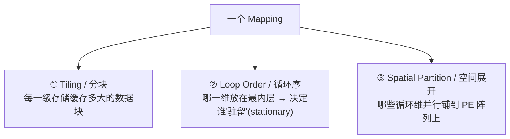
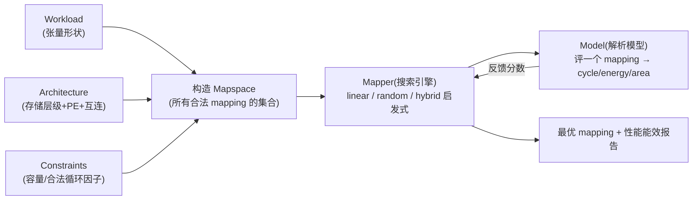
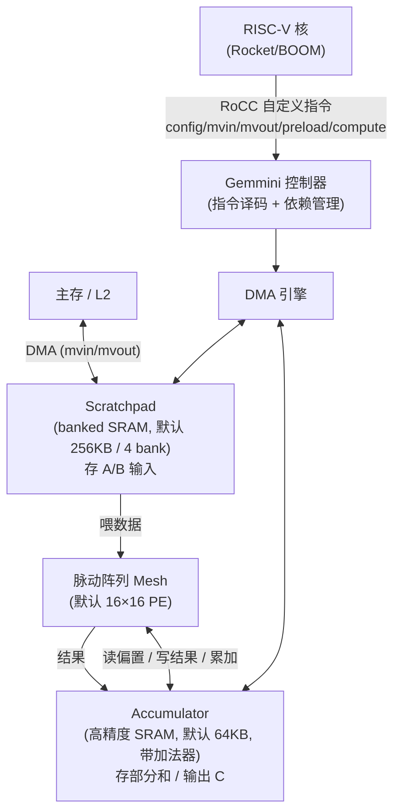
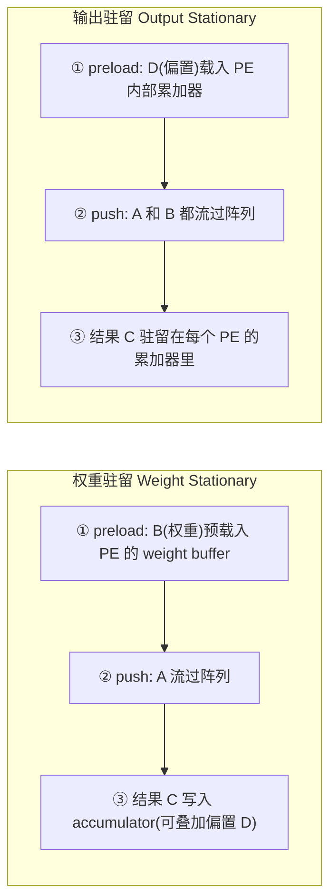

# Timeloop & Gemmini 论文精读笔记

> **为什么这两篇放一起读**：它们正好是 `npu-perf-sim` 的两根支柱。
>
> - **Gemmini** = 我的**硬件锚**。它是一个开源、可综合、跑得了 Linux 的真 RTL 加速器，论文给了真实 cycle/面积数字。我的仿真器"Gemmini 校准"这句话能不能站得住，全靠对它的理解程度。
> - **Timeloop** = 我的**方法论参照**。它证明了"纯解析（analytical）建模 + mapspace 搜索"这条路能把加速器评测做得又快又准。我的 analytical 引擎、以及阶段四的 tile-size 扫描（DSE），思想源头就是它。
>
> 读这两篇时，脑子里一直问一句话：**"这个东西在我的仿真器里，是 analytical 闭式能算的，还是必须 event 仲裁的？"** 这是我双引擎边界判定的练兵。

------

## 零、一句话速记

| 论文                 | 出处          | 一句话                                                       | 对我的角色             |
| -------------------- | ------------- | ------------------------------------------------------------ | ---------------------- |
| **Timeloop**         | ISPASS 2019   | 用统一的"循环嵌套"抽象描述加速器，纯解析地把一个 mapping 评成 energy/cycle，再用 mapper 搜出最优 mapping | analytical 引擎 + DSE 的范式 |
| **Accelergy**        | ICCAD 2019    | Timeloop 的能量搭档：给"每次动作"标价（每次 MAC、每次 SRAM 读写、每段 wire 传输的能耗） | 能量模型（我 MVP 暂不做） |
| **Gemmini**          | DAC 2021      | 一个全栈可综合的脉动阵列 GEMM 加速器**生成器**，RoCC 挂在 RISC-V 上，软硬协同 | 我的校准硬件 + IR 语义参照 |

------

# 第一部分：Timeloop

## 一、它到底解决什么问题

📌 **痛点**：每出一个新 DNN 加速器（Eyeriss、TPU、NVDLA……），评估它好不好，要么搭 RTL/cycle 模拟器（慢、贵、每个架构重写一遍），要么手推电子表格（不可复现、易错）。**没有一个统一、公平、快速的评测框架**。

📌 **Timeloop 的答案**：

1. 用一套**统一抽象**描述"一大类"加速器（存储层级 + 计算单元 + 互连），而不是为每个架构单独建模。
2. 给定 workload（一层 DNN 的张量形状）+ 架构 + 约束，**自动**找到最优的数据调度方式（mapping），并**解析地**报出 energy / cycle / area / 利用率。
3. 关键结论（论文 case study）：**dataflow 与 memory hierarchy 的协同设计，是能效的决定性因素**；而且没有任何单一架构能在所有 workload 上同时拿到最好的性能和能效（灵活性 vs 效率的权衡）。

> 🔑 **对我的启示**：Timeloop 这句"dataflow + memory hierarchy 协同是能效关键"，正是我阶段四杀手锏 Pass（double buffer / tiling）想用真实数字复现的命题。它在能量维度证明，我在 cycle 维度证明。

## 二、核心抽象：Loop Nest 与 Mapping 三要素

Timeloop 把一层卷积/矩阵乘看成一个**多重循环嵌套**（7 层卷积循环：N、K、C、P、Q、R、S）。**怎么把这个循环嵌套"摊"到硬件的存储层级和 PE 阵列上，就叫一个 mapping**。一个 mapping 由三件事唯一确定：



| 要素                  | 含义                                                         | 影响什么                                       |
| --------------------- | ------------------------------------------------------------ | ---------------------------------------------- |
| **① Tiling（分块）**  | 在每一级 buffer 上，把大循环切成"块"，决定每级缓存放多少数据 | 决定各级存储的容量需求与访问次数（数据复用量） |
| **② Loop Order（循环序）** | 每一级里哪个循环维在最内层迭代——最内层不变的那个张量就"驻留"在这一级 | 决定 **stationarity**（weight/output/input stationary 等数据流） |
| **③ Spatial（空间展开）** | 把某些循环维"展开"成空间维，分配到 PE 阵列的行/列上同时算   | 决定**并行度**与**空间复用**（multicast/广播/forwarding） |

> 📌 **时间复用 vs 空间复用**——Timeloop 的灵魂区分：
>
> - **时间复用（temporal reuse）**：一块数据放在某级 buffer 里，被后续多次迭代**反复读**，省下了对上一级存储的访问。← 由 tiling + loop order 决定。
> - **空间复用（spatial reuse）**：同一块数据在同一时刻被**广播/多播**给阵列里多个 PE。← 由 spatial partition 决定。

## 三、两大模块：Model + Mapper



- **Model（解析模型）**：给定**一个具体 mapping**，分析数据 tile 在各级存储间的流动，算出"每个组件被访问多少次"（arithmetic / memory / network 三类活动计数），再乘上单次代价，得到 energy / cycle / area。**它本身需要 mapper 喂给它一个 mapping 才能评。**
- **Mapper（搜索引擎）**：在 mapspace（所有合法分块/排序/展开的组合，可能上百万种）里搜，靠启发式（linear / random / hybrid）找最优或近优。
  - **优化目标可配**：一个有优先级的指标列表，如 `[cycles, energy]`（先最小化 cycle，再 energy）。
  - **终止条件**：mapspace 搜尽 / 有效 mapping 数达上限（`search-size`）/ 连续无效 mapping 超时 / 连续次优达到"胜利条件"。
  - **实务**：复杂设计别开 exhaustive，要用 constraints 把 mapspace 砍小，否则搜爆炸。

## 四、解析模型怎么算（这是我 analytical 引擎要抄的部分）

核心流程：**working-set 分析 → 活动计数 → 乘单价 → 出指标**。

1. **Working-set / 数据 tile 分析**：对每个 dataspace（input/weight/output），算出在每一级存储上一次驻留多大的 tile、被复用多少次。
2. **活动计数（access counts）**：由复用量反推——
   - 各级存储的**读/写次数**；
   - 网络上的 **multicast/广播/forwarding** 次数；
   - MAC 运算总数（这个固定 = 问题规模，与 mapping 无关）。
3. **乘单次代价**：
   - **能量** = Σ(各活动计数 × 单次能量)，单次能量来自 **Accelergy**（乘法器能量、各尺寸 SRAM 读写能量、单位距离 wire 能量……）。
   - **cycle** ≈ 由计算量与各级带宽/stall 推出（理想流水下 ≈ MAC 数 / 阵列吞吐，再叠加供数不足导致的停顿）。
   - **面积** = Σ(组件面积)。
4. **可被 cycle-level 模拟器/流片数据校准**，从而给出误差边界。

> 🔑 **直接搬进 npu-perf-sim 的思想**：
> "**先算 access count，再乘单价**"就是我 analytical 引擎的骨架。MAC array cycle、DMA 单次传输 cycle 都是这种**闭式公式**——给定 tile 形状直接算出来，不需要逐周期模拟。

## 五、Accelergy 是什么关系

- Timeloop 管"**算了多少次**"（access counts），Accelergy 管"**每次多少能量/面积**"（per-action energy/area）。
- Accelergy 提供 **Energy Reference Table**，支持用户自定义复杂组件，可插 CACTI/Aladdin 等技术模型估 SRAM/wire 代价。
- 常被合称 **Timeloop+Accelergy**。
- 📌 **我的边界**：MVP **不做能量**（perf-only），所以 Accelergy 这套我**只借思想不落地**。但简历八股可以讲清楚"为什么 perf-only 仍有价值 + 加能量需要 Accelergy 这层"。

## 六、Timeloop 的局限 → 正是我加 event 引擎的理由

📌 **Timeloop 是纯 analytical 的**，它的强项也是它的盲区：

| Timeloop 假设/盲区                                  | 现实里会出问题的地方                            | 我的 event 引擎来补                          |
| --------------------------------------------------- | ----------------------------------------------- | -------------------------------------------- |
| 各级带宽"理想供数"，stall 用解析近似                | SRAM **bank conflict** 导致的真实排队           | event 仲裁 bank 端口                         |
| DMA 与 compute 的重叠程度靠公式估                   | **double buffer** 切换时机、能否真的掩盖延迟    | event 里两个 buffer 状态机 + 依赖触发        |
| 不显式建模"资源在某时刻被谁占用"                    | DMA channel 与 compute 抢**端口/总线**          | event 里 Resource 占用 + 释放                |
| 一次评一个静态 mapping，不含动态依赖                | op 之间的**真实时序依赖**链                     | event 队列按依赖图拓扑推进                   |

> 🔑 **这就是我对 MAESTRO/Timeloop 的差异化卖点**：它们是**纯解析**；我是 **event + analytical 混合**——闭式能算的归 analytical（快），有外部仲裁/决策点的归 event（准）。**边界判定原则**：有外部仲裁/竞争/决策 → event；闭式可算 → analytical。

------

# 第二部分：Gemmini

## 一、全栈定位

📌 **Gemmini 不是"一个芯片"，是一个"生成器（generator）"**：

- **Chisel** 写的、参数化的硬件**生成器**，是 **Chipyard** 生态的一部分。
- 产物不止 RTL，还有**配套调优好的软件栈**（C 库 + ONNX push-button 流程），软硬协同。
- 作为 **RoCC 加速器**（Rocket Custom Coprocessor）挂在 **RISC-V** Rocket/BOOM 核上，通过自定义 RISC-V 指令驱动；默认经 System Bus 直连 L2，进入 cache-coherent 的 TileLink 总线。
- 论文核心贡献：让"系统性地评估 DL 架构"成为可能——改几个参数就能生成不同设计点，跑全 SoC（带 Linux）、做端到端 ResNet-50 这种真负载。

## 二、架构总览



### 两级空间层级：Tile 与 Mesh

- 阵列是 **2 级层级**：`tile` = 一组**纯组合逻辑**的 PE；`mesh` = 一堆 tile，**tile 之间有流水寄存器**。
- 参数：`tileRows / tileColumns`（tile 内 PE 数）、`meshRows / meshColumns`（tile 的网格）。默认整体 **16×16**。
- 每个 PE 一个 MAC。`pe_latency` 参数：若数据类型一个周期内做不完 MAC（如浮点），可在 PE 内插移位寄存器。

### 两块私有 SRAM：Scratchpad 与 Accumulator

| 存储            | 默认容量      | 精度/特点                                                    | 放什么                       |
| --------------- | ------------- | ----------------------------------------------------------- | ---------------------------- |
| **Scratchpad**  | 256 KB / 4 bank | 与 `inputType` 同宽，row width = `16 × bits(inputType)` = 128 bit（默认 int8） | 输入 A、权重 B               |
| **Accumulator** | 64 KB         | **更宽精度** `accType`（如 int32），带**加法器单元**可就地累加；row width = `16 × bits(accType)` = 512 bit | 部分和、偏置 D、输出 C       |

> 📌 为什么要单独一块高精度 accumulator：脉动阵列做完一个 K-tile 只是**部分和**，多个 K-tile 要累加；累加用低精度会溢出/掉精度，所以单独一块 32-bit SRAM + 加法器。WS 模式下尤其依赖它来攒部分和。DMA 也能直接在 accumulator 与主存间搬（常用于 load 偏置）。

## 三、两种 Dataflow：WS vs OS（必须背熟）

Gemmini 默认**同时支持** OS 和 WS，**运行时**由程序选（也可在 elaboration 时硬化成单一）。



| 维度          | Weight Stationary (WS)                              | Output Stationary (OS)                          |
| ------------- | -------------------------------------------------- | ----------------------------------------------- |
| **谁驻留**    | 权重 B 预载进 PE 的 weight buffer，不动             | 输出 C 的部分和驻留在每个 PE 内部累加器          |
| **preload 什么** | B（权重）                                           | D（偏置，进 PE 累加器）                          |
| **push 什么** | A 流过阵列                                          | A 和 B 都流过阵列                                |
| **结果落点**  | 写到外部 **accumulator** SRAM（依赖它攒部分和）     | 留在 PE 内累加器，算完再搬出                      |
| **省什么**    | 省权重的反复加载（权重复用多时好）                  | 省部分和的搬进搬出（输出复用/累加深时好）         |

> 📌 论文里 WS 通常更省（特定 workload 下），但二者各有适用面——这正好印证 Timeloop 的"没有单一最优 dataflow"。

## 四、指令集（RoCC 自定义指令）—— 我的 IR 语义参照

一次 GEMM 的典型指令序列（显式数据搬运，软件全管）：

```
config_*          # 配置 dataflow / 数据类型 / 激活 / stride 等
mvin   DRAM→SP    # 把 A、B 从主存搬进 scratchpad（DMA）
mvin   DRAM→ACC   # 把偏置 D 搬进 accumulator（可选）
preload           # 把权重(WS)或偏置(OS)载入阵列
compute           # 把 A(、B) 推过阵列，结果进 accumulator/PE
mvout  ACC→DRAM   # 把结果 C 从 accumulator 搬回主存（DMA）
```

> 🔑 **直接对应我的 `my_npu` dialect**：`dma_load`(=mvin) / `mac`(=preload+compute) / `dma_store`(=mvout)。Gemmini 的指令粒度就是我 dialect op 粒度的现成参照——阶段四 Sprint 2 设计 TableGen 时照着抄语义即可。

## 五、Tiled MatMul 执行流程

阵列一次只算 `DIM×DIM`（默认 16×16）的小块，大矩阵乘由**软件循环 tile**：

- 把 `M×N×K` 的大 GEMM 切成 `⌈M/16⌉ × ⌈N/16⌉ × ⌈K/16⌉` 个 tile-matmul。
- K 方向的多个 tile 结果在 **accumulator** 里累加。
- 卷积通过 **im2col** 转成 GEMM；支持虚存（本地 TLB）。
- 软件库负责选 tile 大小、保证 scratchpad/accumulator 放得下——**这正是我 tile-size 扫描脚本（DSE）要扫的旋钮**。

## 六、默认配置 = 我的校准锚点

| 参数            | 默认值                | 我的 sim 对齐值                |
| --------------- | --------------------- | ------------------------------ |
| 脉动阵列        | **16×16**             | `DIM = 16`                     |
| dataflow        | WS + OS（runtime 选） | MVP 先做一种（建议 WS）        |
| scratchpad      | **256 KB，4 banks**   | `SP_CAPACITY=256KB, banks=4`   |
| accumulator     | **64 KB**（高精度）   | 单独高精度 buffer 建模         |
| inputType       | int8（默认）          | 我先做 fp16/ int8 之一         |
| accType         | int32                 | 部分和精度                     |
| scratchpad row  | `16×bits(inputType)`=128 bit | 决定一次 bank 读吐多少数据 |
| accumulator row | `16×bits(accType)`=512 bit   | 决定写回带宽               |
| 挂载            | RoCC on Rocket/BOOM   | （我不建模 host，只建模加速器）|

> 📌 论文第二个评测点是 **32×32 阵列 + 512KB scratchpad + 128KB accumulator**——如果我想展示"扫架构规模"，这是第二个锚点。

------

# 第三部分：把两篇映射进 npu-perf-sim（最重要的一节）

## 一、双引擎职责划分（边界判定实战）

| 现象/量                          | analytical 还是 event？ | 理由（闭式可算 vs 有仲裁）                       |
| -------------------------------- | ----------------------- | ----------------------------------------------- |
| 单个 16×16 tile-matmul 的 cycle  | **analytical**          | 给定 DIM 与 tile 形状，脉动阵列填充+稳态是闭式   |
| 单次 DMA 传输 cycle              | **analytical**          | `bytes / 带宽 + 启动延迟`，闭式                 |
| 总 MAC 数 / 理论利用率上限       | **analytical**          | = 问题规模 / 阵列吞吐                            |
| SRAM **bank conflict** 排队      | **event**               | 多请求争同一 bank，需要仲裁                      |
| **double buffer** 切换 / 重叠    | **event**               | 依赖"DMA 完成"事件触发，动态                     |
| DMA channel 与 compute 抢端口    | **event**               | 资源占用/释放，需仲裁                            |
| op 间依赖链总时长                | **event**               | 依赖图拓扑推进                                   |

## 二、analytical 引擎的两条闭式公式（Sprint 1 Week 2 要落地）

📌 **MAC array cycle（脉动阵列，一个 `DIM×DIM` tile）**：

$$
\text{cycles}_{\text{tile}} \approx \underbrace{2 \cdot DIM}_{\text{填充+排空(流水延迟)}} + \underbrace{K_{\text{tile}}}_{\text{稳态推数}}
$$

整个 GEMM：

$$
\text{cycles}_{\text{compute}} \approx \left\lceil \tfrac{M}{DIM} \right\rceil \cdot \left\lceil \tfrac{N}{DIM} \right\rceil \cdot \left(2 \cdot DIM + K\right)
$$

> 当 $K \gg DIM$ 时，填充开销被摊薄，利用率趋近理论上限——这正是我画 Roofline 时"为什么大 K 更接近 peak"的解释。

📌 **DMA 单次传输 cycle**：

$$
\text{cycles}_{\text{dma}} \approx L_{\text{setup}} + \left\lceil \frac{\text{bytes}}{W_{\text{bus}}} \right\rceil
$$

其中 $W_{\text{bus}}$ = 每周期总线字节宽度（与 scratchpad row width 对齐，如 128 bit = 16 B/cycle），$L_{\text{setup}}$ = DMA 启动/握手延迟。

## 三、event 引擎要建模的仲裁点（Sprint 1 Week 4 落地）

- **Resource 抽象**：scratchpad 的每个 bank、accumulator、DMA channel、compute 阵列，各是一个可被占用/释放的 Resource。
- **Event 抽象**：`dma_load_done`、`mac_done`、`dma_store_done`，进优先队列（堆，按完成时刻排）。
- **double buffer 状态机**：buffer0 在算时 buffer1 在 load；compute 事件完成才允许切换——重叠成功则 `总cycle ≈ max(DMA, compute)` 而非 `DMA + compute`，这正是杀手锏 Pass 要用数字证明的收益。
- **bank conflict**：两个请求同一 bank → 后者排队，体现在 event 时间线上的 stall。

## 四、Gemmini 校准清单（写进 `gemmini-as-reference.md`）

1. `DIM=16`、scratchpad `256KB/4 bank`、accumulator `64KB`，作为默认硬件参数。
2. 指令粒度按 `config/mvin/preload/compute/mvout` 对齐我的 `my_npu` op。
3. 选一个论文里有数字的 case（如某 ResNet 层或 16×16 配置的某 GEMM），让我的 sim 跑出的 cycle 与之**同数量级**——这就是"Gemmini 校准让数字有锚"的落地动作。
4. 数据类型先锁一种（建议先 int8 对齐默认，或 fp16 对齐编译器侧），避免精度旋钮发散。

## 五、差异化卖点（阶段五八股 / README 第一段）

| 对比对象      | 它们是                    | 我是                                            |
| ------------- | ------------------------- | ----------------------------------------------- |
| **Timeloop**  | 纯 analytical + mapspace 搜索，偏能效 | event+analytical 混合，建模真实仲裁/重叠，perf-only 但带动态时序 |
| **MAESTRO**   | 纯解析 dataflow 分析       | 我有 event 队列，能反映 bank/端口/double buffer |
| **Gemmini**   | 真 RTL，慢、要综合         | 我吃 MLIR IR、秒级出 cycle，**MLIR-native**     |

> 🔑 一句话定位（README 固定写法）：*A perf-only, event+analytical hybrid simulator for tensor accelerators, MLIR-native, Gemmini-calibrated.*

------

## 附：术语速查

| 术语                     | 含义                                                         |
| ------------------------ | ------------------------------------------------------------ |
| **Mapping**              | 一层 workload 在硬件上的调度方案 = tiling + loop order + spatial |
| **Mapspace**             | 所有合法 mapping 的集合（搜索空间）                          |
| **Stationarity / Dataflow** | 哪个张量"驻留"在阵列/buffer 里不动（WS/OS/RS/IS）            |
| **Temporal reuse**       | 数据在 buffer 里被多次迭代复用（省上级访问）                 |
| **Spatial reuse**        | 数据同时多播给多个 PE                                        |
| **Systolic array / Mesh** | 脉动阵列：数据"波"一样流过 PE 网格，节拍推进                  |
| **Scratchpad**           | 软件显式管理的私有 SRAM（存输入/权重）                       |
| **Accumulator**          | 高精度带加法器的 SRAM（攒部分和/输出）                       |
| **RoCC**                 | Rocket Custom Coprocessor 接口，挂自定义加速器到 RISC-V       |
| **mvin / mvout**         | Gemmini DMA 搬入/搬出指令                                    |
| **im2col**               | 把卷积展开成矩阵乘的变换                                     |
| **EDDO**                 | Explicitly-Decoupled Data Orchestration，Timeloop 建模的架构类别 |

------

## 论文出处

- **Timeloop**: A. Parashar et al., *"Timeloop: A Systematic Approach to DNN Accelerator Evaluation,"* ISPASS 2019. ([pdf](https://accelergy.mit.edu/timeloop.pdf) · [project](https://timeloop.csail.mit.edu/))
- **Accelergy**: Y. N. Wu, J. S. Emer, V. Sze, *"Accelergy: An Architecture-Level Energy Estimation Methodology for Accelerator Designs,"* ICCAD 2019.
- **Gemmini**: H. Genc et al., *"Gemmini: Enabling Systematic Deep-Learning Architecture Evaluation via Full-Stack Integration,"* DAC 2021. ([pdf](https://people.eecs.berkeley.edu/~ysshao/assets/papers/genc2021-dac.pdf) · [docs](https://chipyard.readthedocs.io/en/1.5.0/Generators/Gemmini.html) · [repo](https://github.com/ucb-bar/gemmini))
