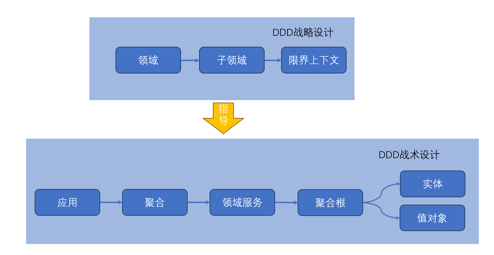
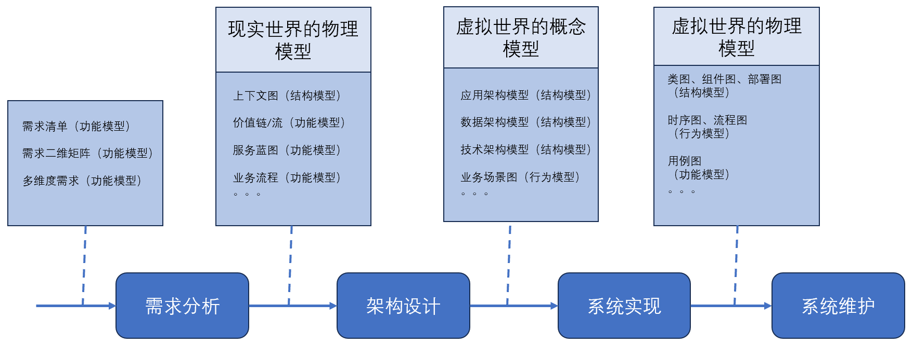
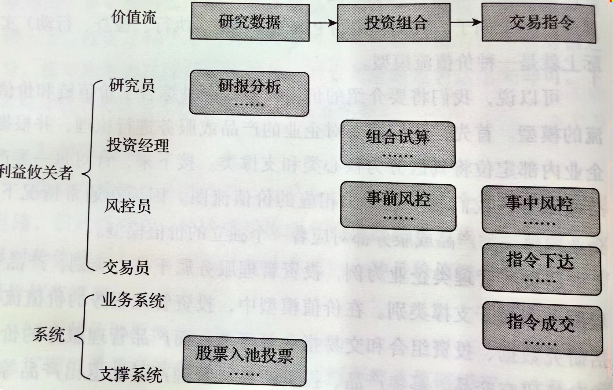
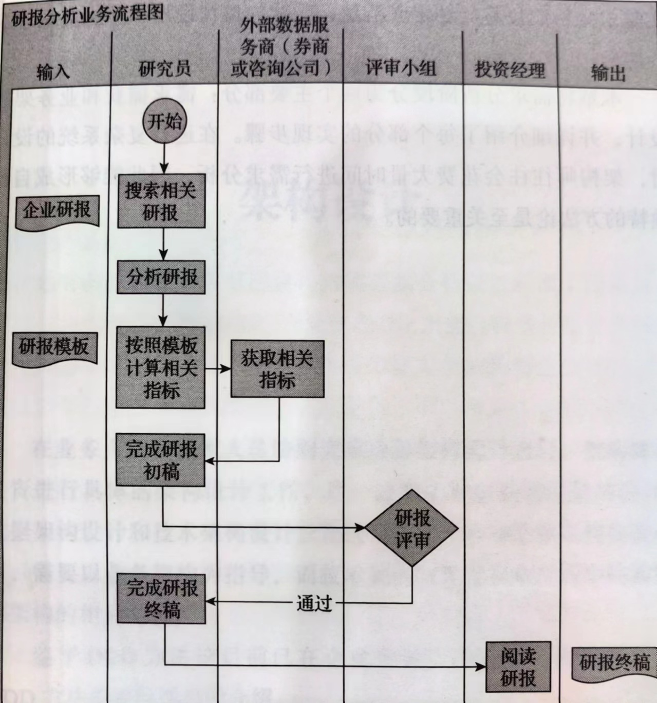
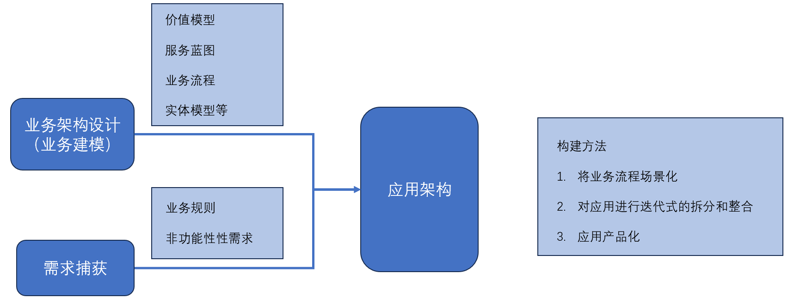
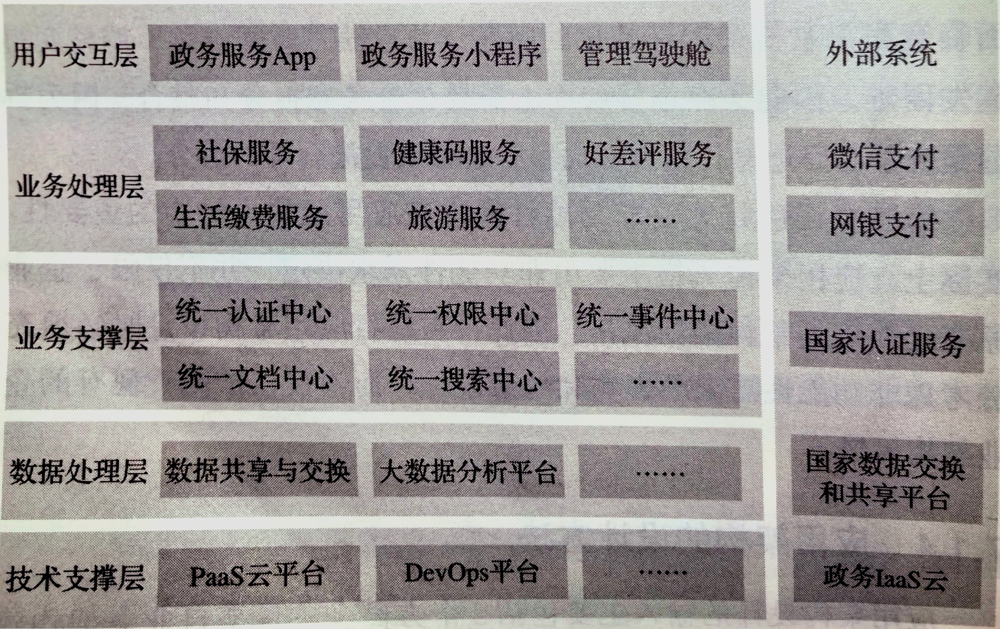
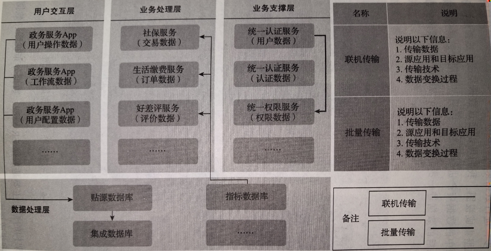
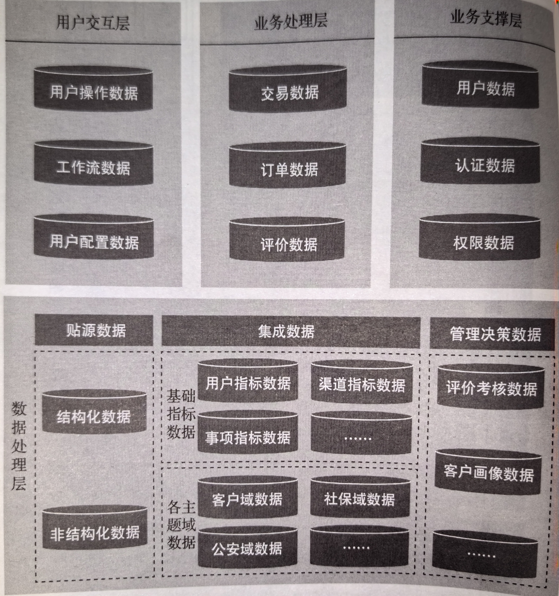
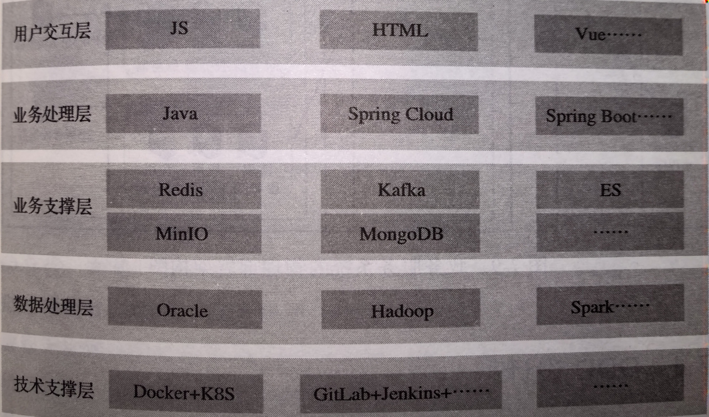
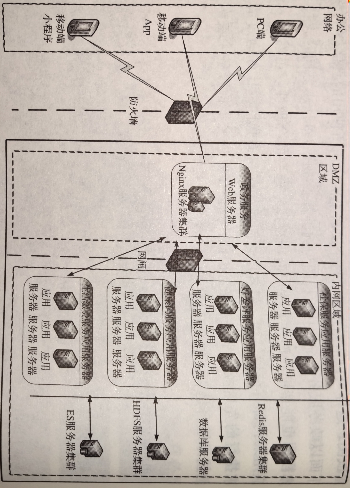

# 一、概述

## 1.1 架构知识模型

系统都有三要素：

1. 功能或者目标，说明了系统需要干什么，解决一个什么样的需求。
2. 元素，说明了系统由什么组成。
3. 关系，说明了元素之间的关系。

总之，就是做什么（目标），是什么（元素），怎么做（关系）。

进一步，架构的知识模型可以分成三个组成：

1. 信息交换，也就是需求获取的进一步深化，在架构设计的各个阶段，需求的获取会映射到业务模型、应用模型、数据模型、技术模型、类图模型、活动模型等，它是一个需要多方充分沟通才能获取得到的结果。

2. 架构的编排：类似于社会组织的“实体+规则”的运转核心。架构编排也可以被描述成“架构元素+架构规则”。这里的元素可以能是应用、服务器节点、限界上下文、类等等。规则则是负责将多个元素有序的编排在一起组合成一个软件组件或者解决一个具体的复杂问题。

   ​	比如在DDD中，多个限界上下文按照规则编排会形成某个领域或者子领域；多个应用按照规则编排会形成应用框架的分层视图；多个服务器节点按照一定规则编排起来就可以实现高并发、高可用；多个类编排在一起就是形成了模块或者DDD中的聚合等。

3. 架构的演进：不同上面两类只在某个时间节点起作用的相对静态的知识领域，还有一类动态的知识领域，这类知识领域通常需要跨越时间周期才能发挥作用，比如：敏捷、DevOps、持续集成、持续交付、迭代、重构、系统或者模型的演进等。

站在客户的角度：需求的获取直接决定了功能符合预期，架构的编排意味着降本增效，架构的演进则决定了需求的变更的快速反应。

## 1.2 架构的落地方式

 目前比较流行的架构落地方法论：面向对象的RUP、面向领域的DDD和企业架构框架TOGAF。

1. RUP

   它是面向对象的软件开发方法，主要包括了4个阶段（初始、细化、构造、移交）、9个核心工作流程（商业建模、需求、分析和设计、实现、测试、部署、配置和变更管理、项目管理、环境）。它融合了现代软件开发中的许多最佳实践，例如迭代开发、需求管理、构件使用、UML等，它是一个完整的指导过程、缺点在于用例驱动，在解决负责系统的开发上表现不佳。

   

2. DDD

   它的优点在于是以领域领域的软件开发，可以解决复杂系统的开发。组成上分成战略设计和战术设计。

   

   它也有一些缺点：

   ​	a. 重设计、轻过程。战略和战术设计通过概念串联、没有像RUP那样提供一个完整的过程指导。

   ​	b. 重概念、轻规则。它提出了许多有用的概念，例如领域、子领域、限界上下文、聚合根等，但在实践中缺乏明确的步骤和规则来推导出或者应用这些概念。

   ​	c. 重现在、轻过往。DDD难以掌握的根源在于，没能与面向对象建立关联，导致过往经验无法重用。

   

3. TOGAF

​	它是业界知名的企业架构框架，提供了一种专门用于企业架构的标准流程--架构开发方法ADM是他的核心。目前，国内大多数金融企业的架构方法均出于TOGAF。优点在于提供了一个完整全面的架构设计原则和过程，缺点就是过于理论化，难以落地。

## 1.3 架构的思维模式

简单点说，思维模式就是思考问题所处的层级。架构师需要在不同的思维层级上进行灵活的切换，以便重各个角度去加深对问题的理解。

分成三层：

1. 专业层：指架构师能够利用架构专业或领域提供的规则，去解决架构设计问题。比如DDD、面向对象、应用架构、数据架构以及中间件技术等。
2. 模型层：能投通过抽象出来的模型或者模式解决同一类架构设计问题，比如上面说到的架构知识模型，以及后面会提到的价值模型、企业模型、TOGAF双飞轮模型等。
3. 本质层：借助底层是为模式来洞察架构问题的本质，并运用跨学科知识综合解决问题。

架构的难点不是技术层面，而在于理解业务的本质，并把业务问题和最合适的技术进行匹配。技术只是问题界定后使用的工具，最欠缺的是对问题的界定和对业务的整体性认知。

 ## 1.4 架构认知框架

以上三方面可以有机的结合，分别描述了架构的不同方面。从架构落地上说，一个系统的落成包括了需求分析、架构设计、系统实现和系统维护四个阶段，每个阶段都可以使用架构知识模型来描述，也就是分成三个方面：信息交换、编排、演进。比如对于系统实现阶段，它的信息交互可以概况成详细设计模型和代码等，架构编排包括代码元素和规则，架构演进则特指代码演进。而架构思维模式则更是自然而然的应用在各个阶段中。

## 1.5 编程与架构的关系-- 微观与宏观的关系

​	他们都可以归纳为信息交换+编排+演进。信息交换方面，架构关注的是系统维护需求，编程关注的是模块维护需求。在编排上，架构关注的是将子系统或者微服务有序的组织起来实现业务功能，编程关注的是将各个模块或者类有序的组织起来以实现技术功能或某一局部的业务功能。在演进上，他们的来源都是需求变更，只是架构关注整体层面，而代码关注代码层面。所以架构关注宏观层面，编程关注微观层面。

​	他们的知识模型具有相似性，使用的规则基本一致，比如高内聚低耦合。此外对于看似不相干的规则上，他们的底层规则其实也一样，比如代码开发中的MVC和架构规则中的应用分层，本质上都是还原论思想的应用；代码开发规则中的异步响应请求和架构中的CAP原理本质上都是升维模式的应用。

# 二、架构知识模型-信息交换

本质上说，信息交换是在架构设计的不同阶段对系统的理解，通常这种理解是通过多方沟通之后以模型的方式呈现出来。所以它的**核心是模型**。

## 2.1. 系统描述的三个维度

系统可以由功能维度（干什么），结构维度（是什么），行为维度（怎么干）来描述。

1. **功能维度**

​	可以进一步分成两类：外部功能和内部功能。在架构设计的落地过程中，不同的阶段需要关注的功能维度不一样，通过内外部功能的区分，能够让我们屏蔽一些不必要的因素，关注当前阶段的主要矛盾点。

​	外部功能决定了系统能带来的价值。比如一个汽车能载客、载物，这就是汽车的外部功能

​	内部功能则支撑外部功能的实现。比如一个满足汽车载客载物的功能，一个汽车需要使用发动机来加速，方向盘来转向，后备箱来储物等。所以内部功能的编排直接影响了外部功能的最终效果。

2. **结构维度**

​	它从静态的角度描述了系统中包含的各个实体，比如一个电商系统的结构通常包括了订单、支付、购物车、物流等实体，汽车的结构包括了方向盘、轮胎、发动机等实体。通常在一段时间内结构都是静态的，体现了系统的样貌或形态。

​	系统的结构和功能之间是密不可分的。不管结构是实体的还是虚拟的，功能都需要结构来支撑；反过来，结构需要通过功能的实现来体现价值。

3. **行为维度**

​	一个系统发挥其外部或者内部功能，需要通过一个行为体的介入，行为体的操作需要结构实体的参与，形成一个任务链路。这些链路串联起来就构建了一个行为。所以行为维度把功能维度和结构维度串联起来了，它需要进一步描述如何在结构维度的施加动作来满足功能维度的需求。

## 2.2. 系统模型的分类

​	模型存在的目的是帮助我们更好的理解系统，大多数情况下，模型只表达了系统在某一个视角下的形态，而屏蔽了其他视角。这样做的好处是让人聚焦于当下要解决的问题的范围，如果都关注那么反倒模型会失去它的价值。举个例子：架构师会把软件系统看作一组子系统之间交互关系的组合；程序员倾向于把软件系统堪称是代码和各种API的组合；运维人员则会倾向于把软件系统看成各个服务节点之间的组合。他们角色不同，看问题的方式也不同，得到的模型也就不同。

### 2.2.1. 存在角度的分类

1. 概念模型

   这类模型是只在想象中的抽象概念。比如架构设计中所绘制的价值模型、数据ER模型等，这些模型在现实或者虚拟世界中都不存在任何可见形式。

2. 物理模型

   这类模型都是存在的，比如汽车的仿真模型，敏捷开发的MVP（最小产品集），一张数据库物理表。

两类模型相互支撑共同完成对软件的设计和研发过程。比如：一个电商系统就是将现实世界中的商场、人、商品、物流等元素在虚拟世界中重建出来。通常先会对现实世界进行建模，建模的过程就形成了现实世界的物理模型，接下来就会将这个物理模型转换成计算机系统的概念模型（比如价值模型、数据ER模型等），最后使用计算机语言工具将概念模型落地为软件系统中的物理模型（比如一个MVP，数据库上的物理表等）。

### 2.2.2. 系统描述角度的分类

​	这也就是第1节提到的系统的维度划分：功能模型、结构模型、行为模型。UML就是支撑这些建模的集大成者，其中用例图描述了功能模型；类图、组件图和部署图描述了结构模型；时序图、活动图则描述了行为模型。

## 3. 架构落地方法中的系统模型

需求分析所产生的结构模型-上下文图可以用于界定系统的范围和边界，价值链\流、服务蓝图和业务流程可以帮助我们划分领域、子领域、微服务和数据实体等。

# 三、架构知识模型-架构编排

## 3.1 架构编排

指某一类别的架构知识。比如微服务、DDD、PaaS等均属于某一类架构形式。随着技术的发展，陆续涌现出了很多的架构知识。他们都可以使用元素和规则这个二元组来描述。

- 语言形态方法，经理了面向过程、面向对象、面向函数等不同形态；
- 服务形态方面，我们经历了单体、SOA再到微服务的转变；
- 在平台方面，出现了IaaS、PaaS、SaaS和中台等不同类型的平台；
- 模型方面，陆续涌现出DFD、用例图、类图、时序图，和业务架构中的价值链、价值流、业务流、服务蓝图等；
- 架构方法方面，从最初的RUP到业务架构、应用架构、数据架构和技术架构、DDD、TOGAF等；
- 中间件方面，陆续涌现出数据库中间件、消息中间件、大数据中间件等。

**a.  架构元素**

​	元素的类型：指某一种架构编排形式是由哪些元素组成。比如微服务包括了服务、注册中心、配置中心、网关等。

​	元素的规模：在单体架时代，整个系统运行的代码可以被打包在一个文件中部署，到了微服务时代，一个复杂系统所需要的微服务数量可能高达成千上万个。

**b. 架构规则**

​	规则是将所有元素有序融合的方法。比如拿SOA和微服务来说，SOA对各种服之间的通信规则做出了明确的规约，而微服务在各服务之间则放开了通信协议的限制，这也是微服务能够支撑复杂系统的规模性增长的主要原因。再比如面向过程与面向对象，面向过程中的规则不外乎就是调用与反调用，面向对象中的规则则要复杂得多，比如组合、聚合、依赖、关联、继承。

时间规则：比如RUP的四个阶段、DDD中的战略与战术设计、TOGAF中ADM方法，这些都是按照时间来串联的。

空间规则：比如IaaS、PaaS、SaaS等平台都蕴含了与业务逻辑的远近关系；应用架构中由分层；DDD设有领域、子领域、限界上下文、聚合的分层等。

## 3.2 系统模型的架构编排

1. 功能模型

   对于外部功能来说，它的组成元素是系统和客户，他们之间的关系就是系统给客户提供了什么样的功能。内部功能中架构元素是一个过程，通常是“动词”+“名词”的形式。元素之间的关系主要依赖对象、数据、控制变量等的传递。比如对于汽车加速（外部功能）对应的内部功能就是 “**踩中油门**”  “控制指令”  “**加速转动发动机**” “”控制指令“ ”**驱动轮胎**“。

2. 结构模型

   结构模型描述了系统”是什么“。架构元素常常使用一个名词来表示，规则则表示一种连接关系或者空间拓扑关系。比如应用交互关系图是一种结构模型，它的元素是应用，通过连接关系表示了应用之间的数据流动或者交互接口。还比如类图、部署图都可以使用类似的思路去完成架构编排。

3. 行为模型

   行为模型的架构元素一般包含了两类：一类是行为的发起者，称为行为体；一类是实体，包括系统、角色、对象。实体之间通过动作建立关系，而多个动作和相应的实体按照先后顺序串联起来，就形成了行为模型。

  # 四、架构知识模型-架构演进

## 4.1 敏捷的本质

敏捷是一组价值观和原则，而不是某一个种具体的方法论、过程或者方法。Scrum、XP都是具体的敏捷方法论。

**个体和互动**高于**流程和工具**

**可工作的软件**高于**详尽的文档**

**客户合作**高于**合同谈判**

**响应变化**高于**遵循计划**

 Scrum的核心思想是通过原型优先、迭代式开发、自组织团队、持续集成、透明化过程的方式来提高软件开发的质量和效率。

它是通过”反馈“、 ”持续“、”迭代“等理念展开，敏捷本质上是一种”负反馈调节的方式“。

## 4.2 DevOps的本质

DevOps是以中国重视”软件开发人员“和”IT运维技术人员“之间的沟通合作的文化、运动和惯例。通过自动化“软件交付”和“架构变更”的流程，使得构建、测试、发布软件能够更快捷、更频繁和可靠。体现了“研发运营一体化”的思想。

国内权威机构中国信息通信研究院把DevOps划分为配置管理、构建与持续集成、测试管理、部署和发布管理、环境管理、数据管理以及度量与反馈七大能力域。

其围绕这个一个中心点展开，那就是最大限度的消除业务、研发、测试、运维等各个阶段的信息不对称。比如在DevOps种倡导一包到底的原则，实际上是强制消除了交付介质在不同阶段的信息差异；再比如PaaS平台引入了镜像概念消除了开发环境和生产环境不兼容的问题；自动化流水线可以用来消除人工操作，打通上下游工具链，让数据能够流通起来，通过数据的整合尽可能发挥其价值。

## 4.3 敏捷和DevOps的关系

​	DevOps是敏捷的延伸，它进一步涵盖了运维阶段，同时也提供了工具能力上的延伸，作为对人员能力的补充或代替。敏捷是DevOps的内核之一，DevOps的一个重要目标是通过缩短项目迭代周期来实现业务快速上线，敏捷是业务快速上线的重要保证。

​	敏捷强调人与人之间的编排、DevOps则强调工具和工具之间的编排。

# 五、架构落地方法 - 需求分析

## 5.1 需求捕获

需求捕获是指在系统确定要建设之后，架构师与系统的利益攸关方进行多方沟通捕获需求的过程。分成下面七个步骤来进行。

1. **明确系统业务目标**

   ​	首先要去顶业务目标，明确给客户带来的价值；其次是明确系统需要提供的功能；再次是尽量通过数据来支撑业务目标。比如电商秒杀系统的业务目标可以描述如下：为给客户带来卓越的购物体验，需要开发一个秒杀系统，在双11期间给客户提供商品的秒杀功能，预计在秒杀高峰期间，并发用户约为500万人。

2. **识别系统分类**

   ​	在确定了系统业务目标后，需要对系统进行分类。大致有4种类型：

   - 用户交互类系统，作为与用户交互的窗口，功能上要关注如下几个方面：
     - 用户体验：需要适合当下技术与社会潮流，通过智能交互、定制体验、用户行为分析、及时反馈等手段为客户提供好的用户体验
     - 流程整合：从用户视角出发，整合后端产品和服务，提供端到端集成的线上服务流程。
     - 渠道整合：在全渠道用户价值交付视角下，提供全渠道服务整合以及跨渠道协同能力，确保产品和服务具备一致性而且能无缝衔接。
     - 客户唯一性：为未来建立客户画像以及大数据分析做准备工作。
   - 业务处理类系统，提供业务处理能力，实现企业对外的专业服务能力，功能上要关注：
     - 流程分析：通过流程的拆分和聚合来识别组件化、模块化的企业级处理能力。
     - 领域建模：通过流程的拆分和聚合进行核心业务的领域建模，将核心资产以模型的方式留存和传递。
     - 数据规集：核心业务产生的数据具有重要的业务价值。
   - 数据分析类系统，用于提供决策支持能力，功能上关注：
     - 决策场景，明确哪些角色在什么场合使用该系统
     - 报表类型，在不同的决策场景下提供成本合理且使用的报表类型。
     - 分析工具：搭建一个企业级统一平台以节约资源。
   - 后台支持类型，比如涉及OA办公、财务、人力等系统，关注工作流程。

3. **分析需求组成**

   - 需求是分层的

     通常可以将需求划分为业务需求、用户需求和系统需求三类。业务需求是外部需求，指投资方要达到的业务目标、预期投资和工期要求等；用户需求指用户希望能够提供的功能；系统需求是内部需求，通常由外部需求推到出来，是系统要实现的功能范围；

   - 需求内部还有不同构成

     ​	需求由三种需求构成，包括功能性需求（系统能做什么？）非功能性需求（描述系统如何更好的完成前面提到的功能）约束条件（需要在什么条件下去实现这些功能性和非功能性需求）。

     ​	非功能性需求会很大程度上影响系统的架构设计（而功能性需求不会），从系统所处的阶段，分成开发期需求（易理解、高可重用、可测试、可拓展、可维护、可移植性）和运行期需求（高性能、安全性、高可用、易用性、可伸缩性、可操作性、可靠性、鲁棒性、可监控性、运营指标可获取性等）。

     ​	约束条件包括业务环境因素（来自客户的约束，比如预算限制、上线要求、集成要求、业务限制、法律法规、专利限制等）使用环境因素（来自用户的约束，比如年龄、偏好、国家使用后环境、软硬件环境等）构建因素（来自开发和运维人员的约束，如开发者水平，管理者水平）技术环境因素（来自技术平台、中间件、编程语言、技术发展趋势）。

4. **获取利益攸关者的需求**

5. **划分优先级**

   

6. **区分变与不变的需求**

7. **输出需求说明书**

## 5.2 业务架构设计

​	业务架构设计是在完成需求捕获之后对需求进行业务建模的过程，以便更好的知道后续的应用架构、数据架构和技术架构。它与需求捕获以及后续架构设计的关系如下所示：

​	业务架构的定义：利用业务和技术都能理解的概念模型把企业的战略意图表达出来，指导后续软件系统的建设，从而保证软件系统能真正的为企业战略提供整体性服务。

### 5.2.1 业务架构设计的核心关注点

- 关注正确的问题。这样做的目的是保证将资源投入到正确的地方，至于系统应该分成多少个应用、如何建设是这个阶段不关心的问题。
- 关注功能性需求。因为系统架构与功能性需求是正交的，而非功能性需求则会影响到系统的架构设计。在这个阶段我们应该不关注系统架构设计的问题。
- 视角必然是企业整体层面，而非业务部门或者业务线层面。

### 5.2.2 业务架构的设计方法

- [ ] **价值模型**

  1. 价值链模型：把企业的活动都分成了基本活动和辅助活动。

     

  2. 价值流模型：它是功能模型的一个特例，用于体现对客户的价值部分。比如常见的PDCA（计划、执行、检查、行动）就是一种价值流模型。

- [ ] **服务蓝图**

  ​	服务蓝图是进一步将价值流模型展开，加入最终实现这些价值所需要的实体，这些实体可能包括人员、生产机器、工具和软件系统。每个实体都要提供相关的业务功能。比如下图是对投资管理服务的服务蓝图实例

  

- [ ] **业务流程图**

  ​	业务流图则是对服务蓝图中业务功能的展开描述。比如如下是上个服务蓝图示例中研报分析的示例。

  

- [ ] **领域模型**

# 六、架构设计

## 6.1 应用架构设计

​	业务架构建模明确了系统的边界、功能、价值；业务流程、业务实体和业务规则，接下来应用架构关注的就是如何将该系统落地，需要考虑的是应该拆分成多少个应用以及应用间如何交互来实现整个系统的功能，最终实现低成本、高效率的软件系统落地。

### 6.1.1 核心关注点

​	仅有应用拆分和整合都不足以实现成功的应用架构设计，应用架构真正的核心应该是编排能力，而拆分和整合只是其中的手段。

### 6.1.2 拆分和整合的思路

- [ ] 拆分的思路

  一个重要的原则是明确应用自身的定位（业务关注点所带来的核心位置的设定），这是业务关注点。除此之外还需要考虑技术关注点（比如生命周期、变更频率、弹性要求、高可用等）。一般业务关注点提前考虑。

- [ ] 整合的思路

  关注下面三个维度：

  1. 交互维度：上下游的应用应该尽可能的形成一条单向链路，而非一个网状结构。
  2. 数据维度：如果应用在运行过程中需要从其他应用实时的获取相关的数据，而这些数据却分布在不同的地方，就会带来数据可用性和一致性方面的冲突，最终的结果就是系统的复杂性和成本上的提升。
  3. 接口维度：一个应用的API调用不频繁或者需要跟其他API结合使用，那么通常需要考虑把这个应用整合。

应用的拆分和整合会相互影响，一个糟糕的拆分会带来一个糟糕的整合，反正亦然。

### 6.1.3 理解误区

​	**第一个误区是将应用架构用于单个应用中**。应用架构一定是关注如何通过一个应用体系来实现业务架构目标，所以它的基本单元应该是一个应用。

​	**第二个误区是忽略了应用的拆分成本**。一方面，网络的通信成本会带来实现的项目预算增高和维护成本增高，另外也会带来整合成本的提高。

​	**第三个误区是忽略了功能性需求在应用架构设计的重要性**。进行应用架构设计时必须充分考虑非功能性需求的影响和约束条件。（开发方面：易理解性、可测试性、可拓展性、可维护性、可移植。运行层面：鲁棒性、可用性、可检测性、易用性、可伸缩性、可操作性等）

### 6.1.4 设计方法

- [ ] 业务流程场景化：比如针对一个用户登录系统的业务流程，可能包括用户名/密码认证场景、指纹认证、刷脸认证等多个场景。

- [ ] 对应用进行迭代式的拆分和整合，并且绘制应用架构图和应用关系图。选择不同的架构风格（比如单体架构、微服务架构、微内核架构）对应用的拆分具有很重要的影响。在绘制应用架构图需要注意1. 元素都是应用或者微服务。2. 同一层次上元素的力度应该是相同的。3. 最好将外部系统也体现出来。

  比如下图是一个政务服务系统应用架构的分层图

  

​	同时需要加入应用交互关系图，要注意：1. 把系统内应用之间的交互以及系统与外部应用之间的交互都要体现出来。2. 要体现出交互方式和数据。3.要画出方向。4. 通常是上层应用调用下层应用，不应该出现同层的相互调用，或者跨层调用甚至反向调用的情况。

- [ ] 应用产品化。需要提升产品的灵活配置能力，以避免在业务需求变更时候的频繁修改代码。比如加入插件机制或者配置文件等方法都可以增加灵活性。

## 6.2 数据架构设计

​	数据架构是一个组织内部和外部所需要的信息资源的架构、分类和关系的描述。它包括了数据实体、数据属性以及他们之间的关系，还包括了与这些数据相关的处理逻辑。它关注的是需要准备哪些数据来支撑系统的落地实现。

### 6.2.1 核心关注点

- [ ] 流转或交换产生的价值

  数据可以被视为一种知识类型，本身的价值体现在流转和交换的过程中，在这之前需要确定哪些数据进行流转和交换。所以数据编排的第一个任务是为数据定义归属，第二个任务是确认数据如何流转和交换

- [ ] 数据的聚合效应

  数据天生具有聚合倾向，较大粒度、更多数量级的数据往往价值更大。所以应该尽可能的将具有聚合效应的数据放在一起。即使在研发阶段无法完全几种处理，也要保证在数据规集时将他们存在一起。

### 6.2.2 理解误区

误区一：认为数据架构只能间接的为企业提供业务价值。其实随着大数据和数据中台等的深入开展，数据逐步称为了驱动要素，不仅可以直接提供业务价值，甚至可以驱动企业业务流程再造和业务转型。

误区二：数据架构只是业务架构的附带设计。其实两者会相互影响，在进行应用拆分时，数据聚类是一条重要的规则；而在数据架构设计中，数据的流转和交换也都是基于应用中的数据开展的。同时，数据架构和应用架构天生就有很大的不同，数据架构倾向于聚合数据发挥更大作用而应用架构则倾向于分工，一个大而全，一个小而美。需要权衡这个矛盾。

### 6.2.3 设计方法

1.进行数据建模并确定归属：需要将业务流程阶段的实体模型进一步喜欢，绘制出数据的ER模型。明确数据的归属，并且为数据指定一个主应用，这个主应用将负责数据的全生命周期管理

2.进行数据分布的设计：虽然主应用充当了数据的管家角色，但是它不一定包含了数据的所有维度，有些维度可能以关联的方式修改其他应用，因此需要设计数据副本。比如下面的关于政务服务系统的数据分布视图。

3.进行数据流转的设计：基于应用架构分层视图绘制数据转移视图。要体现出应用之间的数据传输内容、传输方式、数据变换以及传输过程等信息。

4.进行数据集成的设计：通过数据集成有选择地将分布在各个应用中的数据资产进行汇总。

## 6.3 技术架构设计

​	技术架构是一个关于应用系统、数据和集成设施之间相关关系的描述。它包括了相应的硬件、软件、通信和网络基础设施，以及这些基础设施所支持的应用和数据。主要可以分成三个部分：1. 理论和方法。2.落地能力（系统架构落地能力和工程落地能力）。3.性能优化。

### 6.3.1 核心关注点

- 哪些技术是现阶段的最合适选择、哪些技术需要购买、哪些需要使用开源方案。
- 哪些需要自主掌控、哪些需要升级、哪些需要提前调研规划。

最终要达到的目的是在满足所有功能性需求、非功能性需求、约束条件的同时，还能低成本、高效能

### 6.3.2 技术架构的设计方法

1. 技术选型：首先按照“需求-》场景-》目标-》架构方案”的思路，对每项非功能需求对应的场景、期待实现的目标和架构方案进行梳理。统筹考虑，在非功能性需求加入的场景下对现有的设计有什么影响。

2. 绘制出技术栈图

   

3. 绘制物理部署架构图

   

## 6.4 DDD

​	DDD中一个核心理念就是保证设计和实现的模型是一致的，也就是要求模型能够直接指导代码的实现过程，而代码的变更又会影响模型。模型的实现是使用建模范式决定的，代码的实现是由编程范式决定的。对于面向对象的编程范式来说，它在面对复杂系统中的不同领域，可能会导致概念不一致（两个同名的概念在不同的领域有不同的涵义的时候）时，是不能通过编程范式来解决的。所以这儿就需要做DDD的战略设计，战略设计的意义就是通过拆分领域、子领域、限界上下文消除不同领域的歧义。当确定了限界上下文的时候这个问题也就被消除了。而DDD的战术设计其实都是面向对象的最佳实践。

​	具体来说，DDD通过一个灵活的等级机制来应对系统的复杂度，它可以根据需要将任何规模的系统拆分成合适处理的粒度。具体来说DDD具有以下概念：领域、子领域、限界上下文、聚合、实体、值对象等。他们都是被包含的关系。例如：值对象只能解决对象属性层面的问题，实体可以解决对象完整生命周期的问题，聚合可以解决模块层面的问题，限界上下文则可以解决简单系统层面的所有问题，当系统的复杂度进一步提升，据需要使用子领域、领域对系统按照规则进行拆分，直到拆分为限界上下文级别，到这个级别就能通过面向对象编程实现了。

### 6.4.1 领域和微服务如何划分

1. 绘制价值模型：决定了领域和子领域的划分，通常情况下每个产品或服务就代表一个领域，而价值流图中的每个环境通常对应了一个子领域。通常对领域的拆分可以按照部门职能、按照业务流程两个思路来拆分
2. 绘制服务蓝图和业务流图：这两步决定了微服务拆分。
3. 绘制分层次的模型：包括了领域模型、跨领域模型和应用模型。这儿使用类图、数据实体图来体现。
4. 进行应用架构、数据架构和技术架构的设计。这儿与传统的分层次模型不一样。DDD追求业务的高度耦合而非重用，它先会进行业务上的横向解耦，形成独立的微服务，一种策略是划分后的微服务内部不再进行拆分，而将展示层、应用层、领域层和基础设施层都包含在一个微服务内，另一种策略就是划分后的微服务内部仅仅做前后端的分离。这就是六边形架构和洋葱架构？？？

### 6.4.2 战术设计

DDD提供了一些新概念，分别有：

1. 聚合：一组相关对象会形成一个聚合，聚合在业务逻辑上具有内聚性，并被当成一个整体进行处理。

2. 聚合根：每个聚合都必须有一个唯一标识符，并且至少包含一个实体作为其根实体，即“聚合跟”。从外部看只能通过与该合根根才能对整个聚合进行修改。

3. 仓储：负责管理持久化和检索聚合对象。它提供了与数据存储细节解耦的抽象层，并具备增、删、改、查的接口。（依赖倒置原则）

4. 实体：在领域模型中表示具有唯一身份标识符的核心业务对象。它具备行为和状态，并且可以参与业务规划的运算。

5. 值对象：不可变且没有UUID的轻量级对象，它们通常是用于表示领域中的属性集合，比如日期范围、地址等。

   
