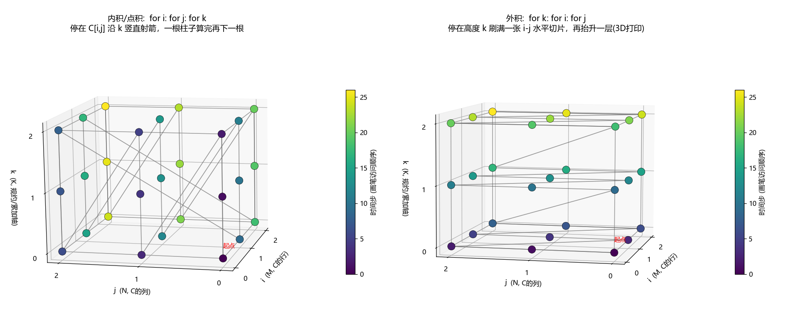
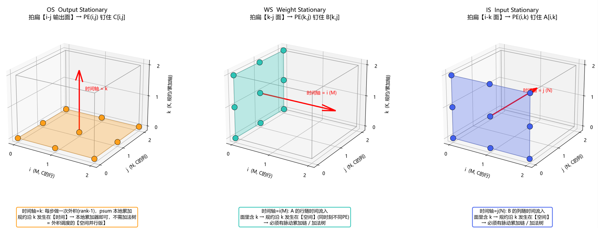
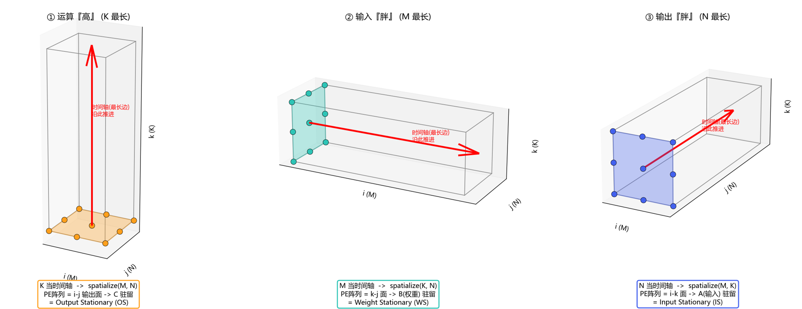

# 附录一：流水线

📌**CPI**

​	CPI（Cycles Per Instruction）指**每条指令平均时钟周期数**，衡量 CPU 执行效率，**只有加权平均 CPI 具有实际意义**。比如：有 5 类指令，CPI 分别为 1、2、3、4、5个时钟周期，假设一个程序中五类指令各占 20%，则加权平均 CPI = 1×0.2 + 2×0.2 + 3×0.2 + 4×0.2 + 5×0.2 = 3。

​	引入流水线是提高CPI的方式，比如还是上面的例子假设引入了三级流水线，流水线的每个stage的时间都严格相等，因为级数小于最大指令的周期数这时候加权平均CPI= 1×0.2 + 1×0.2 + 1×0.2 + 2×0.2 + 3×0.2 = 1.6；假设引入了5级流水，这个是时候的加权平均数就变成了1。但是，实际按照体系架构的不一样，流水设计会被固化成固定的段。

📌**加速比**

引入流水线以后在理想流水线（各级完美平衡、无冲突、无停顿）中，每条指令的平均时间可由以下公式计算：

理想流水线中每条指令的平均时间$= \dfrac{\text{非流水线每条指令时间}}{\text{流水级的数目 } n}$

同时，实现流水线得到的**加速比 = 流水级数目 n**，即理论上性能提升 n 倍。比如：非流水线中一条指令需要 10 个时钟周期完成。理想 5 级流水线也就是每个阶段 2 个周期。那么此时的加速比就是原来的 5 倍。

📌**CPI 与吞吐率（IPC）的关系**

- **CPI（Cycles Per Instruction）**：执行一条指令平均需要的时钟周期数，衡量指令执行的 “成本”。
- **IPC（Instructions Per Cycle）**：每个时钟周期完成的指令数，衡量 CPU 的吞吐率。
- 二者互为倒数。
- 在理想流水线中，虽然单条指令的总延迟可能仍较高（如 10 周期），但指令重叠执行使得吞吐率大幅提升，平均到每条指令上的周期数（CPI）趋近于 1，此时 IPC 也趋近于 1。

📌**GPU或NPU上的评价标准**

​	NPU或者GPU有个核心指标就是FLOPS和TOPS，一个表示一秒内能执行多少次浮点数（FP64，FP32，FP16， FP8精度越低越快）的运算，用在训练。一个表示一秒内能进行多少次低精度的整数运算（INT8，INT4精度越低越快），用在推理。这两类指标指定了GPU或者NPU上的计算上限。在实际的使用中，根据当前的任务的类型不同使用不同的评价标准，对于memory bounding的任务，它的评价标准是内存带宽的利用率。对于computing bounding的任务来说，它的评价标准是计算利用率。两者都可以拿【实际TOPS / 理论TOPS】得出来。算子融合可以提高计算强度，尽量把memory bounding的任务变换成computing bounding。

# 二：存储器层次结构

## 2.1 **缓存的工作原理**

1. **硬件组成：** Cache 在硬件上由 M个“坑位（Block/ Cache Line）”组成，其中**N个“坑位”组成一组**，**一共M/N个组**。每个组除了存放N个 64 Bytes 的数据外，还极其昂贵地配备了N个专属的元数据寄存器，每个元数据寄存器包含 1 个 Tag 标签 + 1 个有效位 Valid Bit。

   <small>**Note:** 如果这个N==M那么就称为是“全相连”结构；如果N==1，那么就称为是“直接映射”结构；通过情况下，N会是一个2的幂次方大小，称为“组相联”结构</small>

2. **基本单位**： 内存是以 Byte（字节）为基本寻址单位的，而 Cache 的搬运和存储是通常是以 64 Bytes 为一个整体块的。

3. **块地址**：CPU 发出的每一个物理内存地址，都对应一个【块地址（Block Address）】（多对一） 。 计算方法：【块地址】 = 【物理内存地址】 / 64。（在硬件上表现为截掉地址的最后 6 位）

4. **块内偏移**：用于在cache击中后，从“坑位”里的哪个位置挑出你要的那个字节（一对一）。计算方法：【块内偏移】 = 【物理内存地址】 MOD 64。（因为当前微处理器通常是 64 位宽（即通用寄存器一次最多吞吐 8 个字节），如果让 Cache 瞬间吐出 64 字节，需要拉 512 根极其浪费空间的物理导线。所以，Cache 硬件在内部把 64 字节切成了 8 个“小组“ （每组 8 字节）。偏移量的**高 3 位**用作多路复用器（MUX）的信号，精确选出其中 1 个小组，顺着 64 根物理导线送往 CPU。这 8 字节送到 CPU 后，CPU 再利用偏移量的**低 3 位**，定位出到底是这 8 个字节里的哪一个（处理 `char` 或 `int` 等小于 8 字节的数据时使用）。这也侧面验证了，long的地址编码低三位一定是000，int的最低两位则是00，short的最低一位则是0，）

5. **硬件查找路标的计算**：

​		a. **组索引（Set Index） = 块地址 mod (M / N)**，精确导航！当前这个块地址只可能在第几个组。

​        	b. **目标Tag = 块地址 / (M / N)**，当前块的唯一身份标识。

6. **寻址与命中判定（瞬间的 N 路并发战争）**：

   ​	a.  硬件根据【组索引】，激活那判定的组。

   ​	b. 硬件会使用N个“并发比较器电路”，在极短的纳秒瞬间，把【目标Tag】跟该组里面所有N个坑位的TAG同时比较。

   ​        c. 命中（Cache Hit）：如果这N个对比中，有任意一个元数据寄存器的【Tag标签】==【目标Tag】而且【有效位】 == 1，那么就命中，硬件的多路复用器会把那个命中坑位中的数据弹出给到CPU。

   ​        d.未命中（Cache miss）：如果 N 个比较器全部报告不一致（或者有效位为0），说明不在组里。CPU 呼叫主存把数据搬过来，与之相关的流水线部分STALL。

   此时硬件的 **LRU 电路**会看一下这 N 个坑位谁最老，把老数据踢掉，新数据填入，并更新**那个特定坑位**的 Tag 和有效位。

7. **读操作和写操作**：计算机关于访存的操作大多数读取操作（load），写操作只占少部分（write）。对于读取操作而言“标签对比”和 “从cache中读数据”可以并发，后续判断对比结果就可以确定是丢弃预读还是使用预读的内容。但是写操作不能，写操作必须串行化（要是tag判断错误，预写就把别的坑位污染了）。所以，相同cache击中率的前提下，读操作的整体速度会比写操作快。

8. **写策略**（修改了数据，低级存储器怎么办）：在跑完了上述“块的识别”以及可能触发的“块的替换”流程以后，如果针对当前内容是一个写操作，如果cache miss了会触发派发策略选择：一种是无写入派发，绕过cache直接写内存（cpu无等待）；一种是写入分派，先触发“块的替换”把内容换出到cache中，再进入写指令的cache击中流程。再cache击中流程，有两种写入策略：一是直写（强制让下一级存储器与当前保持一致），一是写回（只修改当前block并且标记dirty位，在下一次cache miss中被“踢出来”以后才写到下一级存储器）。

9. **通用流程**：


   ```mermaid
%%{init: {"flowchart": {"useMaxWidth": false}} }%%
   graph
       Start([CPU执行指令]) --> IsMem{是否为<br/>访存指令?}
       
       IsMem -->|"Yes"| Placement["【块的放置】<br/>算出目的地址在<br/>Cache中的可能位置"]
       Placement --> Location["【块的定位】<br/>判断该位置的数据<br/>是否存在于Cache中"]
       
       Location --> IsRead{读/写指令?}
       
       %% ================= 读指令分支 =================
       IsRead -->|"读指令<br/>(带提前预读)"| ReadHit{Cache击中?}
       
       ReadHit -->|"Yes"| GetVal(["皆大欢喜<br/>CPU直接拿到值"])
       ReadHit -->|"No"| ReadReplace["触发【块的替换】<br/>从下一级取数据到Cache"]
       ReadReplace --> GetVal
       
       %% ================= 写指令分支 =================
       IsRead -->|"写指令<br/>(无预读)"| WriteHit{Cache击中?}
       
       %% 写命中
       WriteHit -->|"Yes"| WriteHitPolicy{"写入策略"}
       WriteHitPolicy -->|"直写 (WT)"| WT(["强制同步写入下一级存储器"])
       WriteHitPolicy -->|"写回 (WB)"| WB(["仅标记Dirty<br/>在被踢出时才回写"])
       
       %% 写缺失
       WriteHit -->|"No"| WriteMissPolicy{"派发策略"}
       
       WriteMissPolicy -->|"无写入派发"| NWA(["绕过Cache直接写内存<br/>(延后处理写后读)"])
       WriteMissPolicy -->|"写入分派"| WA["触发【块的替换】<br/>从下一级取数据到Cache"]
       
       %% 写入分派后回归写命中流程
       WA -. "后续转入写击中流程" .-> WriteHitPolicy
   
   ```

10. **应用**：现代缓存的设计都放弃直写和无写入派发这种方式，即便在多核设计中的L1 cache也是采用了【写入派发+写回模式】，由此还专门发明了一套极其复杂的“分布式状态机”。其中最著名的就是 **MESI 协议**（或它的变种 MOESI / MESIF）。NPU则走了另外一条【无写入派发+直写/写回混用】的路：

11. **NPU上的变种**：
    a. NPU 的片上高速内存（严格来说应称为 **Scratchpad Memory / SPM**，而非传统的 Cache）摒弃了 CPU 那套复杂的硬件控制机制。它**没有组相联设计，也没有 Tag 标志位**，而是采用**直接的物理地址硬编码**（例如一块 5MB 的 SRAM，寻址就是赤裸裸的 0~5MB，靠软件直接指定地址读写）。

    b. 这种设计**并不是**因为矩阵运算中“局部性原理”失效了。事实恰恰相反：在矩阵运算中，数据的局部性不仅极其强烈，而且具备 **100% 的确定性和可预测性**。

    c. **核心逻辑（静态规划 vs 动态盲猜）**

    - **CPU 的困境（动态盲猜）**：CPU 跑的通用程序充满了随机分支和指针跳转，硬件不知道下一步要读啥，只能靠 Tag、组相联和替换算法（如 LRU）在运行时去**“动态盲猜”**数据局部性，代价是浪费了大量芯片面积和功耗。
    - **NPU 的降维打击（上帝视角）**：NPU 处理的是极度规律的张量/矩阵运算。AI 编译器在编译期就能精确掌握每一个数据块的“出生、使用、死亡”生命周期。既然未来是 100% 确定的，就不需要硬件去“猜”。
      - 块的放置: 变成了编译器里的 **Memory Allocation（内存分配）与 Tiling（切片定位）**问题，编译器需要交出：“卷积层的权重放在 SRAM 的 `0x0000` 到 `0x1000`，激活值放在 `0x1000` 到 `0x2000`”这样的答卷。
      - 块的定位：变成了**绝对的“指针直达”**！ 既然存放位置是编译器提前安排好的，那计算单元（MAC 阵列）去拿数据时，指令里写的直接就是**绝对物理地址**（比如：`READ SRAM_ADDR 0x1000`）。
      - 块的替换：变成了编译器里的 **Liveness Analysis（变量活跃度分析）和 Graph Coloring（图着色算法）**算法，通过算法来编排替换。比如：“张量 A 在第 5 层算完后，后面全网都不会再用到了，它的‘生命’结束了。” 于是，编译器在分配第 6 层的张量 B 时，会**直接把张量 B 的地址复写在张量 A 的物理内存位置上**。 没有踢人的动作，也没有 LRU，只有编译器上帝视角下极其冷酷的**“内存空间强行复用”**。而且上限上满足：**当前算子需要的最大 SRAM 空间 = 输入块大小 + 权重块大小 + 输出块大小 <= 5MB**
      - 分派策略：没有“写入派发”，所有的动作都是基于DMA的“无写入派发”指令。
      - 写入模式：写回和直写混用，写回用在处理中间变量，直写用在**Double Buffering**。

​        d.NPU的指令体量相比较于数据来说要小非常多而且极度依赖循环（时间局部性强），所以，NPU 通常配备专用的 I-Cache、Loop Buffer 或 FIFO 队列。

## 2.2 **缓存的量化分析（经典权衡：分离 vs 统一）**

1. **缺失率的物理规律（容量与结构）**

- **绝对容量定律**：正常的程序执行必然伴随缓存缺失（Cache Miss）。缓存容量越大，每千条指令的缺失数越小。
- **统一 vs 分离的博弈**：在**总容量相等**的前提下（例如 32KB 统一缓存 vs 16KB指令 + 16KB数据），**统一缓存的缺失率更低**。
  - *底层原因*：统一缓存具备“动态容量分配”能力（共享大平层），指令和数��谁需要谁就多占，空间利用率极高；而分离缓存是物理隔断的，容易出现一边塞满、另一边空转的浪费。

2. **性能评估的终极指标：平均访存时间（AMAT）**

- **AMAT 公式**：`平均访存时间 = 命中时间 + (缺失率 × 缺失代价)`
- **“高命中率”的陷阱（本例题的核心反转）**： 虽然 32KB 统一缓存的缺失率比 16KB+16KB 分离缓存更低，但它的**最终性能（AMAT）反而更差（更慢）**！
  - *底层原因*：统一缓存只有一个读写端口。当 CPU 流水线需要同时取指令（IF）和读写数据（MEM）时，统一缓存就会发生**结构冒险（Structural Hazard）**，导致流水线必须停顿 1 个时钟周期。
  - *结论*：这多停顿的 1 个周期（命中时间增加），彻底抵消了它在缺失率上带来的微弱优势。

3. **工业界的最终妥协（现实中的 CPU 是怎么做的？）** 正是基于上述量化分析，现代处理器的缓存层级（Cache Hierarchy）形成了雷打不动的定规：

- **L1 Cache 必须分离（L1i + L1d）**：最靠近 CPU 核心，追求极致的吞吐和零堵塞（不惜牺牲一点命中率），保证流水线畅通无阻。
- **L2 / L3 Cache 必须统一**：位于外层，充当巨大的后备粮仓。由于经过了 L1 的过滤，同时请求指令和数据的冲突概率极小，此时“共享大平层”带来的高命中率优势成为主导。

4. **缓存miss对CPI带来的影响**：假设每千条指令缓存缺失30次，所以平均每条指令的缺失数是0.03次，假设缺失指令带来的代价是200个时钟周期，那么平局每个指令的平均代价就到了0.03x200，也就是6个周期，最终的每条指令的平均周期数（CPI）就变成了7。换言之，这个cpu，6/7的时间都在等数据。所以对低CPI、高时钟频率的处理器来说，缓存的重要性就越大。所以在评估计算机性能的时候，不可忽略缓存的影响。Amdahl定律。

   现代CPU通过疯狂的增加硅片面积，硬件上创造了乱序执行、分支预测、硬件预取等技术，能把这个损耗控制在30%~100%之间。NPU上严格意义上说不存在缓存miss，但是它也要等数据，也就是著名的**Roofline Model**，这个模型是说【实际耗时 = Max(计算耗时, 搬运耗时) + 极短的启动排空时间】，当【搬运耗时】>【运行耗时】的时候：说明遇到了内城墙，这时候叫“左侧斜坡”，这时候就需要编译器尽可能融合算子以及复用SRAM以**提高访存比**去拯救；如果【搬运耗时】<【运行耗时】，那么恭喜你，这就是某个芯片的物理极限了，这时候就要注意内存以及寄存器的bank conflict和通过软件流水线来掩盖延迟，尽可能的逼近“屋顶”。

## 2.3 访存优化

### 2.3.1 访存优化的元原理

要理解这个访存优化的过程，首先我们需要考虑两个正交特性：

1. **存储边界**：DRAM ↔ SRAM ↔ PE 寄存器。这儿有两个存储边界，一个是DRAM ↔ SRAM ；另一个是SRAM ↔ PE 寄存器。每道边界都有自己的带宽、自己的Roofline、自己的驻留决策。
2. **算子图层**：最简单的是一个单算子（比如矩阵乘法），其次是融合算子，再次是带有workload的计算图（比如大模型推理的prefill阶段或者decode阶段）。roofline分析只在算子级别有效，在考虑计算图的时候就不一定有效了（取决于计算图的形状）。

考虑一个最常见的算子，矩阵乘法 C[i,j]=∑A[i,k]×B[k,j] 。把整个算子的计算想象成一个 3D 空间：

- **底面**：由 i 和 j 轴组成，代表输出矩阵 C。
- **高度**：由 k 轴组成，代表累加（Reduction）的过程。 

在这个空间里，计算总量（FLOP），就是体积，只要两个矩阵大小确定了，它就是永恒不变的。所有的访存优化，一切优化都只是在改"填满这个体积的画笔轨迹"。

### 2.3.2. 立方体与时间轨迹

内积是停在底面一点 C[i,j]，沿着 k 轴笔直向上“射箭”，一根柱子算完再算下一根。外积是"建高楼"，先算整层，再算低楼层。



### 2.3.2. 单worker下面的朴素分析

简单起见，我们规定矩阵计算的量是i=3，j=3， k=3。而且假设没有缓存，所有的访问都要从DRAM中拿。

1. **没有reorder的情况**

```c
for i in range(M):
    for j in range(N):
        C[i, j] = 0
        for k in range(K):
            C[i, j] += A[i, k] * B[k, j]
```

​	这个时候的计算就是停在一个C[i,j]上的规约操作，先算C[0,0]的“点积”再算C[0,1]的"点积"，后面依次延申。每算一个C数组的元素需要三步，每一步需要访问一次A和B的对应元素，外加一次C元素的读和写，也就是12次。一个3 x 3个元素，总共也就是108次。通俗点，可以写成M x N x (K x 4)， 也就是$O(N^3)$。

2. **有reorder的情况**

```c
for i in range(M):
    for j in range(N):
        C[i, j] = 0
        
for k in range(K):        
	for i in range(M):
    	for j in range(N):
            C[i, j] += A[i, k] * B[k, j]
```

​	先从k=0开始，算最终结果的一部分。每一步都先停在特定的高度 k，在这个水平面上“刷”出一个MxN  的切片，然后 k 抬升一层，继续“水平 3D 打印”。每一层需要从内存读 3 个 A 的值和 3 个 B 的值，共 6 次访存；再额外假设9次读和9次写C。一共72次。通俗点，可以写成K x (M + N + M x N x 2)，还是$O(N^3)$。


3. **如何提高访存比**

​	如果不考虑SRAM上的内存复用，上面的信息告诉我们其实访存比没法优化。在这种假设下，不管是做不做reorder，访存容量都是$O(N^3)$。另外一个极端，要是SRAM无限大，那么访存总量就单纯的变成了读A和B矩阵，写C矩阵这样的$O(N^2)$，而且也跟做不做reorder没有关系。

​	但是很明显，上面两个极端都不成立，SRAM存在而且很精贵，需要省着用。这个时候算外积的价值就体现出来了。

​	我们先看看算内积，它需要同时把A和B同时都搬运到SRAM上，如果A和B都很大，这很明显是个不现实的策略。当然也可也划分步骤，比如把M分成m份，把N分成n份，这样把C算完，需要从DRAM到SRAM的搬运次数是$m * n$次。

​	再看看算外积，这个时候我们只需要把C搬运到SRAM上，如果C过大，你可以按照需要把C拆分成c份，这样每次只需要


### 2.3.3. 边界一：DRAM ↔ SRAM 的 Roofline分析

1. **访存比**

​                             访存比（算术强度）=$\dfrac{\text{FLOPs}}{\text{跨 DRAM 边界的字节}}$

假设某个NPU的算力是10TFLOPS（RTX3060水平， RTX 4070大概在30TFLOPS， 4090在83TFLOPS），那么通常意味着每秒可以计算$10 * 10^{12}$次fp32（新硬件上这类算力会随着精度的减小而翻倍，比如fp16就变成了20TFLOPs）。如果访存的速度是100GB / s（Apple M4的水平，主流的GPU一般在200~ 1000GB/s这个水平），那么这个Roofline模型的拐点就应该在100 FLOPs/Byte。

算子本身的算术强度和机器拐点 $\dfrac{\text{峰值算力}}{\text{峰值带宽}}$相比，可以判断算子在运算的时候是 memory-bounding（斜坡）还是 compute-bounding（屋顶）。一个算子在经过编译器优化以后它的算术强度就固定了，必然落在Roofline模型的其中一个点上。

复用是连续谱，不是开关。两个端点：

- 无复用：每个输出都重读一行一列 → 强度趴在 (\approx 0.25) FLOP/Byte（fp32），无论问题多大都爬不动。
- 满复用（外积、全驻留）：A、B、C 各读写一次 → 强度 (\sim O(N))，随规模增长。

真实情况由 tile 尺寸在这两个端点之间连续调出。

关键定量结论（修正"必须装下整张矩阵"的旧说法）：在容量为 (C) 的 SRAM 下，可达算术强度

$I ;\propto; \sqrt{C}\quad(\text{Hong–Kung 下界})$

(I) 里没有 (N)！ 即 SRAM 容量定死，可达强度就定死，与问题规模无关。要够到拐点（如 100 FLOP/Byte）只需 SRAM 在几百 KB 量级——恰好是 Gemmini scratchpad(256KB) 的尺度，而不是把整张矩阵塞进去。tiling 的全部意义就是把"SRAM 大小"和"问题大小"解耦。旧笔记里"600×600 要 7.2MB 才能 compute-bound"是"完全不 tiling、整张驻留+双缓存"的退化极端，是充分而非必要。

为什么实际达不到理论上界（caveat 归类）：阵列对齐导致的 padding/Fake FLOPs、内存总线与 SRAM 总线的 bank conflict、GPU 的 Wave Quantization 与 occupancy 不足。这些让坐标点贴不到屋顶。

1. 2.3.2 显式命名原子 = tile(cube)：把你旧的两个 case 重新标注为"tile=1 元素（无复用端点）"和"tile=整矩阵（满驻留端点）"两个退化端点，中间由 tile 尺寸连续插值。

## 2.3.3　边界二：SRAM ↔ 阵列寄存器 的 Roofline + 驻留 = WS/OS/IS

这一层的"寄存器"不是被动缓冲，而是会算数的 2D PE 阵列本身。于是这道边界的驻留决策天生附带空间属性——"让谁驻留寄存器"同时就是"两条轴怎么铺到 2D 网格"。这就是为什么 WS/OS/IS 只出现在 spatialize：因为最内层存储恰好和计算阵列合体。

三种 dataflow = 这一层选哪个张量驻留 PE 寄存器（三者都 register-targeted，方向不同）：

| dataflow | 驻留谁    | 方向                                           | 性质                 |
| :------- | :-------- | :--------------------------------------------- | :------------------- |
| WS       | 权重 B    | SRAM→寄存器，载入后长住、反复当乘数            | load-and-hold        |
| IS       | 输入 A    | SRAM→寄存器，载入后长住、反复当乘数            | load-and-hold        |
| OS       | 输出 psum | 在累加器寄存器里就地累加，最后寄存器→SRAM 排出 | accumulate-and-drain |

空间复用 = 边喂面：阵列从两条 (S) 宽的边喂入数据（周长 (\sim 2S)），却点亮 (S^2) 个 PE（面积）。每个喂进来的元素沿一行或一列广播给 (S) 个 PE，复用 (S) 次。

这一层的强度天花板：设被铺开的两轴恰好 (=S)、第三轴当时间轴长 (T)，

[ I(T)=\frac{2S^2}{(S^2+2ST),b}=\frac{S}{b}\cdot\frac{1}{1+S/(2T)} ]

随 (T) 单调增、封顶 (S/b)（= 复用次数 ÷ 每元素字节）。三种 dataflow 公式同形，唯一区别是 (T) 取哪条轴：OS→(T=K)，WS→(T=M)，IS→(T=N)。

形状决定 dataflow（把最长的轴留作时间轴，复用最充分、强度最高）：

- 运算"高"（K 最长）→ K 时间轴 → spatialize(M,N) → OS（C 驻留）
- 输入"胖"（M 最长）→ M 时间轴 → spatialize(K,N) → WS（B 驻留）
- 输出"胖"（N 最长）→ N 时间轴 → spatialize(M,K) → IS（A 驻留）

铁律：判据是"复用次数"（=最长轴），不是"块头大小"。 大只意味着搬一次贵；只有"大且被反复用"才值得驻留。复用 = 1 时（如单条 decode 的权重，M=1）再大也驻留无益——那是带宽墙，靠 batching 造复用，不靠 stationary。

附加约束：利用率。被铺开的两轴若 (< S)，阵列填不满（PE 空转）。所以真实选择是"复用最大化（最长轴留时间）"与"利用率（spatial 轴 ≥ (S)）"之间的权衡。

1. 2.3.3 里给 spatialize 下定义：它就是"在阵列边界把原子设成 S×S 空间切片"的动作——于是 reorder 退化成"沿时间轴 T 扫切片"，驻留升级成 WS/OS/IS。

## 2.3.4　合：两种机制是同一元原理的两副面孔

|              | tiling                     | dataflow (WS/OS/IS)           |
| :----------- | :------------------------- | :---------------------------- |
| 作用边界     | DRAM↔SRAM 等被动缓冲边界   | SRAM↔阵列寄存器边界           |
| 驻留性质     | 纯时间驻留（选 tile 尺寸） | 空间驻留（选谁驻留+铺哪两轴） |
| 有无空间属性 | 无                         | 有（因为这层是 2D 计算阵列）  |

二者都是元原理"留住热数据、砍跨界搬运"的体现。WS/OS/IS 之所以只在阵列边界出现，正因为那层寄存器与计算融合，驻留决策被迫同时是空间映射。

分层 Roofline：每道存储边界都是一面墙，各有带宽与天花板。一个算子要打满峰值，必须同时翻过每一层墙（翻过 DRAM 墙 ≠ 翻过阵列墙）。注意：这个"分层"是存储边界维度，别和下一节的算子图维度混。

## 2.3.5　Roofline 的适用边界：L0 / L1 / L2

- L0 单算子 / L1 融合算子：单个 kernel、单一强度 → 单点 Roofline 完美适用。融合的价值正可用 Roofline 表达：中间结果留 SRAM、不落 DRAM → 字节变少 → 强度抬升 → 坐标右移。
- L2 整段 workload（如整段推理）：内含强度迥异的几十个 kernel（大 GEMM compute-bound、GEMV/softmax/elementwise memory-bound）。单点 Roofline 会骗人（平均强度掩盖多峰结构）。正确用法是逐 kernel 散点 + 逐 kernel 时间下界求和当诊断。
  - （注：prefill / decode 各自内部较均质，单点尚可用；两者混合或整模型则必须散点。）
- Roofline 结构上算不出的东西：算子间依赖与关键路径、资源竞争（DMA/bank/端口）、double-buffer 的 overlap、融合改变的流量、kernel launch 开销。
- 这些正是 event 仿真要建模的，也是 `npu-perf-sim` 双引擎的分工由来：analytical 引擎吃 L0/L1（闭式 cycle，Roofline 级公式），event 引擎把它们沿依赖图缝成 L2（端到端 cycle，主指标换成延迟/吞吐/利用率/瓶颈归因/overlap 效率，而非强度）。


#### 2.3.1. 简单的分析

简单起见，我们规定i=4，j=4， k=4.

1. **reorder之前要算的内容**：

```python
for i in range(I):
    for j in range(J):
        C[i, j] = 0
        for k in range(K):
            C[i, j] += A[i, k] * B[k, j]
```

- 停在底面一点 C[0,0]，沿着 k 轴笔直向上“射箭”，一根柱子算完再算下一根。

- 最内层是 k。A[i,k] 是连续读取（Cache Hit），但 B[k,j] 随着 k 的跳动在做**跨行跳跃访问**。

- 算完 C[0,0] 再算 C[0,1] 时，之前读入 Cache 的 A[0,0∼3] 早就被冲刷干净，必须重新去主存捞数据。所以“每一根柱子”的算都意味着12次内存访问（两次读一次写，对于特定的C[i,j]来说一共要做4次）。这样总的访存次数到了12x16也就是192次。

- 每次都在做**点积（Dot Product）**，毫无数据复用，内存访问达到了$O(N^3)$。

  

2. **SRAM + reorder之后要算的内容**：

```python
for i in range(I):
    for j in range(J):
        C[i, j] = 0
        
for k in range(K):        
	for i in range(I):
    	for j in range(J):
            C[i, j] += A[i, k] * B[k, j]
```

- 在硬件最核心的地方（Registers/SRAM）开辟一个如 IxJ 大小的 `C_cache` 暂存区。停在特定的高度 k，在这个水平面上“刷”出一个IxJ  的切片，然后 k 抬升一层，继续“水平 3D 打印”。

- 最内层是 j。读 B[k,j] 时沿着内存行连续滑动，极其完美的 Cache Hit; A[i,k] 中则完全没有 j，它是个常数！

- 在 k=0 时，只需从内存读 4 个 A 的值和 4 个 B 的值（共 8 次访存），就能在 `C_cache` 寄存器里完成 4×4=16 次乘加计算。总共也就是(4+4)x4读访存动作，加下C_cache的回写也就是4次。总共也就是36次。

- 利用极少量的寄存器，把计算转化为**外积（Outer Product）**。将实际内存访问量降维至接近理论极限的 $O(N^2)$。


#### 2.3.2. **Roofline模型的量化分析**

​	如果面对一个1024x1024的fp32的矩阵乘法，每个元素需要1024次乘法和1023次加法，一共1024x1024元素，所以整体的计算强度是$1024 * 1024* (1024+1023)$ **FLOP**。 按照访存模式的不同：

- 如果是无优化的写法那么每个元素的计算，需要分别读两个矩阵的一行和一列，也就是1024 x 2次读，外加加一次写结果，一共访存1024x1024个fp32（注意一个fp32是4bytes）的元素，也就是$1024 * 1024* (1024 * 2 + 1) * 4$ **Bytes** ，那么第一种情况的访存比约等于**0.25 FLOPs/Byte**。
- 如果是有优化的写法，那么每一次“外积”需要一行和一列的读，也就是1024 x 2次读。写cache不算内存访存，所以忽略。一共1024次外积，外加1024 x 1024次写回。总共也就是$(1024 * 2 * 1024 + 1024 * 1024) * 4$ **Bytes** , 那么第二种情况的访存比约等于**170.58 Flops/Byte**。

​	更通用一些，假设固定fp32，而且输入的形状是(m,k)和(k,n)。那么整体的计算强度就是**$mn(k+(k-1))$ FLOPs**。如果是无优化，那么整体访存就是**$4mn(k+k+1))$ Bytes** ，最终的计算密度的结果就是 $$ \frac{\text{总 FLOPs}}{\text{总访问Bytes}} = \frac{2k-1}{4(2k+1)}$$**Flops/Byte**；如有是带上优化那么整体访存就是**$4(k(m+n) + mn)$ Bytes**， 最终的计算密度就是$$ \frac{\text{总 FLOPs}}{\text{总访问Bytes}} = \frac{mn(2k-1)}{4(km+kn+mn)}$$ **Flops/Byte**。为了便于分析我们还是假定m == k == n。那么前面的结果不受影响，后面的变成$$ \frac{2k-1}{12}$$ **Flops/Byte**。我们可以总结：

- **带有reorder的访存比会随着输入输入规模递增**，这理论上就决定了带有reorder的写法，会随着k的变大爬到拐点，变成computing bounding。
- **原始的访存比只会趴在那儿**，但现实中就不可能爬到computing bounding。

#### 2.3.3. **更进一步的例子**

​	

​	按照上面的分析k大于600才能达到computing bounding，现实中很多的基础模型都能达到这个门槛。BERT-Base 的 k=768，GPT-3 的 k=12288，哪怕是普通的图像卷积转成矩阵乘法（im2col），k 也动辄上千。

​	这里面有个非常强假设就是计算过程中的所有内容都能塞进SRAM，如果是600x600的矩阵乘法那么一共有600x600x4x3 Bytes，也就是约等于4MB多一些。实际上，为了掩盖延迟，还需要引入软件流水线，这个时候累加器的单缓存是600x600x4， 加上输入双缓存也就是600x600x4x2和输出双缓存600x600x4x2。最终约等于7.2 MB（中端手机 SoC / 经典中端显卡）。换句话说低于7.2MB的硬件上根本不可能达到Computing bounding，这还只是第一张入场券。

​	实际上，GPU上这还得算上流多处理器的调度开销，假设你的硬件有 100 个 SM， 如果你的任务被切成了 101 个 Block，最后会出现99个等1个的现象（**Wave Quantization**）。为了掩盖内存延迟，GPU 的 SM 需要同时驻留多个 Warp 进行上下文切换，如果你的每一个线程为了追求极限性能，用了太多的寄存器（Registers）或者共享内存（Shared Memory），导致一个 SM 里面塞不下几个 Warp，那么调度器就没法做有效的切换，计算单元还是得发呆。（triton上解决这个分配问题使用了autotune方法，效果显著）

​	相应地，NPU上还得算上数据对齐开销，假设 NPU 的脉动阵列是 32x32 的，这就意味着它每一次呼吸，都必须吞下 32×32 形状的数据。 还记得我们之前算的 k=600 吗？对不起，600 不是 32 的整数倍（600/32=18.75）。为了喂给 NPU，你必须在内存里把它补齐（Pad）到 608。 NPU 会老老实实地去算那多出来的 8 行 0。这部分算力（FLOPs）在硬件层面确实消耗了，但在算法层面是完全无效的（Fake FLOPs），这就导致你实际有效算力永远达不到标称峰值。

​	同时，不管是NPU还是GPU，它们都要面对“内存总线对齐”（斜坡上的 Bank Conflict）和“SRAM访问总线对齐”(屋顶上的 Bank Conflict)问题。


​	总结起来，**访存比 = 计算总量(FLOPs) / 真实的物理内存访问量(Bytes)**。只要数据是从 SRAM/寄存器里拿的，对主存带宽的压力就是 0。所以通过 Tiling + Reorder，分母（实际物理读写）被结结实实地砍掉了几倍甚至几十倍。在 Roofline 图上，你的算子坐标实现了**向右的巨大平移**，从“被内存带宽卡死（Memory Bound）”的斜坡，冲向了“纯拼算力（Compute Bound）”的平坦屋顶。

​	在斜坡上，表示理论上，这个算子就是达不到computing bound。这时候通过“融合计算”以及“算子融合”改变这个问题。要是实在不行就只能认命，此时啥方法都不好使，避免bank conflict逼近理论上的斜坡，就是唯一能做的一件事情。

​	但是，访存比上去了不是意味着最终的效果上去了。真实的情况下，要配合tiling保证分配出来的中间结果能塞进SRAM，同时还得保证整个流程满足软件流水线的要求。最后还得死磕 **Bank Conflict**（避免访存拥堵降低吞吐）。在屋顶上，任何一次停顿都会让你直接从理论峰值上跌落。

# 三、指令级并行及其利用

## 1. 动机：为什么要跨越基本块开发 ILP？

​	现代编程语言的很多用法（循环、流控制、函数调用、安全检查等）都会在执行之前被编译器转换成分支语句（条件跳转或无条件跳转）。在 CPU 的动态执行视角下，它看到的跳转频率会非常高，基本上 **4~7 条语句就有一个跳转**。 由于跳转指令是“基本块（Basic Block）”的边界，这导致程序的基本块通常都非常小。在一个基本块内部，指令往往为了完成同一个连贯动作，存在数据相关（尤其是 RAW 写后读）的可能性极高。因此，在单个基本块中挖掘指令级并行的天花板极低，**必须跳出基本块（如利用循环）去跨越多个基本块来开发指令级并行（ILP）**。

## 2. 世界观：并行的问题归类 vs. 架构的解法流派

在计算机科学中，寻找并行机会首先要对**“问题的本质（工作负载）”**进行归类。宏观上，并行问题可以分为两大类：

- **异构任务问题**：例如听歌、下载、写代码同时进行（处理完全不同质的任务）。
- **循环级并行问题（Loop-Level Parallelism）**：处理海量同质化、重复性的计算。这是计算机榨取极限性能的绝对“金矿”。

针对“循环级并行”这一核心**问题分类**，计算机体系结构根据“拆解颗粒度”的大小（从大到小），演化出了四种主要的**解法流派**：

1. **请求级流派（RLP）**：极宏观的循环派发。例如 Tomcat/Nginx 的事件死循环，把独立用户的海量请求派发给不同服务器节点。
2. **线程级流派（TLP）**：大粒度代码块的循环切分。例如多核 CPU 把一个百万次的 `for` 循环拆给 8 个线程跑，或者 GPU 的 SIMT 架构。
3. **数据级流派（DLP）**：中等粒度的数据打包。例如 SIMD 向量指令，不用循环跑 8 次，而是一条指令把 8 个数据“一锅端”算完。
4. **指令级流派（ILP）**：极微观的底层压榨。在单线程内，通过循环展开等技术打破迭代边界，把原本属于不同循环次数的指令塞进同一个时钟周期发射。

> **注：** 超长指令字（VLIW）是硬件层面用来高效描述 DLP 和 ILP 这两种微观解法的实现路径。这种把调度完全交给编译器的极简思路，在通用 CPU 上因为分支不可预测遭遇了滑铁卢；但在 **NPU** 上，由于 AI 算子本质全是规整确定的大循环（完美的循环级并行问题），VLIW 重新焕发了新生。

## 3. 方法论：相关与冒险的双面性

不管使用哪种流派去解决循环级并行问题，其底层基石都离不开对**“相关（Dependence）与冒险（Hazard）”**的分析。这两者实际上是对同一个冲突的两面性描述：

- **站在程序自身分析的角度（问题域）**：使用**“相关”**来描述代码逻辑上固有的依赖特性。
- **站在硬件构成的角度（解法域）**：使用**“冒险”**来概括指令强行塞入物理流水线时引发的碰撞。

为了解决这些碰撞，计算机体系结构在指令级（ILP）层面分化出了两大协同战线：**编译器负责静态规避（防患于未然），硬件负责动态兜底（运行时实时化解）**。

### 3.1. ILP 绝对基石：硬件流水线（Pipelining）

> **注**：**流水线是所有优化的前提。它把指令执行切分成多个步骤，让多条指令在时间上重叠。如果没有流水线，就不存在任何“冒险”，也不存在 ILP。**

### 3.2. 核心战术矩阵：静态规避 vs. 动态兜底

| 程序逻辑属性<br>*(相关性)*                      | 硬件物理表象<br>*(冒险)*           | 汇编冲突示例                         | 静态解法 (编译器/软件) <br>*(目标：编译期提前规避)*          | 动态兜底解法 (硬件/微架构) <br>*(目标：运行时实时化解)*      |
| :---------------------------------------------- | :--------------------------------- | :----------------------------------- | :----------------------------------------------------------- | :----------------------------------------------------------- |
| **真数据相关**<br>(RAW)                         | **数据冒险**<br>(ALU 连贯)         | `ADD R1, R2, R3`<br>`SUB R4, R1, R5` | **指令调度**：生成代码时强行把指令拉开，中间塞入不相关指令。 | **旁路 (Bypassing)**：硬件直接飞线短路，把刚算出的数据传给下一条。 |
|                                                 | **数据冒险**<br>(Load-Use)         | `LW R1, 0(R2)`<br>`ADD R3, R1, R4`   | **延迟槽填充**：找无关指令填补空隙；实在找不到，主动插入 `NOP` 指令。 | **流水线互锁 (Interlock / Stall)**：硬件检测到数据还没从内存出来，强制踩刹车。 |
|                                                 | **数据冒险**<br>(长延迟计算)       | 浮点除法 (20周期)<br>或 Cache Miss   | **强度减弱** (如 `/2` 改 `*0.5`)；<br>**循环展开/软件流水线**掩盖延迟。 | **乱序执行 (Out-of-Order)**：当前指令卡住时，把后面不相关的指令直接提上来执行。 |
| **名称相关**<br>(WAR反相关<br /> / WAW输出相关) | **数据冒险**<br>(假相关，名字撞车) | `ADD R1, R2, R3`<br>`SUB R1, R4, R5` | **静态寄存器重命名 (如 SSA)**：寄存器分派阶段使用不同的寄存器名；**死代码消除**。（IR阶段，寄存器分配后一定不受用） | **硬件寄存器重命名 (Renaming)**：底层偷偷分配隐藏的物理寄存器，化解抢名冲突。（寄存器分配后一定会再次出现WAW和WAR，为了**乱序发射**，逼出了硬件上的**重命名**技术） |
| **控制相关**<br>(分支 / 循环)                   | **控制冒险**<br>(执行流断裂)       | `BEQ R1, R2, L1`<br>`ADD R3...`      | **静态预测** (如：假设向后跳循环必成立)；**分支延迟槽**；**循环展开** (物理消灭分支)。 | **动态分支预测 (BHT/BTB)**：结合**推测执行 (ROB)**，猜对血赚，猜错清空流水线作废。 |
| **无相关**<br>(纯随机组合)                      | **结构冒险**<br>(抢夺硬件资源)     | 两条指令同时<br>要读同一内存端口     | **资源感知调度**：排代码时绝不把消耗同类紧缺资源的指令排在一起。 | **增加物理资源 / 停顿**：指令/数据 Cache 分离 (哈佛架构)；增加多套 ALU (多发射)。 |

​	总结起来，真相关才是阻碍指令级并行的“绊脚石”。其本质就是在说“**指令 B 必须等指令 A**”。现代处理器为了解决这类真相关也做了相应的努力：

- 硬件层面，其中一个就是数据旁路转发，A 在 ALU 里刚算出结果，还没来得及写回寄存器，就直接“空投”到 B 所在的 ALU 输入端。这类解法能解决RAW，但是使用层面仅限背对背的ALU这一种情况。
- 硬件层面的另外一个尝试就是乱序执行，既然 B 必须等 A，CPU 的调度器（Tomasulo 算法）就会绕过 B，去指令池里找和 A、B 都没有 RAW 关系的指令 C 和 D，把它们塞进 ALU 执行。需要注意的是这种解法本质上是**尝试缓解RAW**。（这也反推，编译器需要它通过循环展开为硬件的乱序执行提供足够的候选以填满发射槽）
- 软件层面，则需要通过指令调度、强度减弱、循环展开等方式，掩盖和配合硬件来解决真相关。

**⚠️ 为什么编译器不能包打天下？** 编译器在做静态分析时，面临最大的敌人是**“可能会（May Dependence）”**的数据相关（如：无法确定的指针别名、动态计算的数组下标）。本着“保证绝对正确”的保守原则，编译器遇到“可能”就会放弃激进调度。因此，必须依赖硬件在运行时（真地址已经算出时）进行动态兜底。

**⚠️ 既然硬件有OoO兜底，编译器还需要指令调度干嘛？**动态乱序发射窗口的窗口是固定的，编译器则具备静态的宏观视角，可以完成更大规模的调度，从而提升整体性能。另外就是调度本身也要受限于结构冒险，如果一堆的load被挤在一块儿，那么乱序的效果也会受到影响，所以编译器需要把Load、Add、Mul均匀打散。最后，不是所有的处理器都是支持乱序发射的，这时候兜底的那个就是编译器的指令调度了。

### 3.3.  相关的时空维度分析

前面提到了相关是什么，那么这里就是分析相关怎么发生的。以循环为标准相关可划分为两大类：

#### 1. 循环内相关 (Loop-Independent Dependence)

- **概念：** 发生在同一次循环迭代（或基本块）内部的指令之间。

- **举例**：下面的例子S1写入了A[i], S2读取A[i]，所以这就是一个RAW，发生在了循环内。当然把这两个颠倒一下就成了反相关（也就是WAR）。

  ```c
  for (int i = 0; i < 10; i++) {
      A[i] = B[i] + 1;      // 语句 1 (S1): 写入 A[i]
      C[i] = A[i] * 2;      // 语句 2 (S2): 读取 A[i]
  }
  ```

- **解法**：

  对于循环内的反相关和输出相关：

  - 软件端：如果是标量软件侧的解法phi语句形成SSA，既解决这两类WAW和WAR相关，又方便中间基于SSA的优化分析。后续在替换phi的pass中再把phi替换成mov语句。如果是数组，编译器将会尝试1. 把数组替换成标量 `SROA` (Scalar Replacement of Aggregates) 或 `Mem2Reg`优化。2. 使用MemorySSA来构建一个内存版本图，后续的其他pass会基于这个版本图完成优化。
  - 硬件端：采用寄存器重命名 (Register Renaming)。 CPU 硬件底层的 RAT（寄存器别名表）动态将架构寄存器映射到物理寄存器堆，完美消除 WAR 和 WAW 假依赖，从而释放乱序执行潜力。

  对于真数据相关：

  - 软件端：通过指令调度在真相关的语句的中间插入语句来消耗延迟。通过强度减弱来减小延迟。
  - 硬件端：通过旁路来解决背靠背的ALU，通过OoO来缓解延迟。

#### 2. 跨循环相关 (Loop-Carried Dependence)

- **概念：** 第 i+1 次迭代的读取，依赖于第 i 次（或更早）迭代的写入。这是阻碍大面积并行（如 DLP 向量化）的最大元凶。
- **数学分析工具：仿射索引 (Affine Index)**
  
  - **前提：** 数组下标必须形如 a×i+b。如果是间接寻址（如 `x[y[i]]`）或包含指针别名（Aliasing），分析将失效。
  - **求解方法：** 将依赖问题转化为求解线性丢番图方程。首先使用极快的 **最大公约数测试 (GCD Test)** 进行初筛，若疑似存在依赖，再使用 Banerjee 测试 或 Omega 测试结合循环边界进行精确判定。对于丢番图方程有解那么一定存在RAW、WAW或者WAR中的其中一个，根据丢番图方程的解还能算出依赖距离。
- **优化策略：**
  
  - **无依赖：** 放心大胆地进行 100% 向量化（DLP）或多线程拆分。
  - **对于WAW依赖或者WAR依赖：**
  - **有RAW依赖，但依赖距离 d>1：** 借助 **循环展开 (Loop Unrolling)**，将跨循环依赖降维打击为“循环内相关”，暴露出多个互不干扰的独立指令流，最终要么借助硬件的ILP能力要么换成SIMD指令处理循环内（大循环依然是串行的）。或者借助软件流水线来提高吞吐量。比如：
  
    ```c
    for (int i = 5; i < N; i++) {
        Y[i] = Y[i - 5] + 1;
    }
    ```
  
    解法一：循环展开（Loop Unrolling）
  
    ```c
    // 按步幅 5 展开
    for (int i = 5; i < N; i += 5) {
        // 【循环体内部】：这 5 条语句互相绝对独立！没有任何相关性！
        Y[i]     = Y[i - 5] + 1;  // 链条 0
        Y[i + 1] = Y[i - 4] + 1;  // 链条 1
        Y[i + 2] = Y[i - 3] + 1;  // 链条 2
        Y[i + 3] = Y[i - 2] + 1;  // 链条 3
        Y[i + 4] = Y[i - 1] + 1;  // 链条 4
    }
    ```
  
    因为循环体内这 5 条指令完全独立，CPU 可以通过乱序执行（OoO）同时发射它们；更进一步，编译器可以把它们打包成一条 **SIMD 向量指令**，从而大大调高了吞吐量。但是，下一批（`i=10` 到 `14`）必须严格等待这一批（`i=5` 到 `9`）全部算完并写回内存后，才能开始启动。外层循环依然是串行的。
  
    解法二：软件流水线（software pipeline）
  
    假设该计算分为 3 个阶段，各占 1 周期：`Load (L)` -> `Compute (C)` -> `Store (S)`那么，最终的效果就变成
  
    | 周期  | Load (读)         | Compute (算) | Store (写)       | 备注                                          |
    | :---- | :---------------- | :----------- | :--------------- | :-------------------------------------------- |
    | 1     | L0                |              |                  | **序言 (Prolog)**：流水线注水                 |
    | 2     | L1                | C0           |                  |                                               |
    | 3     | L2                | C1           | **S0 (写 Y[0])** | 迭代 0 完成写回！                             |
    | 4     | L3                | C2           | S1               |                                               |
    | 5     | L4                | C3           | S2               |                                               |
    | **6** | **L5 (读 Y[0]!)** | C4           | S3               | **进入稳态！此时 L5 完美读到 C3 写入的 Y[0]** |
  
    稳态的代码也就变成
  
    ```assembly
    ; 编译器最终生成的稳态循环体（对应时间表的第 6 周期及以后）
    Loop_Steady_State:
        Store   Y[i - 3]    ; 收尾：老迭代的写回 (如 S3)
        Compute Y[i - 1]    ; 计算：中迭代的加法 (如 C4)
        Load    Y[i + 1]    ; 开头：新迭代的预取 (如 L5)
        i++
        if (i < N) goto Loop_Steady_State
    ```
  
    

### 3.4. 计算相关 (Computation Dependence) 及其突破

在排除了内存数据依赖，或者通过循环展开暴露出了大量的纯计算指令后，**ALU 的计算等待链条（关键路径 Critical Path）** 成为新的瓶颈。编译器通过以下技术重构计算图，获取更多的 ILP：

1. **复制传播 (Copy Propagation)：** 消除代码中无意义的中间变量传递（如 `x=y; z=x+1` → `z=y+1`），直接缩短指令间的等待链条。
2. **树高缩减 (Tree Height Reduction)：** 利用数学的结合律和交换律，将深长的串行计算链（如 `(((a+b)+c)+d)`）重构为扁平的并行树（如 `(a+b) + (c+d)`），使得多个加法器可以在同一周期内并行开工。
3. **缓解递推关系 (Reduce recurrences)：** 针对最顽固的累加求和（Reduction，如 `sum += A[i]`），利用**标量扩展 (Scalar Expansion)** 将单个 `sum` 裂变为多个局部累加器（`sum0, sum1...`）。配合循环展开，将原本铁板一块的单链条强行拆分为多条完全独立的并行车道。

## 4. 实现：循环展开、软件流水线

### 4.1. 循环展开

- **局限性**：传统的局部指令调度受限于单个基本块（Basic Block, BB），遇到分支指令即终止，难以挖掘足够的指令级并行（ILP）。
- **循环展开（Loop Unrolling）的本质**：一种“扩建”手段。通过消除循环控制跳转，将多个小基本块融合成一个没有内部跳转的“超级块”，从而为编译器重排指令、发掘 ILP 创造物理空间。
- **动态上限（如 `\*ptr`）的展开**：编译器需要先进行**指针别名分析**。如果安全，会采用“主循环（处理 N 的倍数） + 尾部循环（处理余数）”的动态展开策略。为了防止循环次数极少时导致性能倒退，通常会插入运行时检查（Bypass Check）。
- **额外好处**：循环展开可减少循环本身的开销 —— 即分支指令与循环计数器更新代码的开销。

### 4.2. 软件流水线-符号化的循环展开

软件流水线不是被淘汰的技术，而是在不同硬件架构中不断进化的“性能密码”。

- **三段式结构**：Prologue（流水线预热/注水） -> Kernel（稳态运行，重叠不同迭代的指令） -> Epilogue（流水线排空/扫尾）。
- **VLIW 时代的“双生子”**：VLIW 硬件提供了多槽位的物理指令字，而软件流水线的 Kernel 恰好能将不同迭代的独立指令拼凑在一起填满这些槽位。两者是完美的软硬件协同设计。
- **适用边界**：
  1. 强烈的循环携带依赖（如链表遍历、状态机）。
  2. 复杂的内部控制流（不可预测的 `if-else`）。
  3. 极短的循环次数（导致 Prologue/Epilogue 开销倒挂）。

在构建软件流水线的时候，当循环体中指令数量很少、而延迟又很大时需要结合循环展开技术一起使用。


​	无论是循环展开还是软件流水线，都会极大地增加同一时刻“存活”的变量数量。变量数量将会是代价模型的关键指标。编译器会查询目标硬件的物理寄存器数量（如 x86 的 16 个），动态测算并削减展开粒度（Unroll Factor）。一旦预测到重排会导致寄存器耗尽并产生 Spill（溢出到内存栈），代价模型会立刻否决该优化。这个过程种找到一个合适的“**甜区**”。计算精准的寄存器压力是一个 NP-Hard 问题，在通用 CPU 编译器（如 GCC/LLVM）中，软件流水线通常作为极度谨慎的**独立编译选项**（如 `-fmodulo-sched`）存在。

​	

# 四、数据级并行

## 1. 决定向量运算执行时间的 3 个核心因素

一条向量指令的执行时间公式大致为：**总时间 ≈ 启动延迟 (Latency) + 吞吐耗时 + 冒险导致的 Stall**。具体取决于以下三个物理限制：

### 1.1 操作数向量长度、Lane、延迟与吞吐量

要理解一条向量或张量指令在硬件中真实的执行周期，必须将软件视角的逻辑需求与硬件视角的物理妥协结合起来。这四个概念构成了一个“水管模型”：

- 操作数向量长度 (**Vector Length**, VL)：软件视角的“任务包”（水箱的总水量）。它取决于“向量寄存器的总位宽”和“数据类型大小”（例如：64-bit 宽的寄存器，装 FP32 时 VL=2，装 INT8 时 VL=8）。软件期望这条指令一次性处理完这 VL 个数据。
- 车道 (**Lane**)：硬件视角的“物理并发度”（并排打开的水龙头数量）。硬件在物理上不可能为每一个逻辑元素配备一个 ALU。出于硅片面积和功耗的妥协，通常会设计成 物理车道数 < 逻辑向量长度 (**Lanes < VL**)。
- 延迟 (**Latency**)：物理电路的深度（水管的长度）。单批数据从进入流水线到算出结果所需的绝对周期数。它只受数据类型和计算复杂度影响（如 INT8 流水线浅仅需 2 拍，FP32 复杂需 5 拍；TPU 脉动阵列需 31 拍，华为 Cube 需 16 拍，SFU 算 `exp` 需 21 拍），与 Lane 数完全无关。
- 全流水线设计的救场与吞吐量 (**Throughput**)：
  - 妥协的代价：分时复用。由于 Lanes<VL，硬件被迫在底层将长长的向量数据“切块”，分成多批排队送入计算单元。
  - 掩盖延迟的刚需（全流水线化）：如果硬件不是全流水线的，分批送入简直是灾难（上一批等 16 拍出结果了，下一批才能进）。为了掩盖延迟，必须引入全流水线设计 (Fully Pipelined)——即使整条流水线需要 16 拍才能流透，但它的入口永远是敞开的（吞吐间隔为 1）。第 1 拍送入第一批数据，第 2 拍送入第二批数据……后一批的发射完美掩盖了前一批在深层电路里漫长的等待（Latency）。
  - 吞吐耗时 / 发射霸占周期 (Occupancy)：这就是上述博弈的最终结果。一条指令实际需要霸占硬件发射入口的时间为：吞吐耗时 = ⌈VL/Lanes⌉。
  - 总结论：**一条指令的总执行时间 ≈ 流水线延迟 (Latency) + 吞吐耗时 (⌈VL/Lanes⌉) - 1**。单次计算的物理延迟（Latency）绝不会因为 Lane 少而加倍，真正加倍的是该指令死死堵住发射端口的吞吐耗时。
- 边界处理（尾部循环）：当剩余的向量长度填不满有限的物理 Lane 时（例如剩 3 个元素，但有 8 条 Lane），必须引入谓词寄存器（Predicate/Masking）屏蔽掉多余的车道，防止内存越界访问或脏数据写回。此时硬件虽然部分空转，但吞吐耗时依然会消耗完整的一拍。

### 1.2 操作之间的结构冒险 (Structural Hazards)

- **本质含义**：两条指令即使数据完全独立，但因为**争抢有限的硬件物理部件**而被迫排队（Stall）。在向量计算中，这是编译器最头疼的问题。

- **三大典型冲突场景**：

  1. **寄存器端口冲突 (Register Bank Conflict)**：超宽向量寄存器堆的读写端口极少。如果并发指令需要的端口数超出物理上限，或者同时访问了同一个 Register Bank，就会引发阻塞（取决于静态的寄存器编号）。一个由 65536 个寄存器组成的庞大寄存器堆，会被硬连线划分为几个独立的 Bank（例如 4 个 Bank：Bank0, Bank1, Bank2, Bank3）。这样`R0, R4, R8...` 永远在 Bank0；`R1, R5, R9...` 永远在 Bank1。面对这样一个写法，`FMA R0, R4, R8, R1`。硬件试图在同一个时钟周期内，从 Bank0 中同时读出 `R4` 和 `R8`。但 Bank0 只有一个读端口，硬件只能将这条指令的发射延迟拉长一倍，被迫分两次去读。

  2. **访存系统冲突 (Memory Bank Conflict)**：多个车道同时访存时，如果步长 (Stride) 不合适，导致所有请求挤在同一个物理 Memory Bank 中，带宽会瞬间退化为串行（通常靠编译器做 Padding 解决）。

     ​	最常见的映射：`Bank_ID = (Memory_Address / Word_Size) % 32`。这意味着连续的内存字（Word），被交错地散布在 32 个 Bank 中。此时车道数（32）和访存步长就强相关了。

     ​	最完美的情况就是步长为1，此时车道被占满了，比如对于A[32][32\]，访问A[0\][0..31\]。如果步长正好是32或者是32的倍数，也就是访问A[0..31\][0\]，那么就都落在了bank0上，访存效率降低32倍。这时候需要申明A[32\][33\]才能把所有bank都用起来。有意思的是即便是使用了这类方法，全局内存的访问在物理上还是依靠**“连续突发传输（Burst）”**，也就是说物理接口还是依赖最小颗粒（64字节）操作，你还是不得不丢弃一次访问的绝大多数内容（虽然只有用了A[0\][0\]但是物理上还是读了A[0\][0..15\]），这样的访问也意味着整体带宽下降了16倍。

     ​	这也隐含着另外一条信息，**NPU编译器中用来改变内存布局从而改善访存步长的Layout Transform pass，是提高访存效率的非常常见的技巧。**

     ​	有一种特殊场景是处理稀疏矩阵的场景，一般的微处理器器都对gather和Scatter提供了硬件级别原语（批量的间接写和间接读）。但是由于这种情况一定索引是不可预知的，所以这种情况下，不能插入预取指令，对于引起Bank Conflict是一个不可预知的事情。此时使用**索引重排序**就是编译器领域解决此类问题的大杀器，通过索引重排强制执行局部性。

  3. **特殊功能单元 (SFU) 匮乏**：例如计算 `exp`、`sin`，硬件车道极少，发射间隔（Issue Rate）长。连续发射这类指令会导致极其严重的流水线堵塞。

- **编译器的无力与解法**：存在**物理资源下界 (ResMII)**。当结构冒险达到极限时，任何编译器调度（包括软件流水、模调度）都是徒劳。此时只能依靠硬件改良（如：引入 Tensor Core 专门做乘加，或者用 LUT 硬件查表法代替复杂的超越函数流水线）。

### 1.3 数据相关 (Data Dependencies)

- **本质含义**：后一条指令的输入，依赖前一条指令的输出（RAW，读后写依赖），必须等待前一条指令走完流水线。
- **核心指标（延迟 Latency）**：取决于底层 ALU 流水线的深度。
  - **数据类型差异**：INT8 流水线浅（比如 2 拍），FP32 或超越函数流水线极深（可能高达 20+ 拍）。依赖越长，流水线气泡（Stall）越大。
- **体系结构的解法（链接 Chaining）**：为了解决这种等待，向量机会采用**“链接 / 旁路 (Bypassing)”**技术。当前一条指令算出第 0 个元素的结果时，不写回寄存器，直接内部转发给下一条指令，让多条有依赖的指令在流水线上**重叠（Overlap）执行**。

### 1.4 软硬协同 —— 微观软件流水线 (VLIW) 驱动硬件全流水线

​	通过一个完整的 `A[i] = B[i] + 1` (Load -> ALU -> Store) 循环，我们来看看**编译器（软件调度）**和**微架构（物理电路）**是如何在时钟滴答声中咬合的。最终达到在lane有限和延迟偏长的情况下如何实现高效吞吐率的。

**【设定：软硬件物理契约】**

- 指令集：3-issue VLIW，每周期可并发 `[ LOAD槽 || ALU槽 || STORE槽 ]`。
- 硬件单元（全流水线设计）：
  - LOAD 单元：延迟 = 2 拍，吞吐间隔 = 1 拍（内部 2 级）。
  - ALU 单元：延迟 = 3 拍，吞吐间隔 = 1 拍（内部 3 级）。
  - STORE 单元：延迟 = 1 拍，吞吐间隔 = 1 拍（内部 1 级）。

**【推演：当编译器的 VLIW 机器码灌入全流水线硬件】** 

编译器为了掩盖 2 拍 Load 延迟和 3 拍 ALU 延迟，跨循环打包了指令（即**微观软件流水线**）。下表展示了每个时钟周期硬件物理执行单元内真实发生的事情：

```
====================================================================================================
 终极软硬协同推演：软件流水线 (VLIW) + 硬件全流水 + 【吞吐耗时(Occupancy=2)】
 (设定：VL=8, Lanes=4 -> 每条逻辑指令拆分批次 p1/p2，霸占发射槽 2 拍)
 (任务：处理连续 5 个向量块 V0, V1, V2, V3, V4)
====================================================================================================
时钟 | VLIW 发射槽 (每列代表一个执行单元入口)        | 硬件物理单元内部状态 (斜向流动)
====================================================================================================

--- [ Prologue: 充水区 (逐渐唤醒所有管线，爬坡) ] ---------------------------------------------------
C1  | LOAD V0(p1) || NOP         || NOP          | [L_S1: 取V0_p1]

C2  | LOAD V0(p2) || NOP         || NOP          | [L_S1: 取V0_p2] -> [L_S2: 取V0_p1 (出!)]

C3  | LOAD V1(p1) || ALU V0(p1)  || NOP          | [L_S1: 取V1_p1] -> [L_S2: 取V0_p2 (出!)]
    |                                            | [A_S1: 算V0_p1]

C4  | LOAD V1(p2) || ALU V0(p2)  || NOP          | [L_S1: 取V1_p2] -> [L_S2: 取V1_p1 (出!)]
    |                                            | [A_S1: 算V0_p2] -> [A_S2: 算V0_p1]

C5  | LOAD V2(p1) || ALU V1(p1)  || NOP          | [L_S1: 取V2_p1] -> [L_S2: 取V1_p2 (出!)]
    |                                            | [A_S1: 算V1_p1] -> [A_S2: 算V0_p2] -> [A_S3: 算V0_p1 (出!)]


--- [ Kernel: 稳态区 (波浪式完美交错，所有管线、所有级数全满载！) ] --------------------------------
C6  | LOAD V2(p2) || ALU V1(p2)  || STO V0(p1)   | [L_S1: 取V2_p2] -> [L_S2: 取V2_p1 (出!)]
    |                                            | [A_S1: 算V1_p2] -> [A_S2: 算V1_p1] -> [A_S3: 算V0_p2 (出!)]
    |                                            | [S_S1: 存V0_p1 (毕!)]

C7  | LOAD V3(p1) || ALU V2(p1)  || STO V0(p2)   | [L_S1: 取V3_p1] -> [L_S2: 取V2_p2 (出!)]
    |                                            | [A_S1: 算V2_p1] -> [A_S2: 算V1_p2] -> [A_S3: 算V1_p1 (出!)]
    |                                            | [S_S1: 存V0_p2 (毕!)]   <-- 【V0 彻底完工】

C8  | LOAD V3(p2) || ALU V2(p2)  || STO V1(p1)   | [L_S1: 取V3_p2] -> [L_S2: 取V3_p1 (出!)]
    |                                            | [A_S1: 算V2_p2] -> [A_S2: 算V2_p1] -> [A_S3: 算V1_p2 (出!)]
    |                                            | [S_S1: 存V1_p1 (毕!)]

C9  | LOAD V4(p1) || ALU V3(p1)  || STO V1(p2)   | [L_S1: 取V4_p1] -> [L_S2: 取V3_p2 (出!)]
    |                                            | [A_S1: 算V3_p1] -> [A_S2: 算V2_p2] -> [A_S3: 算V2_p1 (出!)]
    |                                            | [S_S1: 存V1_p2 (毕!)]   <-- 【V1 彻底完工】

C10 | LOAD V4(p2) || ALU V3(p2)  || STO V2(p1)   | [L_S1: 取V4_p2] -> [L_S2: 取V4_p1 (出!)]
    |                                            | [A_S1: 算V3_p2] -> [A_S2: 算V3_p1] -> [A_S3: 算V2_p2 (出!)]
    |                                            | [S_S1: 存V2_p1 (毕!)]


--- [ Epilogue: 排水区 (任务不再派发，等待残余数据排干) ] -----------------------------------------
C11 | NOP         || ALU V4(p1)  || STO V2(p2)   | [L_S1: 空     ] -> [L_S2: 取V4_p2 (出!)]  <-- LOAD彻底收工
    |                                            | [A_S1: 算V4_p1] -> [A_S2: 算V3_p2] -> [A_S3: 算V3_p1 (出!)]
    |                                            | [S_S1: 存V2_p2 (毕!)]   <-- 【V2 彻底完工】

C12 | NOP         || ALU V4(p2)  || STO V3(p1)   | [A_S1: 算V4_p2] -> [A_S2: 算V4_p1] -> [A_S3: 算V3_p2 (出!)]
    |                                            | [S_S1: 存V3_p1 (毕!)]

C13 | NOP         || NOP         || STO V3(p2)   | [A_S1: 空     ] -> [A_S2: 算V4_p2] -> [A_S3: 算V4_p1 (出!)]
    |                                            | [S_S1: 存V3_p2 (毕!)]   <-- 【V3 彻底完工】

C14 | NOP         || NOP         || STO V4(p1)   | [A_S2: 空     ] -> [A_S3: 算V4_p2 (出!)]  <-- ALU彻底收工
    |                                            | [S_S1: 存V4_p1 (毕!)]

C15 | NOP         || NOP         || STO V4(p2)   | [S_S1: 存V4_p2 (毕!)]   <-- 【V4 彻底完工，全部任务收官】
====================================================================================================
```

**【核心结论提取】**

1. **软件流水线（VLIW 包）是图纸**：编译器巧妙地利用了数据无关性，在 C7 周期强行把“第 2 次循环的读、第 3 次循环的算、第 1 次循环的存”揉在同一个周期发射。
2. **硬件全流水线（Stage 级数）是容器**：如果 ALU 不是全流水线（吞吐为 1），C4 发射 `ALU V0(p1)` 时，入口就会被 C3 未算完的 `ALU V0(p2)` 堵死。只有依靠物理电路的多级锁存器，才能吃下每个周期源源不断的新指令，从而用**连续的吞吐掩盖了漫长的单次计算延迟 (Latency)**。

## 2. 量化书中的相关概念

### 2.1 护航指令组 (Convoy) 与 钟声 (Chime)

- **Convoy（护航组）**：是指在**代码逻辑中**，能够被打包在一起、**并发（重叠）执行且没有结构冒险**的一组向量指令集合（如 `{LOAD V0, ALU V0, STORE V0}`）。

  - 抛开VLIW不看，如果还是传统的指令流的话，护航组的概念应该是由硬件来检测的，硬件会动态的把一个护航组中的指令形成流水线。编译器需要检测出属于护航组的指令，打包在一起发射。CPU的前端（取指、译码和寄存器重命名）是严格按照顺序执行的，后端却是乱序执行的。如果编译器发射了太多的依赖指令，那么会导致前端堵了，后端发射不出去的情况，另外CPU的护航组检测是有个动态窗口的，超过了这个动态窗口是的护航组是看不到的。
  - 如果有VLIW那么一个VLIW指令就是一个护航组。
  - *注：只要硬件支持，即使指令间存在 RAW 数据依赖，依然可以同属一个 Convoy。（Chaining 机制）*

- **Chime（钟声）**：是衡量一个 Convoy 霸占流水线入口的**宏观时间单位**。

  - **公式**：1 Chime=⌈VL/Lanes⌉ 个时钟周期 + 护航组中所有指令的启动时间。
  - **物理意义**：如果车道（Lane）不够，一个逻辑上的长向量（VL）被迫分成多批次（p1, p2...）进入执行单元，这个“排队进门”的总时间就是 1 个 Chime。

- **举个例子**

  在一个处理器支持

  - 多车道（Multiple Lanes）：向量功能单元包含 4 个并行车道（L=4）。即每个时钟周期可以同时处理 4 个元素的同类运算。
  - 启动开销（Startup Latency）：指令填满流水线并产生第一个结果需要的周期数如下：访存指令（`LV` / `SV`）-》12 个周期；乘法指令（`MULVS.D`）-》20 个周期；加法指令（`ADDVV.D`）-》4 个周期。
  - 支持链接（Chaining）：存在数据依赖的指令可以在同一个护航指令组中通过链接并行执行。

  给出以下向量代码序列，假定每个向量功能单元只有一个副本（即1个乘法器、1个加法器、1个存取单元）。向量寄存器长度 N=64。

  ```
  1. LV      V1, Rx      ; 载入向量 X
  2. MULVS.D V2, V1, F0  ; 向量-标量乘 (V1 * F0 -> V2)
  3. LV      V3, Ry      ; 载入向量 Y
  4. ADDVV.D V4, V2, V3  ; 两个向量相加 (V2 + V3 -> V4)
  5. SV      V4, Ry      ; 存储所得之和
  ```

​	回答：1. 将该代码序列划分到护航指令组（Convoy）中? 2. 计算执行完这 64 个元素的向量操作，总共需要多少个时钟周期？3. 每个 时钟周期有多少个FLOP（浮点运算）？

​	a. 存在结构冒险（争夺同一个硬件单元）的指令必须分到不同的组；只有数据依赖的指令可以通过“链接”在同一组执行。 因为只有一个存取单元，所以所有的 `LV` 和 `SV` 必须错开。所以会有三组：`LV` (V1) 和 `MULVS.D` (V2)、`LV` (V3) 和 `ADDVV.D` (V4)以及`SV` (V4)。

​	b. 因为车道为4，那么除了长度为64的向量，“流过”流水线的时间就是64/4也就是16。（每一拍每个流水线都会有一个结果泵出，一共4个流水线）假设启动耗时那么每个护航组的周期数分别就是12(LV)+20(MUL) + 16 - 1 = 47； 12(LV)+4(ADD)+16−1 = 31； 12(SV)+16−1 = 37。总耗时就是105个时钟周期

​	c. 序列中包含 1 次乘法 (`MULVS.D`) 和 1 次加法 (`ADDVV.D`)，共 2 个浮点运算指令。 向量长度为 64，

​		所以： $$ \text{总 FLOPs} = 64 \text{ 个元素} \times 2 \text{ 次运算/元素} = 128 \text{ FLOPs} $$，

​		那么平均每 FLOP 时钟周期就是： $$ \frac{\text{总 FLOPs}}{\text{总耗时}} = \frac{128}{105} \approx \mathbf{1.21} \text{ FLOPs/Cycle} $$

​	*注：有 1 个乘法器和 1 个加法器，理想情况下它们每个周期都能吐出一个结果。那么这个硬件的理论峰值是 2 FLOPs/Cycle。这其实就对应了roofline模型中的屋顶，这个序列在当前硬件配置只能跑出1.21所以，这个任务是memory bounding的。*

### 2.2 为什么 VMIPS 支持 `{LOAD V0, ALU V0, STORE V0}`？（Chaining 机制）

在传统的 VMIPS 向量机中，你可以直接写出数据相互依赖的 `{LOAD V0, ALU V0, STORE V0}` 并让它们并发。这依赖于硬件提供的 **链区 (Chaining)** 技术：

- **原理**：`LOAD V0` 每取回一个元素（比如第 1 拍取回元素 0），不需要等整个向量（VL）全取完，硬件会立刻通过内部的**旁路网络（Bypass）**将该元素即时转发给 `ALU` 进行计算。
- **本质**：这是**“硬件替软件负重前行”**。它以元素（Element）为粒度，靠复杂的动态硬件逻辑来实现流水线的无缝咬合。

### 2.3 为什么现代 NPU 抛弃了 Chaining，走向了 `{LOAD Vn, ALU Vn-1, STO Vn-2}`？

现代 NPU（如基于 VLIW 架构的 AI 芯片）在微观流水线上，放弃了直观的 `V0` 同步执行，转而采用极其反人类的 **VLIW 软件流水线（指令包：取当前、算上一个、存上上个）**。原因在于极其残酷的硬件妥协：

1. **旁路网络的“布线地狱”**：要实现 Chaining，需要在各执行单元间拉出海量的物理连线（Crossbar/MUX）。NPU 架构师的信条是“压榨算力密度”，必须砍掉这些庞大且耗电的控制电路，把 90% 的硅片留给纯粹的乘加器（MAC）阵列。
2. **避免动态调度的硬件成本**：如果在 Chaining 过程中发生 SRAM 读写冲突（Bank Conflict），硬件必须有极复杂的“记分板（Scoreboard）”来触发全局 Stall。NPU 选择变成“瞎子”，把排布和避险的任务全盘甩给编译器（模调度）。只要编译器排出的 `{LOAD Vn, ALU Vn-1...}` 在理论上无冲突，硬件就只管闭眼发射。
3. **从 1D 向量到 2D 张量的降维打击（最致命）**：VMIPS 是一维流式的，可以逐个元素 Chaining。但 NPU 的核心是**脉动阵列（Systolic Array）**，它吃数据必须是**整块（Block / Tile）**吞入。既然必须等整块 `V0` 完全 Load 完才能塞给矩阵乘法器，元素级 Chaining 就彻底失效了。只能依靠块级别的交错排布（即 VLIW 软流水）来掩盖延迟。

### 2.4 最大向量长度和向量长度寄存器

 1. 核心硬件概念：MVL 与 VLR 及其配合

    **最大向量长度（MVL, Maximum Vector Length）**是由“硬件向量寄存器的物理总位宽”和“当前处理的数据类型大小”共同决定的**硬件参数（并非实际的物理寄存器）**。例如，对于 128 位的向量寄存器，处理 fp32 时 MVL 为 4，处理 fp16 时 MVL 为 8。

    在实际计算任务中，数组的总长度 N 几乎不可能永远是 MVL 的整数倍。为了处理最后一次循环的“尾巴”，硬件引入了一个真实的物理寄存器——**向量长度寄存器（VLR, Vector Length Register）**。在编程时，我们需要利用 **Strip Mining（分段开采）** 技巧，通过动态读取 MVL 并设置 VLR，告诉硬件在处理尾部数据时截断多余的计算，从而避免越界访问。

 2. 指令集演进：定长 SIMD vs. 可缩放 VLA

    - **早期定长 SIMD 架构（Intel x86 SSE/AVX系列, ARM NEON）：** 缺乏动态获取 MVL 的机制。程序员（或编译器）只能将当前硬件的向量长度“写死（Hardcode）”在汇编循环的步长中。这种二进制代码虽然能向下兼容，但**缺乏性能可移植性**：在未来更宽的寄存器硬件上运行时，无法自动利用多出来的算力，必须修改代码并重新编译。

    - **现代可缩放向量架构（VLA, Vector Length Agnostic，如 RISC-V RVV, ARM SVE）：** 原生支持向量长度无关特性。指令集中新增了类似 `vsetvl` 的动态配置指令，能够在运行时向硬件查询当前芯片的 MVL，并自动将合法的计算长度写入 VLR。这种设计使得手写汇编或 C Intrinsics 具备了**真正的二进制级性能可移植性**（一次编译，在不同宽度的同架构芯片上均可实现性能最大化）。

 3. 软件抽象：Strip Mining 在 Triton 上的高维映射

    Strip Mining 的思想在现代 AI 编译器（如 Triton）中同样大放异彩。虽然 Triton 是面向高速缓存（SRAM/Shared Memory）进行 Block 级别的内存 Tiling 编程，不直接操作底层硬件寄存器，但其核心抽象与底层体系结构形成了极具启发性的对偶关系：

    - **`BLOCK_SIZE` 对偶于硬件的 `MVL`：** 为了减少流水线停顿（Stall）并最大化硬件利用率，Triton 源码中的 `BLOCK_SIZE` 必须设置为底层硬件向量处理单元的整数倍（如 GPU Warp Size 32，或 NPU MVL 的倍数）。
    - **`mask = tl.arange(0, BLOCK_SIZE) < N` 对偶于硬件的 `VLR`：** `mask` 的语义同样是告诉硬件“到达边界时，屏蔽剩余的非法元素”。
    - **编译器的 Lowering（降级）映射：** 这套高级的 Python 软件抽象在经过 Triton/MLIR 编译后，如果在 GPU 上运行，PTX/NVVM 后端会将其无缝降级（Lowering）为 **谓词寄存器（Predicate Registers）**；如果在向量 NPU 上运行，编译器后端则会将其翻译为操控 **VLR 或硬件向量掩码** 的机器指令。

### 2.5 向量遮罩寄存器 (VMR, Vector Mask Register)

​	向量遮罩寄寄存器本质上是一个**布尔掩码寄存器**。在 SIMD/SIMT 架构中，一个向量指令中的多个元素（或一个 Warp 中的多个线程）在物理电路上是**同时发射和执行**的。遮罩寄存器的作用是充当“过滤器”：只有对应遮罩位为 `1` 的元素，才会将计算结果真正写回到目标寄存器或内存中；而遮罩位为 `0` 的元素，其结果会被静默丢弃（Masked off）。

对于包含完整 `if-else` 控制流的代码，编译器会将其转换为带有**谓词（Predicate）**的顺序指令序列。例如以下代码：

```
for i in range(0, n):
    if A[i] != 0:
       A[i] = 1 / A[i]
    else:
        A[i] = inf()
```

在底层会被展平为两条互斥的谓词指令：

```
@P  A[i] = 1 / A[i]   // 仅当谓词 P 为真时生效，否则线程闲置
@!P A[i] = inf()      // 仅当谓词 P 为假时生效，否则线程闲置
```

*注：由于硬件无法同时走两个分支，这两条指令在流水线中必须**串行执行**。*

​	从逻辑语义上讲，**向量长度寄存器（VLR）可以视为向量遮罩寄存器（VMR）的一种特例**（即掩码呈现前段全为 `1`、后段全为 `0` 的连续模式，如 `111...000`）。现代 GPU 往往直接省略 VLR，统一使用 VMR 来处理边界截断问题。然而，在微架构层面，真实的 VLR 具有不可替代的控制优势：它能直接向硬件控制器发出信号，在处理完指定长度的元素后**提前截断流水线并关闭空闲的 ALU 单元（Clock Gating）**，从而大幅节省时钟周期和动态功耗。而单纯依赖 VMR 模拟长度截断时，硬件通常仍需花费跑满最大向量长度的时间做“无用功”。

​	在 GPU 架构中，谓词指令是导致**线程束分化（Warp Divergence）**的根本原因。分化带来的性能惩罚，绝不仅限于单个 Warp 内部因分支串行导致的“运算成本翻倍”。其更深层次的灾难在于**同步阻塞（Barrier Synchronization Stall）**： 当一个产生严重分化的慢速 Warp 到达同步屏障（Barrier）时，会死死拖慢整个线程块（Block）的进度。由于该 Block 迟迟无法结束，其占用的核心物理资源（如寄存器堆、共享内存）无法释放。这导致流多处理器（SM）的调度器无法将新的任务分发进来，最终引发全局性的“木桶效应”——**极少部分线程的分化，导致整个 SM 上的海量计算资源被迫“罚站”空转。**

​	为了对抗控制流带来的高昂代价，优秀的编译器（如 Triton, XLA）和算子开发者通常采取以下三种策略：

1. **控制流转数据流（纯数学化）**：将 `if-else` 逻辑转换为带有**掩码**参与的数学运算（甚至直接作为稠密矩阵乘法执行）。利用 Tensor Core 强大的绝对算力“强吃”稀疏或分支逻辑，用算力溢出对抗分支惩罚。这类转化（if-conversion）会带来额外的访存压力。在ISA层面，现代向量体系结构都引入了掩码指令。例如：

   ```assembly
   VLOAD v_X, [X]        ; v_X = [ 5, -2, 8, -7, 3, 0, -1, 4 ]
   VCMP.GT mask_T, v_X, 0    ; mask_T 里面现在是 [ 1, 0, 1, 0, 1, 0, 0, 1 ] (1代表true)
   VLOAD.mask v_A, [A], mask_T  ; 带有掩码的 Load：只加载 A 中掩码为 1 的对应位置的数据！
   VADD.mask v_Res, v_X, v_A, mask_T  ; 如果掩码为 0，v_Res 对应位置的值【保持原样不变】
   
   VNOT mask_F, mask_T       ; mask_F 里面现在是 [ 0, 1, 0, 1, 0, 1, 1, 0 ] (1代表false)
   VLOAD.mask v_B, [B], mask_F 
   VMUL.mask v_Res, v_X, v_B, mask_F  ;这次乘法刚好只会写回到之前加法没有碰过的那几个“空位”里！
   ```

   虽然现代硬件提供了掩码加载（`VLOAD.mask`）从逻辑上屏蔽无效通道，但底层物理内存是按**块**搬运的（CPU/GPU 的 Cache Line 或 NPU 的 DMA 块），只要向量中有一个元素命中了某分支，总线就会把包含它的整块数据强行拖入片内，导致真假分支的数据实际上被**双倍全量加载**。此外，同时计算两路分支会使大量中间变量挤占稀缺的向量寄存器，极易引发高昂的寄存器溢出（Spilling）读写。因此，这种“全量加载+掩码选择”的策略只适用于计算密集的场景；一旦滥用于访存密集型算子（如简单的 `A+B`），冗余访存会瞬间堵死外部带宽，此时必须改用算子拆分与数据重排来应对。
2. **无效数据填充（Padding 补齐）**：在处理动态形状或边界时，主动使用无效数据（如 0）将输入对齐到 Warp 长度的整数倍。这是一种典型的“以空间换时间”策略，通过强制统一所有线程的步调，彻底消灭分化。
3. **数据重排（Sorting / 创造局部性）**：在进入核心计算内核前，提前对数据进行排序或聚合（如 Stream Compaction）。强行将特征相同的数据聚集在一起（例如让前面的 Warp 遇到的全为 1，后面的全为 0），避免在单个 Warp 内部出现状态交替，这在稀疏矩阵处理（SPMV）中尤为关键。

### 2.6 存储体-堆料和使用技巧

​	现代计算机架构发展的主要矛盾之一，是**存储系统带宽与处理器计算速度之间的巨大鸿沟（即“内存墙”问题）**。

**1. 理论计算：SRAM 与处理器的速度差** 以早期的高端向量计算机（如 Cray T90）为例，假设主存 SRAM 的访问延迟是 15ns，而处理器的时钟周期（计算延迟）仅为 2.167ns，两者的物理速度差高达 7 倍。 假设系统拥有 32 个处理器，每个处理器每个时钟周期可以生成 4 个载入（Load）和 2 个存储（Store）操作。那么在 1 个时钟周期内，系统理论上会同时产生 192 次 SRAM 访问请求。为了抵消这种严重的数据吞吐不匹配，必须利用“空间换时间”，也就是将内存划分为大量独立的存储体（Bank）。 所需的最少 Bank 数量计算如下： `192 × (15 / 2.167) = 192 × 6.9215 ≈ 1329 个` 这意味着，仅仅是为了掩盖 SRAM 与处理器的速度差，理论上至少需要 1330 个存储体。

**2. 现代演进：GPU 架构如何通过“堆料”掩盖极高延迟** 在现实中，现代计算机的主存 DRAM 与处理器的速度差更为恐怖（DRAM 延迟通常在 50~100ns 级别）。这倒逼硬件设计必须通过极端的并行化架构（疯狂“堆料”）来掩盖访存延迟。以 NVIDIA GPU 为例，为了填补巨大的速度差，其内部引入了海量分布的两种 Bank 架构：

- **第一类：芯片内部的 SRAM Bank（高速缓存）**
  - **共享内存（L1 级）**：为了完美配合 GPU 基本执行单元——线程束（Warp，包含 32 个线程）的并发调度，每个流多处理器（SM）内的共享内存被精准划分为 32 个 Bank，允许 32 个线程在无冲突时一周期内完成访存。以 NVIDIA RTX 4090 为例，全卡共有 128 个 SM，理论上仅共享内存层面就拥有 `128 × 32 = 4096` 个 Bank。
  - **L2 Cache**：此外，GPU 内部巨大的 L2 Cache（同样基于 SRAM）也被切分为数十到上百个独立的分区与 Bank 阵列。
- **第二类：全局显存的 DRAM Bank（主存）**
  - **消费级 GDDR 显存**：以 RTX 4090 为例，显卡 PCB 上搭载了 12 颗 GDDR6 内存颗粒。每颗颗粒内部通常包含 16 到 32 个 Bank，总计可提供约 200 到 400 个 DRAM Bank。
  - **数据中心 HBM 显存**：对于 NVIDIA A100 或 H100 这种极其昂贵的 AI 计算卡，它们采用了高带宽内存（HBM），通过 3D 堆叠技术将多层 DRAM 晶圆叠合。单个 HBM 堆栈内部就包含 64 甚至 128 个 Bank（在伪通道模式下甚至更多）。一张 H100 通常配备 5 到 6 个 HBM 堆栈，其全局 DRAM Bank 的总数量轻轻松松突破 1000 个。

3. **存储体的使用技巧**

​	既然解决内存墙问题的方式是“堆料”，所以关于存储体的使用方法，也就是访问步幅（Stride）就成了非常关键的瓶颈。当**访问步幅 = Bank数量的整数倍**时，所有并行请求会全部挤进同一个物理 Bank，导致硬件从“多车道高速”退化为“单车道堵车”。比如：GPU对共享内存的访问，一个流多处理器由32个bank组成共享内存，如果按照最佳步幅1去访问，32 个线程同时取数据。32个请求完美落在32个不同Bank，绝对并行。总耗时：1 个时钟周期。但是如果步幅是32，那么这些请求就会罗埃同一个bank，被迫串行了，速度暴跌32倍。

​	对于DRAM的访问这类差距会更甚，DRAM 不仅分 Bank，Bank 内部还有“行 (Row)”。打开一行极慢 (约 50ns)，连续读已打开的行极快 (Burst传输约 2ns)，那么如果步幅是1那么访问1024个数据的时间就是50 ns + 1023× 2 ns = 2096ns。但是如果步幅正好等于bank数量（比如1024），那么1024次读取 × 50 ns = 51200ns。差了24倍，而且这个差距会随着读取内容的增大而逐步增大。

### 2.7 在向量体系结构中处理稀疏矩阵

​	稀疏矩阵的元素在内存中是不连续的（通过索引向量访问，如 `A[K[i]]`），传统向量机无法直接高效处理。解决的办法就是区分：

- **集中 (Gather)**：根据索引，将内存中零散的数据收集到向量寄存器，变成“密集向量”以供计算。
- **分散 (Scatter)**：计算完成后，再根据索引将结果打散写回内存。

​	传统向量处理器（如 RV64V）采用显式指令驱动，它提供了专门的硬件指令（如 `vldx` 集中, `vstx` 分散）。连续访存和稀疏访存用不同的指令区分。编译器难以自动判断索引冲突，通常需要程序员显式指示安全。

​	每个线程独立发出一组地址，GPU 并没有“整体连续载入”的指令。因为它SPMD的编程模型天生就忽略了这个概念（假设你写了这样一句简单的连续数组读取代码： `float value = A[thread_ID];`那么线程 0 计算出它要读的地址是 `A[0]`、线程 1 计算出它要读的地址是 `A[1]`。以此类推）。因此在 GPU 看来，所有的访存天生就是散列的“集中/分散”。硬件在运行时动态检查这些散列地址：若碰巧连续，硬件自动合并为一次高效的宽总线访问；无法合并，退化为低效的多次独立访存（真正的 Gather/Scatter）。

## 3. 图形处理器

### 3.1 cuda编程

CUDA 提供了几个核心的内置变量供程序员直接定位和管理线程：

- `blockIdx` 表示当前线程属于哪个block；`threadIdx`表示当前thread在block中的定位；`blockDim`表示当前 Block 的大小（即包含的线程总数）。三者变量组合在一起，可以计算出全局唯一的 Thread ID，实现物理线程与逻辑数据的精确映射。

  即：threadID = blockIdx.x * blockDim.x + threadIdx.x;

- 在 Triton 编程模型中，由于一个 Warp 固定包含 32 个线程，因此 `blockDim` 等同于 `num_warps * 32`，比较疑惑的，BLOCK_SIZE本质上是当前这个block每次处理任务的大小。

GPU 的高速缓存主要分为两级，程序员可以通过特定方式显式利用：

- **L1 Cache / 共享内存**：为单个流多处理器（SM）**私有独享**。程序员可以通过 `__shared__` 关键字显式地申请一段共享内存（Shared Memory），它在物理上与 L1 Cache 同级，可实现 Block 内线程间的高速数据共享与复用。
- **L2 Cache**：为整个 GPU 的所有 SM **全局共享**。全局内存（Global Memory）的读写操作通常都会经过 L2 Cache 进行缓冲。

CUDA 的内核调用语法为：`name<<<dimGrid, dimBlock>>>(... parameters ...)`。

- **参数类型**：`dimGrid` 和 `dimBlock` 的数据类型均为 **`dim3`**，这是一个包含 x, y, z 三个维度的结构体（传入标量时会自动转换为一维 `dim3`）。

- **网格与块**：`dimGrid` 决定了当前 Kernel 包含多少个 Block；`dimBlock` 决定了每个 Block 包含多少个线程。由于线程束固定包含32个线程，所以`dimBlock`定了那么每个Block包含多少个线程束也就定了。 **线程束是流多处理器的基本调度单元**，所有的流多处理器都会有一个计分板，来动态的记录每个线程束的状态，根据线程束的状态执行哪个线程束。 

  ​	从编译器的角度来看，这里的`dimBlock`其本质就是带条挖掘后的向量化循环体的步长，cuda中会使用算threadID对比总量来处理尾巴（if(threadID < n) {....}）。（triton中则使用mask，在PTX下就是谓词执行）。

- **SM 调度控制**：在标准的 CUDA 模型中，程序员**无法直接指定**将 Block 分配给哪几个具体的 SM，也无法强制限制参与运算的 SM 数量（这由硬件的千兆线程调度器自动完成）。整体的调度模型包含两个步骤：第一步是把block分配到流多处理器上，第二步才是在流多处理器上通过调度线程束完成任务。需要强调的是一个block只能被分配到一个流多处理器上去，其原因是因为一个block会存在硬件级同步原语(`__syncthreads()`)，而且一个block也会需要L1级别的内存共享(`__share__`)。所以cuda对block的最大线程容量也做了限制，最多只能是1024，多了就罢工了。

- **工程 Workaround（持久化线程）**：如果必须限制硬件资源的占用率，可以通过**持久化线程（Persistent Threads）**的软件设计模式来实现。例如：原本有 256 个任务块（逻辑 Block），我们可以只定向启动 64 个物理 Block（通常分配给 64 个 SM），并在此 Kernel 内部写一个循环，让这 64 个物理 Block 不断从全局任务队列中主动拉取消费那 256 个逻辑任务。这样就在软件层面上实现了并发度的精细控制。

### 3.2 与传统向量处理器的区别

​	**1. 传统向量处理器**

​	死磕指令级并行（ILP）与动态长度 传统向量处理器中的向量长度是动态变化的。在处理长数组时，通常会使用条带开采（Strip Mining）技术，并通过设置向量长度寄存器（VLR, Vector Length Register）来动态调整单次向量操作的长度。因此，每个钟鸣（Chime）所需的时钟周期数严格正比于当前的向量长度。 虽然专门的向量指令集是实现数据级并行（DLP）的基石，但在微架构层面，传统向量机依然依赖**指令级并行（ILP）中的深度流水线和链接机制（Chaining）来维持吞吐量**。它本质上依然是一个单线程模型，一旦遇到 Cache Miss 导致数据断供，整个流水线就只能被迫停顿“发呆”。

​	**2. 现代超标量向量技术（CPU SIMD）**

​	极度依赖编译器的“吞吐巨兽” 业界的主流通用处理器（CPU）采用了超标量向量技术（如 AVX/SVE），但其本质依然是在指令级并行（ILP）的框架内解题。有意思的是，这类技术极度依赖硬件的预取（Prefetch）功能和编译器的深度优化。 究其原因，向量单元的“胃口”太大，一条指令就能干完标量单元几十条指令的活。由于计算吞吐量极高，向量单元就像个无底洞，对内存数据的需求瞬间翻了十几倍。如果所需数据不在 L1 缓存中，超标量处理器会极其迅速地耗尽乱序执行窗口（ROB），导致流水线严重拥堵，反而比纯标量架构“死”得更快。 然而，纯硬件的预取器往往只能做简单的模式预测（例如侦测到连续访问地址 `1000`、`1064`、`1128` 后，顺手把 `1192` 等后续地址提前搬进缓存）。对于复杂的访存模式，硬件便无能为力。因此，超标量向量技术对编译器的依赖极为严重：一旦编译器未能优化好数据布局或预取指令插入不到位，遭遇复杂访存时性能便会发生断崖式下跌。

​	**3. GPU（SIMT 架构）**

​	用硬件调度与海量线程（TLP）掩盖延迟 与之截然不同，GPU 彻底放弃了硬件级的动态向量长度，将基本执行单元（即 Warp，线程束）的宽度死死固定在 32。在 GPU 中，发射一个 Warp 所需的周期数取决于当前指令的物理执行成本：若是简单的乘加运算可能只需 4~6 个周期；若是交由特殊功能单元（SFU）处理的复杂数学运算（如求对数、开平方、三角函数），则可能拉长到几十个周期。 单看微架构，GPU 的单个线程其实非常“笨”——流水线很浅，没有复杂的乱序执行（OoO）逻辑，一旦遇到数据未就绪就会直接卡死（Stall）。单论单线程性能，GPU 绝对会被 CPU 按在地上摩擦。 但是，GPU 的杀手锏在于流多处理器（SM）的极速上下文调度。这也是 CUDA 中 Block 概念的伟大之处：一个 Block 作为原子单元被整体分配到一个确定的 SM 上后，SM 内的调度器会利用计分板动态监控所有 Warp 的状态。一旦某个 Warp 因为等数据而停顿，调度器会在零周期开销下瞬间切到另一个处于就绪状态的 Warp 去执行。这本质上就是在**用宏大的线程级并行（TLP）来暴力掩盖内存和指令延迟**。

- 传统向量/超标量处理器的思路（榨取 ILP）：“我只有一个精英员工（单线程），我要给他配最昂贵、最复杂的工具箱和智能传送带（乱序执行/分支预测），让他像千手观音一样同时干几道工序，并且绝不能让他停下发呆。”
- GPU 的思路（用 TLP 降维打击）：“我有十万个廉价劳动力（多线程），就算每个人干活都很慢、遇到困难还经常原地发呆（容忍长延迟），但只要我的调度系统能随时保证有几千人同时在干活，我的总吞吐量就是无敌的。”

## 4. 访存优化

对于算子层级

先考虑一个简单的算法，矩阵乘法，把矩阵乘法 C[i,j]=∑A[i,k]×B[k,j] 想象成一个 3D 空间：

- **底面**：由 i 和 j 轴组成，代表输出矩阵 C。
- **高度**：由 k 轴组成，代表累加（Reduction）的过程。 在这个空间里，计算总量（FLOPs，体积）是永恒不变的。所有的优化（Schedule），本质上都是在改变填满这个 3D 空间的“画笔轨迹”。

最初关于矩阵乘法的写法如下：

```c
for i in range(M):
    for j in range(N):
        C[i, j] = 0
        for k in range(K):
            C[i, j] += A[i, k] * B[k, j]
```


### 4.1. 单PE（Processing Element）视角下的分析

​	在reorder前后，有一个明显的区别，那就是算内积和算外积。内积是停在底面一点 C[i,j]，沿着 k 轴笔直向上“射箭”，一根柱子算完再算下一根。外积是"建高楼"，先算整层，再算低楼层。


注意这里还没引入多个计算单元，我们始终都只考虑只有一个ALU的情况。所以，三个轴都是时间轴，整个计算轨迹是一条线。

### 4.2. 多PE（Processing Element）视角下的分析

#### 4.2.1 基于空间维度的变换

​	多PE视角下，会引入一个空间维度，那就是用于计算的MAC单元变多了。这个时候就引入了带有stationary倾向的硬件设计。分别是Output Stationary，Weight Stationary，Input Stationary。上面的原始输入也就变成了下面的语义写法：

```python
#Output Stationary
for k in range(K):                      # 时间轴 = K
   parallel (i,j) on PE array:          # 空间：i、j 各占一个物理维
	 C[i, j] += A[i, k] * B[k, j]       # 每个PE直接累加

#Weight Stationary
for i in range(I):                      # 时间轴 = M
   parallel (k,j) on PE array:          # 空间：k、j 各占一个物理维
       p[k,j] = A[i,k] * B[k,j]         # 每个 PE 一次乘
   for each j:
       C[i,j] = spatial_reduce_k( p[:,j] )   # ★沿 k 跨 PE 的空间规约(脉动链/加法树)
        
#Input Stationary
for j in range(J):                      # 时间轴 = N
   parallel (k,i) on PE array:          # 空间：k、i 各占一个物理维
       p[k,i] = A[i,k] * B[k,j]         # 每个 PE 一次乘
   for each i:
       C[i,j] = spatial_reduce_k( p[:,j] )   # ★沿 k 跨 PE 的空间规约(脉动链/加法树)
```



#### 4.2.2 形式化分析

整个模型可以描述成：

- 阵列大小 ($S\times S$)，每个 PE 每拍做 1 个 MAC。
- 元素 (b) 字节（fp16 → (b=2)）。
- 被 spatialize 的两条轴，tile 尺寸正好 (=S)（恰好填满阵列）。
- 剩下那条没被 spatialize 的轴当时间轴，长度 (=T)，整条流过去。

计算总量就是：每拍 ($S^2$) 个 MAC，跑 (T) 拍。一共$$2S^2T $$ 个FLOP。

三种stationary的数据访问永远都是"1 个张量驻留(只搬一次) + 2 个张量流 动(每拍喂 S个元素和吐 S个元素，按行或者按列的PE，数据被横向或者纵向广播)"：

- 驻留张量（stationary，被 spatial 两轴索引那个）：一共是$$S^2$$ 个元素，每个元素的位宽是b，整体只搬一次。所以总共$S^2 b$个bytes。
- 两个流动张量：每拍喂2S个元素，共 T 拍 ，所以总共$2STb$个bytes。（OS 驻留 C、流动 A/B；WS 驻留 B、流动 A 进 + C 出；IS 驻留 A、流动 B 进 + C 出。个数永远是 1+2，只是身份不同。）

整体的访存比或者算术强度是：$$I(T)=\frac{2S^2T}{(S^2+2ST)\cdot b}=\frac{2ST}{(S+2T)\cdot b}=\boxed{\frac{S}{b}\cdot\frac{1}{1+\dfrac{S}{2T}}} $$

可以推断，S是对应了PE数量，所以固定不变，随着拍数的增加，$\dfrac{S}{2T}$会越来越小，最终趋近于0，那么随着T的增加，算术强度将趋近于$\dfrac{S}{b}$，也就是说驻留张量那次性能开销被摊得越来越薄了。

> 注意Spatialize不是Vectorize，Vectorize只是把运算向量化，本质上是把一个循环转换成1D SIMD指令。Spatialize则是空间化，本质是把两个嵌套的循环铺到一个2D PE网络。

#### 4.2.3 对比

公式形式完全一样，唯一的区别是 (T) 取哪条轴：

| dataflow | spatialize 的两轴 | 驻留张量 | 时间轴 (T) | 驻留位置             |
| :------- | :---------------- | :------- | :--------- | -------------------- |
| OS       | M, N              | C        | K          | 每个PE里的累加寄存器 |
| WS       | K, N              | B        | M          | 每个PE里的权重寄存器 |
| IS       | M, K              | A        | N          | 每个PE里的累加寄存器 |

因为 (I(T)) 随 (T) 单调递增，所以：

> 把最大的那条维度留给时间轴（即 spatialize 另外两条），算术强度最高。等价于：让那条最长的轴去当 stationary 张量的复用轴。

这意味着：




​	

